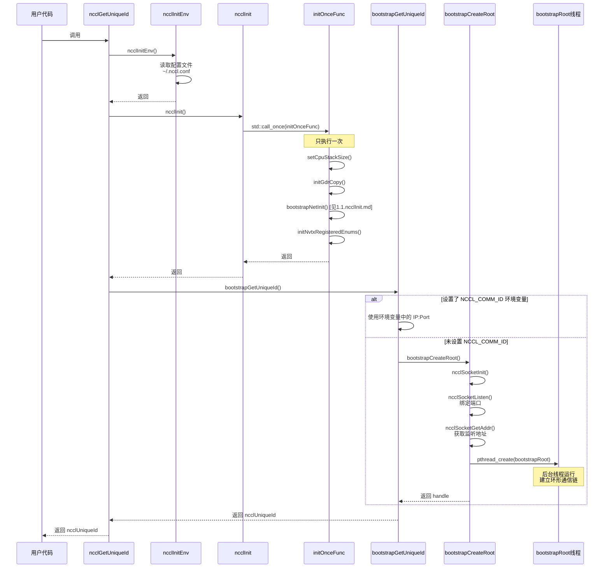

# `ncclGetUniqueId` 的实现

`ncclGetUniqueId` 是 NCCL 多进程通信中的第一个关键函数,用于生成一个全局唯一的通信标识符 `ncclUniqueId`。这个标识符包含了 root 进程的网络地址信息,使得所有参与通信的进程都能找到并连接到 root 进程。

## 与 NCCL 通信链路的关系

在 NCCL 的分布式通信架构中,`ncclGetUniqueId` 扮演着"引导节点发现"的角色:

1. **Bootstrap 阶段的起点**: `ncclGetUniqueId` 在 root 进程(通常是 rank 0)中调用,生成包含 root 监听地址的 `ncclUniqueId`

2. **地址广播**: 用户代码需要将这个 `ncclUniqueId` 广播到所有参与通信的进程(通过 MPI、shared memory 等方式)

3. **环形链路建立**: 所有进程通过 `ncclUniqueId` 中的地址连接到 root,root 进程收集所有进程的监听地址后,构建环形 bootstrap 通信链

4. **后续初始化**: 基于这个环形链路,NCCL 可以进一步协商和建立高性能的通信拓扑(如 Ring、Tree 等)

简而言之,`ncclGetUniqueId` 是 NCCL 通信网络初始化的"第一步",它建立了进程间相互发现和连接的基础。

要注意的是，这个函数只需要**一个 rank 调用**（一般为 rank 0），其他 rank 只需要等待被广播通知即可。

## 典型使用流程

```c
// 在 rank 0 进程中
ncclUniqueId id;
if (rank == 0) {
    ncclGetUniqueId(&id);  // 生成唯一ID
}

// 将 id 广播到所有进程 (通过 MPI 等机制)
MPI_Bcast(&id, sizeof(id), MPI_BYTE, 0, MPI_COMM_WORLD);

// 所有进程使用相同的 id 初始化 communicator
ncclCommInitRank(&comm, nranks, id, rank);
```

## 调用关系图



## `ncclUniqueId`的结构

NCCL 通信库通过 `ncclGetUniqueId` 函数生成并获取 「`ncclUniqueId*`」。本质上，`ncclUniqueId` 是一个大小为 128 字节数组，如下所示。参考 [nccl.h.in](nccl.h.in)（对外接口）

```c
#define NCCL_UNIQUE_ID_BYTES 128
typedef struct {
  char internal[NCCL_UNIQUE_ID_BYTES];
} ncclUniqueId;
```

真实结构在 [bootstrap.h](https://github.com/NVIDIA/nccl/blob/834ef7231913ecf22f5cad29d7e26a6596f36452/src/include/bootstrap.h#L13) 中，是一个 64 位 magic number + 记录 socket 地址的数据结构。也就是说，**ncclUniqueId 是一个包含魔术值和root进程的 socket 地址和端口的数据结构**。

```c
struct ncclBootstrapHandle {
  uint64_t magic;
  union ncclSocketAddress addr;
};
```

ncclSocketAddress 的定义如下，参考代码：[socket.h](https://github.com/NVIDIA/nccl/blob/ae7aed194dc63c65d1bf5c0385ba3d68d3b64c8c/src/include/socket.h#L24)

```c
/* Common socket address storage structure for IPv4/IPv6 */
union ncclSocketAddress {
  struct sockaddr sa;
  struct sockaddr_in sin;
  struct sockaddr_in6 sin6;
};
```

## 函数 - `ncclGetUniqueId`

NCCL 维护两套独立的网络:

| 网络类型 | 用途 | 实现 | 使用频率 |
|---------|------|------|---------|
| Bootstrap 网络 | 初始化时交换元数据 | TCP Socket | 一次性 |
| 通信网络 | 实际数据传输 | RDMA/GDRCopy/IB | 高频 |

`ncclGetUniqueId` 仅用于建立 bootstrap 网络,后续的高性能通信使用专门优化的通信网络。

`ncclGetUniqueId`逻辑如下，

- `ncclGetUniqueId` 首先调用 ncclInitEnv 初始化环境变量

- 调用`ncclInit` 函数初始化网络组件

- 接着调用 `bootstrapGetUniqueId` 函数生成 `ncclUniqueId`

- 处理 alignment mismatch 的问题

```c
ncclResult_t ncclGetUniqueId(ncclUniqueId* out) {
  NCCLCHECK(ncclInitEnv());
  NCCLCHECK(ncclInit());
  NCCLCHECK(PtrCheck(out, "GetUniqueId", "out"));
  struct ncclBootstrapHandle handle;
  NCCLCHECK(bootstrapGetUniqueId(&handle));
  // ncclUniqueId and bootstrapHandle don't have the same size and alignment
  // reset to 0 to avoid undefined data
  memset(out, 0, sizeof(*out));
  // copy to avoid alignment mismatch
  memcpy(out, &handle, sizeof(handle));
  TRACE_CALL("ncclGetUniqueId(0x%llx)", (unsigned long long)getHash(out->internal, NCCL_UNIQUE_ID_BYTES));
  return res;
}
```

**该函数在 root 进程中执行**，根据用户设置或者系统选择决定所使用的 bootstrap 网络的网卡，并初始化 bootstrap 网络。这里，获取的 ncclUniqueId 实际上是包含magic number和使用上述网卡 IP 地址和绑定端口的信息。通过广播该 ncclUniqueId，所有进程都可以连接 root 进程，并进一步创建环形通信链路。

代码参考 [init.cc: 158](https://github.com/NVIDIA/nccl/blob/ae7aed194dc63c65d1bf5c0385ba3d68d3b64c8c/src/init.cc#L158)


## 函数 - `ncclInitEnv`

`ncclInitEnv` 函数读取 \~/.nccl.conf 或者 /etc/nccl.conf 文件中的 NCCL 环境变量，这和在用户脚本中通过 export 设置环境变量是等价的。

```c
ncclResult_t ncclInitEnv() {
  std::call_once(envInitOnceFlag, envInitOnceFunc);
  return envInitResult;
}

static ncclResult_t envInitResult = ncclSuccess;
static std::once_flag envInitOnceFlag;

static void envInitOnceFunc() {
  NCCLCHECKGOTO(ncclEnvPluginInit(), envInitResult, exit);
exit:;
}
```

## 函数 - `ncclInit`

参考：[ncclInit.md](./1.1.ncclInit.md)

## 函数 - `bootstrapGetUniqueId`

参考：[bootstrapGetUniqueId.md](./1.2.bootstrapGetUniqueId.md)
