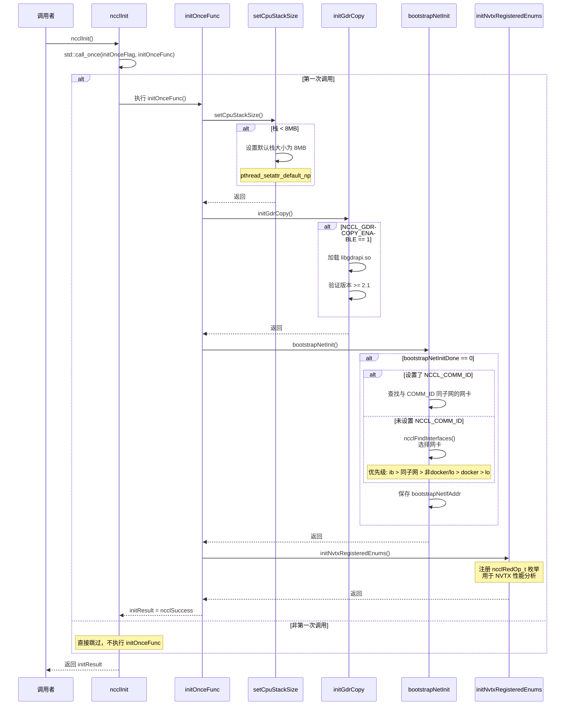

# `ncclInit` 的实现

`ncclInit` 是 NCCL 的全局初始化函数，主要用于初始化 bootstrap 网络。

该函数通过 `std::call_once` 保证 `initOnceFunc` 在多线程环境中只执行一次，依次调用：
1. `setCpuStackSize()`：设置线程栈大小
2. `initGdrCopy()`：初始化 GdrCopy
3. `bootstrapNetInit()`：初始化 bootstrap 网络
4. `initNvtxRegisteredEnums()`：注册 NVTX 信息

```c
static ncclResult_t ncclInit() {
  std::call_once(initOnceFlag, initOnceFunc);
  return initResult;
}

static ncclResult_t initResult = ncclSuccess;
static std::once_flag initOnceFlag;

static void initOnceFunc() {
  setCpuStackSize();
  initGdrCopy();
  // Always initialize bootstrap network
  NCCLCHECKGOTO(bootstrapNetInit(), initResult, exit);

  initNvtxRegisteredEnums();
exit:;
}
```
## 调用关系图



## 函数 - `setCpuStackSize`

`setCpuStackSize` 函数用于检查并设置 pthread 线程的栈大小，确保 NCCL 创建的线程有足够的栈空间。

GNU libc 的默认行为中，如果系统的 `RLIMIT_STACK` 设置为 "unlimited"，pthread 只会使用 2MB 作为栈大小，这个值太小可能导致栈溢出。NCCL 需要至少 8MB 的栈空间。

该函数首先查询当前线程的默认栈大小，如果小于 8MB（`SAFE_STACK_SIZE`），则通过 `pthread_setattr_default_np` 将后续创建的所有线程的默认栈大小设置为 8MB。

```c
static ncclResult_t setCpuStackSize() {
  if (ncclParamSetCpuStackSize() != 0) {
    // Query the stack size used for newly launched threads.
    pthread_attr_t attr;
    size_t stackSize;
    PTHREADCHECK(pthread_attr_init(&attr), "pthread_attr_init");
    PTHREADCHECK(pthread_attr_getstacksize(&attr, &stackSize), "pthread_attr_getstacksize");

    if (stackSize < SAFE_STACK_SIZE) {
      // GNU libc normally uses RLIMIT_STACK as the default pthread stack size, unless it's set to "unlimited" --
      // in that case a fallback value of 2MB (!) is used.

      // Query the actual resource limit so that we can distinguish between the settings of 2MB and unlimited.
      struct rlimit stackLimit;
      char buf[30];
      SYSCHECK(getrlimit(RLIMIT_STACK, &stackLimit), "getrlimit");
      if (stackLimit.rlim_cur == RLIM_INFINITY)
        strcpy(buf, "unlimited");
      else
        snprintf(buf, sizeof(buf), "%ldKB", stackLimit.rlim_cur/1024);
      INFO(NCCL_INIT|NCCL_ENV, "Stack size limit (%s) is unsafe; will use %dKB for newly launched threads",
           buf, SAFE_STACK_SIZE/1024);

      // Change the default pthread stack size (via a nonportable API, which will become necessary if we switch
      // to C++ threads).
      PTHREADCHECK(pthread_attr_setstacksize(&attr, SAFE_STACK_SIZE), "pthread_attr_setstacksize");
      PTHREADCHECK(pthread_setattr_default_np(&attr), "pthread_setattr_default_np");
    }

    PTHREADCHECK(pthread_attr_destroy(&attr), "pthread_attr_destroy");
  }

  return ncclSuccess;
}
```

## 函数 - `initGdrCopy`

`initGdrCopy` 函数用于初始化 GdrCopy（GPUDirect RDMA Copy）。GdrCopy 是一个可以在 CPU 用户空间直接读写 GPU 显存的库，用于优化小数据传输性能。

该功能默认关闭（`NCCL_GDRCOPY_ENABLE=0`），启用后会：调用ncclGdrInit初始化 Gdr相关函数。具体来说，ncclGdrInit函数加载 libgdrapi.so动态库，并初始化相关的操作函数，如 gdr_open、gdr_close等。接着，判断 GdrCopy 库和驱动版本的兼容性，当前 NCCL 要求 GDRAPI 2.1 及其之后版本。

```c
// GDRCOPY support: Off by default
NCCL_PARAM(GdrCopyEnable, "GDRCOPY_ENABLE", 0);

// GDRCOPY support
gdr_t ncclGdrCopy = NULL;

ncclResult_t initGdrCopy() {
  if (ncclParamGdrCopyEnable() == 1) {
    ncclGdrCopy = ncclGdrInit();
  }
  return ncclSuccess;
}
```

真正的 GDR 初始化部分

```c
static gdr_t ncclGdrInit() {
  int libMajor, libMinor, drvMajor, drvMinor;
  gdr_t handle = NULL;
  // Dynamically load the GDRAPI library symbols
  if (wrap_gdr_symbols() == ncclSuccess) {
    handle = wrap_gdr_open();

    if (handle != NULL) {
      ncclResult_t res;

      // Query the version of libgdrapi
      NCCLCHECKGOTO(wrap_gdr_runtime_get_version(&libMajor, &libMinor), res, error);

      // Query the version of gdrdrv driver
      NCCLCHECKGOTO(wrap_gdr_driver_get_version(handle, &drvMajor, &drvMinor), res, error);

      // Only support GDRAPI 2.1 and later
      if (libMajor < 2 || (libMajor == 2 && libMinor < 1) || drvMajor < 2 || (drvMajor == 2 && drvMinor < 1)) {
        goto error;
      }
      else
        INFO(NCCL_INIT, "GDRCOPY enabled library %d.%d driver %d.%d", libMajor, libMinor, drvMajor, drvMinor);
    }
  }
  return handle;
error:
  if (handle != NULL) (void) wrap_gdr_close(handle);
  return NULL;
}
```

代码参考：[gdrwrap.h](https://github.com/NVIDIA/nccl/blob/ae7aed194dc63c65d1bf5c0385ba3d68d3b64c8c/src/include/gdrwrap.h#L160)

## 函数 - `bootstrapNetInit`

在调用 `bootstrapNetInit` 初始化 bootstrap 网络之前，我们先看一下要初始化的static变量。

```c
/* Init functions */
static char bootstrapNetIfName[MAX_IF_NAME_SIZE+1];
static union ncclSocketAddress bootstrapNetIfAddr;
static int bootstrapNetInitDone = 0;
static std::mutex bootstrapNetMutex;

NCCL_PARAM(BootstrapNetEnable,"OOB_NET_ENABLE", 0);
```

首先，如果设置了 NCCL_COMM_ID 环境变量，则查找一个和该环境变量中指定的 IP 地址处于同一子网的网卡作为 booststrap 网络通信所使用的网卡 bootstrapNetIfAddr。

否则，使用 ncclFindInterfaces 函数选择一个合适的网卡。这里，**如果用户通过 NCCL_SOCKET_IFNAME 环境变量指定了特定的网卡名称，则选择该网卡**。

否则网卡选择的具体顺序如下：

- 首先，选择名称以 "ib" 为起始字符串的网卡；如果没找到，

- 接着，选择与 NCCL_COMM_ID 中指定 IP 地址处于同一子网的网卡；否则，

- **其次，选择名称不以 "docker" 和 "lo" 为起始字符串的网卡；否则**，

- 再次，选择名称以 "docker" 为起始字符串的网卡；否则，

- 最后，选择名称以 "lo" 为起始字符串的网卡。

当不指定环境变量时，就是上述红色字体部分选择出的网卡。这里就确定了bootstrap网络的接口名称bootstrapNetIfName和接口地址bootstrapNetIfAddr。

```c
ncclResult_t bootstrapNetInit() {
  if (bootstrapNetInitDone == 0) {
    std::lock_guard<std::mutex> lock(bootstrapNetMutex);
    if (bootstrapNetInitDone == 0) {
      const char* env = ncclGetEnv("NCCL_COMM_ID");
      int nIfs = 0;
      if (env) {
        union ncclSocketAddress remoteAddr;
        if (ncclSocketGetAddrFromString(&remoteAddr, env) != ncclSuccess) {
          WARN("Invalid NCCL_COMM_ID, please use format: <ipv4>:<port> or [<ipv6>]:<port> or <hostname>:<port>");
          return ncclInvalidArgument;
        }
        NCCLCHECK(ncclFindInterfaceMatchSubnet(bootstrapNetIfName, &bootstrapNetIfAddr, &remoteAddr, MAX_IF_NAME_SIZE,
                                               &nIfs));
        if (nIfs <= 0) {
          WARN("NET/Socket : No usable listening interface found");
          return ncclSystemError;
        }
      } else {
        NCCLCHECK(ncclFindInterfaces(bootstrapNetIfName, &bootstrapNetIfAddr, MAX_IF_NAME_SIZE, 1, &nIfs));
        if (nIfs <= 0) {
          WARN("Bootstrap : no socket interface found");
          return ncclInvalidUsage;
        }
      }
      char line[SOCKET_NAME_MAXLEN+MAX_IF_NAME_SIZE+2];
      snprintf(line, sizeof(line), " %s:", bootstrapNetIfName);
      ncclSocketToString(&bootstrapNetIfAddr, line+strlen(line));
      INFO(NCCL_BOOTSTRAP, "Bootstrap: Using%s", line);
      bootstrapNetInitDone = 1;
    }
  }
  return ncclSuccess;
}
```

参考 [bootstrap.cc](https://github.com/NVIDIA/nccl/blob/ae7aed194dc63c65d1bf5c0385ba3d68d3b64c8c/src/bootstrap.cc#L93) 和 [bootstrap.h](https://github.com/NVIDIA/nccl/blob/master/src/include/bootstrap.h#L19)

## 函数 - `initNvtxRegisteredEnums`

最后，通过 `initNvtxRegisteredEnums` 函数为基于 nvtx 的工具注册额外的信息。具体来说，注册 reduce 类通信的算子类型。

```c
// Must be called before the first call to any reduction operation.
void initNvtxRegisteredEnums() {
  // Register schemas and strings
  if (ncclParamNvtxDisable()) {
    return;
  }

  constexpr const nvtxPayloadEnumAttr_t eAttr {
    .fieldMask = NVTX_PAYLOAD_ENUM_ATTR_ENTRIES | NVTX_PAYLOAD_ENUM_ATTR_NUM_ENTRIES |
      NVTX_PAYLOAD_ENUM_ATTR_SIZE | NVTX_PAYLOAD_ENUM_ATTR_SCHEMA_ID,
    .name = NULL,
    .entries = NvtxEnumRedSchema,
    .numEntries = std::extent<decltype(NvtxEnumRedSchema)>::value,
    .sizeOfEnum = sizeof(ncclRedOp_t),
    .schemaId = NVTX_PAYLOAD_ENTRY_NCCL_REDOP,
    .extension = nullptr
  };

  nvtxPayloadEnumRegister(nvtx3::domain::get<nccl_domain>(), &eAttr);
}
```

参考代码：[init_nvtx.cc](https://github.com/NVIDIA/nccl/blob/ae7aed194dc63c65d1bf5c0385ba3d68d3b64c8c/src/init_nvtx.cc#L22)
