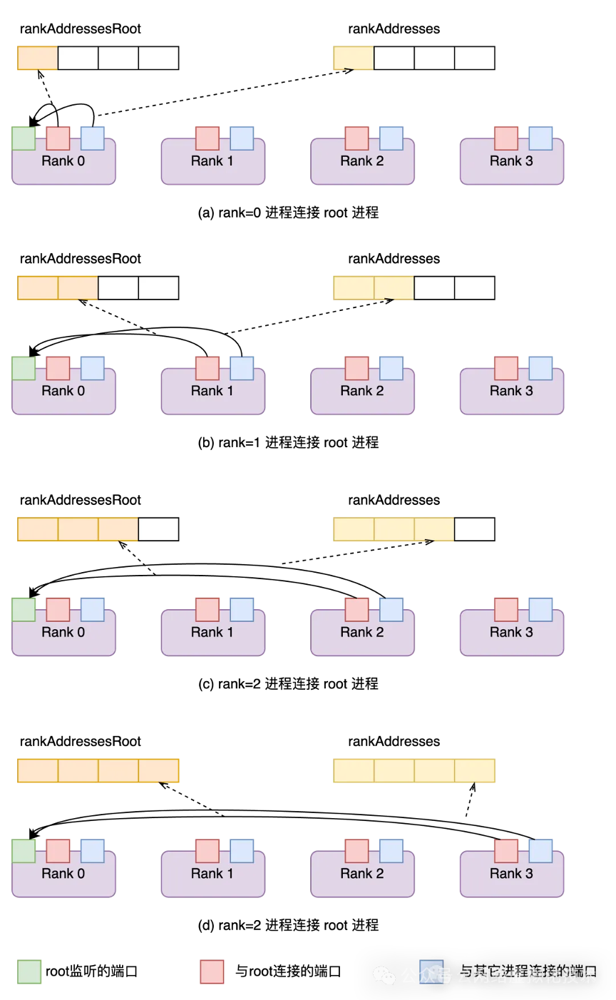
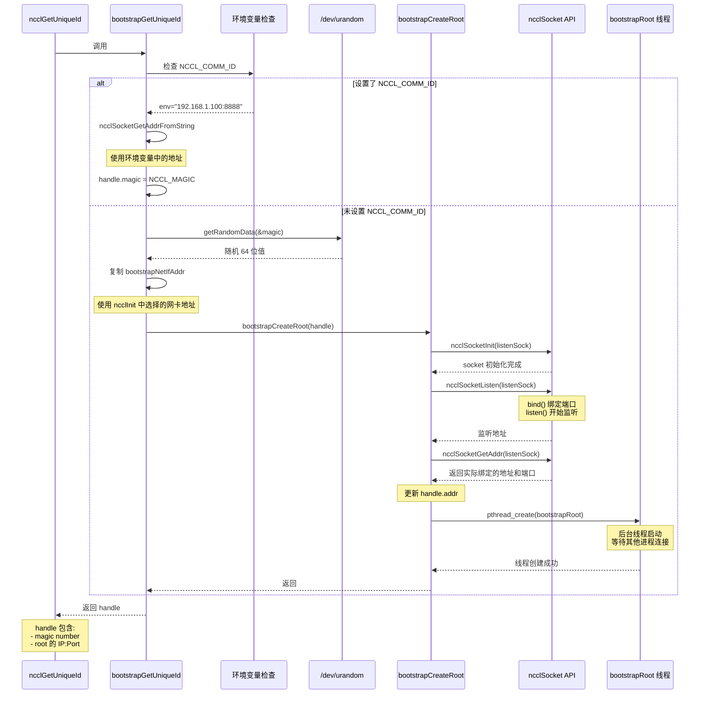

# `bootstrapGetUniqueId` 的实现

`bootstrapGetUniqueId` 是 `ncclGetUniqueId` 的核心实现函数,负责创建包含 root 进程监听地址的 `ncclBootstrapHandle` 结构。这个函数决定了 NCCL 如何建立初始的进程间连接。

`ncclBootstrapHandle` 定义参考 [ncclUniqueId的结构](./1.0.ncclGetUniqueId.md#nccluniqueid的结构)

`bootstrapGetUniqueId`函数首先判断是不是设置了NCCL_COMM_ID环境变量。NCCL_COMM_ID 中包含 IP 地址和端口号，比如"ip:port"。上面我们提到，`ncclUniqueId` 是一个包含魔术值和 root 的 socket 地址的数据结构。那么，如果设置了 NCCL_COMM_ID 环境变量，那么我直接使用 NCCL_COMM_ID中的 IP 地址和端口初始化 `ncclUniqueId` 数据结构，并使用默认值 NCCL_MAGIC初始化魔术值。

反之，函数通过读取 /dev/urandom获取随机魔术值。接着，使用前面[ncclInit](#函数---ncclinit) 函数中获取的`bootstrapNetIfAddr`继续初始化 ncclUniqueId 结构

```c
// 获取唯一的 bootstrap ID
// 这个函数通常由 rank 0 调用来创建 ncclUniqueId
// handle: 输出参数，被填充为 bootstrap handle
ncclResult_t bootstrapGetUniqueId(struct ncclBootstrapHandle* handle) {
  memset(handle, 0, sizeof(ncclBootstrapHandle));

  // 检查是否通过环境变量指定了已存在的 root 地址
  const char* env = ncclGetEnv("NCCL_COMM_ID");
  if (env) {
    // 使用环境变量指定的地址（用于跨进程/节点初始化）
    INFO(NCCL_ENV, "NCCL_COMM_ID set by environment to %s", env);
    if (ncclSocketGetAddrFromString(&handle->addr, env) != ncclSuccess) {
      WARN("Invalid NCCL_COMM_ID, please use format: <ipv4>:<port> or [<ipv6>]:<port> or <hostname>:<port>");
      return ncclInvalidArgument;
    }
    handle->magic = NCCL_MAGIC;  // 使用标准 magic number
  } else {
    // 创建新的 root（用于同一进程/节点内的初始化）
    NCCLCHECK(getRandomData(&handle->magic, sizeof(handle->magic)));  // 生成随机 magic number
    memcpy(&handle->addr, &bootstrapNetIfAddr, sizeof(union ncclSocketAddress));  // 使用本地接口地址
    NCCLCHECK(bootstrapCreateRoot(handle, false));  // 启动 root 线程
  }

  return ncclSuccess;
}
```

参考代码：[bootstrap.cc](https://github.com/NVIDIA/nccl/blob/ae7aed194dc63c65d1bf5c0385ba3d68d3b64c8c/src/bootstrap.cc#L414)

## 环形可达通信链路

在 bootstrap 阶段，NCCL 通过 `bootstrapRoot` 在所有进程间建立环形通信链路。

每个进程（rank）都会：
1. 创建一个监听 socket
2. 获知其后继进程（rank+1）的监听地址

这样就形成了一个环形拓扑：rank 0 → rank 1 → rank 2 → ... → rank N-1 → rank 0。通过这个环形链路，可以简单地在所有进程间传播信息。

## 函数 - `bootstrapCreateRoot`

现在我们知道 `ncclUniqueId` 需要包含 root 进程的监听地址。但这里有个问题：**root 进程怎么知道自己应该监听在哪个端口？**

答案是：不知道，需要让操作系统来分配。这就是 `bootstrapCreateRoot` 函数要解决的核心问题——创建一个监听 socket，获取系统实际分配的地址和端口，然后把这个信息写回 `ncclUniqueId`，这样用户才能把完整的连接信息广播给其他进程。

整个流程分三步：

**1. 创建并绑定监听 socket**

函数首先调用 `ncclSocketInit` 初始化 socket，然后调用 `ncclSocketListen` 在 `handle->addr`（即之前获取的 `bootstrapNetIfAddr`）上开始监听。这一步会调用底层的 `bind()` 系统调用——如果你没有指定端口号（端口为 0），操作系统会自动分配一个可用端口。

**2. 获取实际绑定的地址**

这是关键的一步。调用 `ncclSocketGetAddr` 获取 socket **实际**绑定的地址和端口，并写回到 `handle->addr` 中。为什么要这样做？因为端口号可能是系统自动分配的，我们需要知道实际的值才能告诉其他进程"来这个端口找我"。

**3. 启动后台线程处理连接**

最后，函数创建了一个独立线程运行 `bootstrapRoot` 函数。为什么要用独立线程？因为 root 进程需要等待并处理来自所有其他进程的连接——这是一个耗时操作，不能阻塞主线程。主线程返回后，用户就可以拿着包含完整监听地址的 `ncclUniqueId` 去广播给其他进程了，而 `bootstrapRoot` 线程则在后台默默等待其他进程的连接。

```c
// 创建 bootstrap root
// 启动后台线程运行 bootstrapRoot 函数来协调所有 ranks 的连接
// handle: 输入/输出，包含 root 的地址和 magic number
// idFromEnv: 是否从环境变量读取（这里未使用）
ncclResult_t bootstrapCreateRoot(struct ncclBootstrapHandle* handle, bool idFromEnv) {
  ncclResult_t ret = ncclSuccess;
  struct ncclSocket* listenSock = NULL;
  struct bootstrapRootArgs* args = NULL;
  pthread_t thread;

  // 创建监听 socket
  // ncclCalloc 分配主机内存，大小为 1 个 ncclSocket 结构体的大小
  NCCLCHECK(ncclCalloc(&listenSock, 1));
  /* Socket 类型：用于握手时验证连接双方的用途是否匹配 */
  // enum ncclSocketType {
  //   ncclSocketTypeUnknown = 0,      // 0: 未知类型（默认值）
  //   ncclSocketTypeBootstrap = 1,    // 1: Bootstrap 连接，用于初始化阶段的 rank 间通信
  //   ncclSocketTypeProxy = 2,        // 2: Proxy 连接，用于 proxy 线程的网络通信
  //   ncclSocketTypeNetSocket = 3,    // 3: 网络插件的 socket 传输
  //   ncclSocketTypeNetIb = 4,        // 4: 网络插件的 InfiniBand 传输
  //   ncclSocketTypeRasNetwork = 5    // 5: RAS（Reliability, Availability, Serviceability）网络连接
  // };
  NCCLCHECKGOTO(ncclSocketInit(listenSock, &handle->addr, handle->magic, ncclSocketTypeBootstrap, NULL, 0), ret, fail);
  NCCLCHECKGOTO(ncclSocketListen(listenSock), ret, fail);
  // 获取实际绑定的地址并赋值给 handle->addr（可能端口号由系统分配）
  NCCLCHECKGOTO(ncclSocketGetAddr(listenSock, &handle->addr), ret, fail);

  // 准备线程参数
  NCCLCHECKGOTO(ncclCalloc(&args, 1), ret, fail);
  args->listenSock = listenSock;
  args->magic = handle->magic;

  // 创建并启动 bootstrap root 线程
  PTHREADCHECKGOTO(pthread_create(&thread, NULL, bootstrapRoot, (void*)args), "pthread_create", ret, fail);
  ncclSetThreadName(thread, "NCCL BootstrapR");  // 设置线程名称，便于调试
  PTHREADCHECKGOTO(pthread_detach(thread), "pthread_detach", ret, fail);  // 分离线程（不需要 join）
exit:
  return ret;
fail:
  // 失败时清理资源
  if (listenSock) free(listenSock);
  if (args) free(args);
  goto exit;
}
```

## 函数 - bootstrapRoot

`bootstrapRoot` 是一个线程函数，在 root 进程中运行，负责协调所有进程建立环形通信链。你可能会问：为什么需要一个中心协调者？直接让每个进程自己去找下一个进程不行吗？

问题在于：**各个进程启动时间不同，彼此不知道对方的监听地址**。root 进程的作用就是做一个"信息交换所"——收集所有进程的地址信息，然后告诉每个进程"你的下一个邻居在哪里"。

这个函数的设计有两个关键点：

### 设计思路 1：渐进式信息交换

最简单的做法是：等所有进程都连上来，再一次性告诉每个进程它的邻居地址。但这样效率太低——如果有 1000 个进程，前面连上来的进程要一直等最后一个进程。

NCCL 采用了更聪明的策略：**一旦某个进程和它的邻居都已知，就立即发送消息**。具体来说，当 rank=i 连接过来时：

- 检查 rank=i-1 是否已连接？如果是，立即告诉 i-1："你的下一个邻居 i 的地址是这个"
- 检查 rank=i+1 是否已连接？如果是，立即告诉 i："你的下一个邻居 i+1 的地址是这个"

这样就不需要等所有进程都到齐，大大减少了等待时间。

### 设计思路 2：双向检查

为什么要同时检查"前一个"和"后一个"？因为进程连接的顺序是不确定的。

假设有 3 个进程，连接顺序是 rank 1 → rank 0 → rank 2：

- rank 1 连接时，rank 0 和 rank 2 都还没来，保存 rank 1 的信息，暂时不发送
- rank 0 连接时，发现 rank 1（它的下一个）已经在了，**立即发送** rank 1 的地址给 rank 0
- rank 2 连接时，发现 rank 1（它的前一个）已经在了，**立即发送** rank 2 的地址给 rank 1

这个"双向检查"机制保证了无论进程以什么顺序到达，只要相邻的两个进程都到了，就能立即完成配对。



### 代码结构

函数主体是一个循环，每次处理一个进程的连接：

```c
// Bootstrap root 线程函数
// 这个函数在后台线程中运行，作为 bootstrap 协调者
// 核心职责：收集所有 ranks 的连接信息，协调建立环形拓扑
//
// 工作流程：
// 1. 接收所有 ranks 的连接信息（包括它们的监听地址和环形连接信息）
// 2. 将每个 rank 的"下一个邻居"的连接信息发送给它
// 3. 这样每个 rank 就知道该连接到哪个 rank，从而形成环形拓扑
static void* bootstrapRoot(void* rargs) {
  struct bootstrapRootArgs* args = (struct bootstrapRootArgs*)rargs;
  ...
}
```

**阶段 1：渐进式接收和发送**

这个循环是整个函数的核心。每次迭代处理一个新连接的进程：

```c
  do {
    struct ncclSocket sock;
    // 接受来自某个 rank 的连接
    NCCLCHECKGOTO(ncclSocketInit(&sock), res, out);
    NCCLCHECKGOTO(ncclSocketAccept(&sock, listenSock), res, out);
    // 接收该 rank 的扩展信息
    NCCLCHECKGOTO(socketRecv(&sock, &info, sizeof(info)), res, out);
    NCCLCHECKGOTO(ncclSocketClose(&sock), res, out);

    if (c == 0) {
      // 收到第一个连接时，初始化数据结构
      BOOTSTRAP_PROF_CLOSE(timers[BOOTSTRAP_INIT_ROOT_WAIT]);  // 结束等待计时
      BOOTSTRAP_PROF_OPEN(timers[BOOTSTRAP_INIT_ROOT_RECV]);   // 开始接收计时
      nranks = info.nranks;  // 从第一个连接获取全局信息
      iroot = info.iroot;
      nroots = info.nroots;
      // 计算需要接收的连接数
      // 如果有多个 roots，会多收到一个来自下一个 root 的第一个 rank 的连接
      n2send = nRankFromRoot(iroot, nranks, nroots);  // 本 root 负责的 ranks 数量
      nrecv = n2send + ((nroots > 1) ? 1 : 0);  // 额外的一个连接用于跨 root 的环形连接
      // 分配存储数组
      NCCLCHECKGOTO(ncclCalloc(&rankInfo, nrecv), res, out);
      NCCLCHECKGOTO(ncclCalloc(&rankAddressesRoot, nrecv), res, out);
    }

    // 验证所有连接的全局信息一致
    if (nranks != info.nranks || nroots != info.nroots || iroot != info.iroot) {
      WARN("Bootstrap Root : mismatch in info from procs, nranks %d vs %d, nroots %d vs %d, iroot %d vs %d",
           nranks, info.nranks, nroots, info.nroots, iroot, info.iroot);
      goto out;
    }

    // 计算该 rank 在本 root 中的本地 ID
    localId = localIdFromRoot(info.rank, iroot, nranks, nroots);
    // 检查是否重复连接（防止同一个 rank 连接两次）
    if (memcmp(&zeroAddress, &rankAddressesRoot[localId], sizeof(union ncclSocketAddress)) != 0 ||
        memcmp(&zeroInfo, &rankInfo[localId], sizeof(union ringConnectInfo)) != 0) {
      WARN("Bootstrap Root : rank %d of %d ranks has already checked in", info.rank, nranks);
      goto out;
    }
    // 核心逻辑：根据已收集的信息，尽早向 ranks 发送它们需要的信息
    // 这样可以减少 ranks 的等待时间，提高初始化效率

    // 处理"前一个" rank：如果前一个 rank 已经连接过，立即告诉它"下一个"（即当前 rank）的信息
    // 计算前一个 rank 的 local ID
    // 如果有多个 roots，local_id=0 的前一个属于上一个 root，本 root 不负责
    // 如果只有一个 root，使用周期性索引（形成环）
    int prev = (nroots > 1) ? (localId - 1) : BOOTSTRAP_PID(localId - 1, nrecv);
    if (prev >= 0 && prev < n2send && memcmp(&zeroAddress, &rankAddressesRoot[prev], sizeof(union ncclSocketAddress)) != 0) {
      // 前一个 rank 已经连接过（地址不为零），立即发送当前 rank 的连接信息给它
      NCCLCHECKGOTO(rootSend(&rankAddressesRoot[prev], magic, &info.connectInfo), res, out);
    } else {
      // 前一个 rank 还没连接，保存当前 rank 的连接信息，等前一个连接时再发送
      memcpy(&rankInfo[localId], &info.connectInfo, sizeof(union ringConnectInfo));
    }

    // 处理"下一个" rank：如果下一个 rank 已经连接过，立即告诉当前 rank"下一个"的信息
    // 计算下一个 rank 的 local ID（使用周期性索引）
    int next = BOOTSTRAP_PID(localId + 1, nrecv);
    if (localId >= 0 && localId < n2send && memcmp(&zeroInfo, &rankInfo[next], sizeof(union ringConnectInfo)) != 0) {
      // 下一个 rank 已经连接过（信息不为零），立即发送下一个 rank 的信息给当前 rank
      NCCLCHECKGOTO(rootSend(&info.listenRootAddress, magic, &rankInfo[next]), res, out);
    } else {
      // 下一个 rank 还没连接，保存当前 rank 的监听地址，等下一个连接时再发送
      memcpy(rankAddressesRoot + localId, &info.listenRootAddress, sizeof(union ncclSocketAddress));
    }

    ++c;  // 增加已接收的连接计数
    TRACE(NCCL_BOOTSTRAP, "Received connect from rank %d total %d/%d", info.rank, c, nrecv);
  } while (c < nrecv);  // 直到收到所有期望的连接

```

**阶段 2：收尾处理**

循环结束后，所有进程都已经连接过了。但可能还有一些信息没发送（比如最后连接的进程还不知道它的下一个邻居）。这个循环负责发送这些剩余的信息：

```c
for (int r = 0; r < n2send; ++r) {
  // use nrecv to periodize: if 1 root, we will send the first one to the last one, if >1 roots we will send the additional one we have received
  int next = BOOTSTRAP_PID(r + 1, nrecv);
  if (memcmp(&zeroAddress, &rankAddressesRoot[r], sizeof(union ncclSocketAddress)) != 0 &&
      memcmp(&zeroInfo, &rankInfo[next], sizeof(union ringConnectInfo)) != 0) {
    NCCLCHECKGOTO(rootSend(&rankAddressesRoot[r], magic, &rankInfo[next]), res, out);
  }
}
```

这里用 `memcmp` 检查是否为零是为了避免重复发送——如果某个配对在阶段 1 已经发送过了，这里就跳过。

参考代码：[bootstrap.cc](https://github.com/NVIDIA/nccl/blob/ae7aed194dc63c65d1bf5c0385ba3d68d3b64c8c/src/bootstrap.cc#L282)

## 调用关系图



