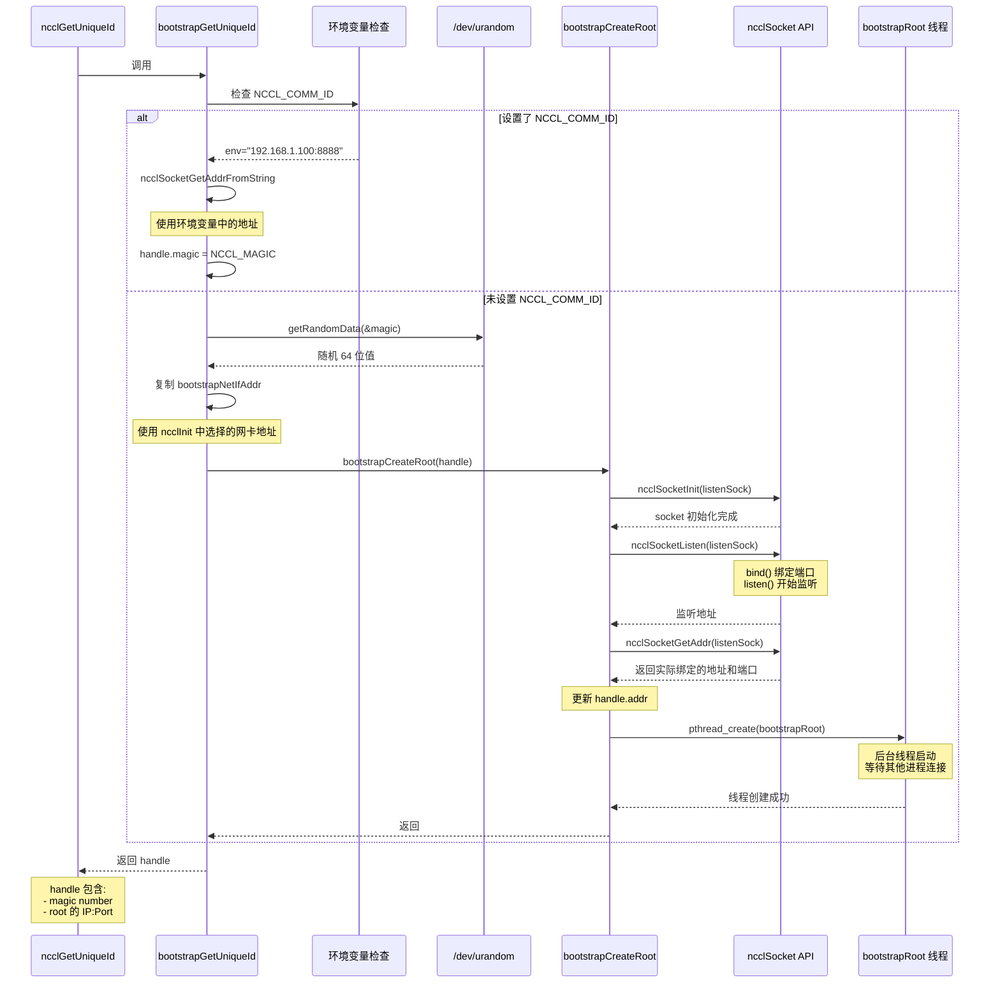

# `bootstrapGetUniqueId` 的实现

`bootstrapGetUniqueId` 是 `ncclGetUniqueId` 的核心实现函数,负责创建包含 root 进程监听地址的 `ncclBootstrapHandle` 结构。这个函数决定了 NCCL 如何建立初始的进程间连接。

`ncclBootstrapHandle` 定义参考 [ncclUniqueId的结构](./1.0.ncclGetUniqueId.md#nccluniqueid的结构)

`bootstrapGetUniqueId`函数首先判断是不是设置了NCCL_COMM_ID环境变量。NCCL_COMM_ID 中包含 IP 地址和端口号，比如"ip:port"。上面我们提到，`ncclUniqueId` 是一个包含魔术值和 root 的 socket 地址的数据结构。那么，如果设置了 NCCL_COMM_ID 环境变量，那么我直接使用 NCCL_COMM_ID中的 IP 地址和端口初始化 `ncclUniqueId` 数据结构，并使用默认值 NCCL_MAGIC初始化魔术值。

反之，函数通过读取 /dev/urandom获取随机魔术值。接着，使用前面[ncclInit](#函数---ncclinit) 函数中获取的`bootstrapNetIfAddr`继续初始化 ncclUniqueId 结构

```c
ncclResult_t bootstrapGetUniqueId(struct ncclBootstrapHandle* handle) {
  memset(handle, 0, sizeof(ncclBootstrapHandle));

  const char* env = ncclGetEnv("NCCL_COMM_ID");
  if (env) {
    INFO(NCCL_ENV, "NCCL_COMM_ID set by environment to %s", env);
    if (ncclSocketGetAddrFromString(&handle->addr, env) != ncclSuccess) {
      WARN("Invalid NCCL_COMM_ID, please use format: <ipv4>:<port> or [<ipv6>]:<port> or <hostname>:<port>");
      return ncclInvalidArgument;
    }
    handle->magic = NCCL_MAGIC;
  } else {
    NCCLCHECK(getRandomData(&handle->magic, sizeof(handle->magic)));
    memcpy(&handle->addr, &bootstrapNetIfAddr, sizeof(union ncclSocketAddress));
    NCCLCHECK(bootstrapCreateRoot(handle, false));
  }

  return ncclSuccess;
}
```

参考代码：[bootstrap.cc](https://github.com/NVIDIA/nccl/blob/ae7aed194dc63c65d1bf5c0385ba3d68d3b64c8c/src/bootstrap.cc#L414)

## 环形可达通信链路

在 bootstrap 阶段，NCCL 通过 `bootstrapRoot` 在所有进程间建立环形通信链路。

每个进程（rank）都会：
1. 创建一个监听 socket
2. 获知其后继进程（rank+1）的监听地址

这样就形成了一个环形拓扑：rank 0 → rank 1 → rank 2 → ... → rank N-1 → rank 0。通过这个环形链路，可以简单地在所有进程间传播信息。


## 调用关系图




## 函数 - `bootstrapCreateRoot`

接下来，我们来看一看 `bootstrapCreateRoot` 函数, 该函数在所有进程间建立环形可达的通信链路。

`bootstrapCreateRoot` 函数首先调用 `ncclSocketInit` 函数初始化 listenSock。接着，调用 `ncclSocketListen` 函数绑定并在 `listenSock` 监听。这里使用的是handle->addr，即前文所获取的`bootstrapNetIfAddr`。

此外，`ncclSocketListen` 还通过 bind 函数确定了监听端口。`ncclSocketGetAddr` 函数将监听的网络地址和端口拷贝到 `ncclUniqueId` 数据结构中。也就是说，此时 ncclUniqueId 包含了 root 进程监听的 IP 地址和端口。（这里其实主要是端口信息，地址在调用bootstrapCreateRoot之前已经对handle->addr进行了赋值）

在实际使用时，用户需要将 ncclUniqueId 广播到所有进程。因此，其它进程都可以通过 root 进程的监听地址连接 root 进程。这样，其它进程可以将它们自己的监听地址发送到 root 进程，从而构建上面提到的环形通信链。

最后，bootstrapCreateRoot 函数还启动 bootstrapRoot 线程，在所有进程间建立环形通信链。

```c
ncclResult_t bootstrapCreateRoot(struct ncclBootstrapHandle* handle, bool idFromEnv) {
  ncclResult_t ret = ncclSuccess;
  struct ncclSocket* listenSock = NULL;
  struct bootstrapRootArgs* args = NULL;
  pthread_t thread;

  NCCLCHECK(ncclCalloc(&listenSock, 1));
  NCCLCHECKGOTO(ncclSocketInit(listenSock, &handle->addr, handle->magic, ncclSocketTypeBootstrap, NULL, 0), ret, fail);
  NCCLCHECKGOTO(ncclSocketListen(listenSock), ret, fail);
  NCCLCHECKGOTO(ncclSocketGetAddr(listenSock, &handle->addr), ret, fail);

  NCCLCHECKGOTO(ncclCalloc(&args, 1), ret, fail);
  args->listenSock = listenSock;
  args->magic = handle->magic;
  PTHREADCHECKGOTO(pthread_create(&thread, NULL, bootstrapRoot, (void*)args), "pthread_create", ret, fail);
  ncclSetThreadName(thread, "NCCL BootstrapR");
  PTHREADCHECKGOTO(pthread_detach(thread), "pthread_detach", ret, fail); // will not be pthread_join()'d
exit:
  return ret;
fail:
  if (listenSock) free(listenSock);
  if (args) free(args);
  goto exit;
}
```

## 函数 - bootstrapRoot

`bootstrapRoot` 是一个线程函数，在 root 进程中运行，用于在所有进程间建立 bootstrap 网络的环形通信链。

该函数的核心逻辑分两步：

1. **接收所有 rank 的连接信息**：通过 `ncclSocketAccept` 接收所有其他进程发来的连接，获取它们的监听地址，保存在 `rankAddressesRoot` 数组中
2. **建立环形链路**：将每个 rank=i 进程的后继 rank=i+1 的监听地址发送给它，这样每个进程都可以连接其后继进程，形成环形通信链

注意这里建立的是 bootstrap 网络的环形通信链，用于后续的初始化协调，不是数据传输的通信链路。


```c
/* Receive addresses from all ranks */
do {
  struct ncclSocket sock;
  NCCLCHECKGOTO(ncclSocketInit(&sock), res, out);
  NCCLCHECKGOTO(ncclSocketAccept(&sock, listenSock), res, out);
  NCCLCHECKGOTO(socketRecv(&sock, &info, sizeof(info)), res, out);
  NCCLCHECKGOTO(ncclSocketClose(&sock), res, out);

  if (c == 0) {
    BOOTSTRAP_PROF_CLOSE(timers[BOOTSTRAP_INIT_ROOT_WAIT]);
    BOOTSTRAP_PROF_OPEN(timers[BOOTSTRAP_INIT_ROOT_RECV]);
    nranks = info.nranks;
    iroot = info.iroot;
    nroots = info.nroots;
    // if the number of root > 1, we will receive one extra info from the first local_id of the next root
    n2send = nRankFromRoot(iroot, nranks, nroots);
    nrecv = n2send + ((nroots > 1) ? 1 : 0);
    NCCLCHECKGOTO(ncclCalloc(&rankInfo, nrecv), res, out);
    NCCLCHECKGOTO(ncclCalloc(&rankAddressesRoot, nrecv), res, out);
  }

  if (nranks != info.nranks || nroots != info.nroots || iroot != info.iroot) {
    WARN("Bootstrap Root : mismatch in info from procs, nranks %d vs %d, nroots %d vs %d, iroot %d vs %d", nranks, info.nranks, nroots, info.nroots, iroot, info.iroot);
    goto out;
  }

  localId = localIdFromRoot(info.rank, iroot, nranks, nroots);
  if (memcmp(&zeroAddress, &rankAddressesRoot[localId], sizeof(union ncclSocketAddress)) != 0 ||
      memcmp(&zeroInfo, &rankInfo[localId], sizeof(union ringConnectInfo)) != 0) {
    WARN("Bootstrap Root : rank %d of %d ranks has already checked in", info.rank, nranks);
    goto out;
  }
  // if the previous has already checked in, send the newly received handle, if not save the handle for later
  // if we have more than 1 root, I do not own the previous of local_id = 0
  // if we have prev > n2send, we do not send anything
  int prev = (nroots > 1) ? (localId - 1) : BOOTSTRAP_PID(localId - 1, nrecv);
  if (prev >= 0 && prev < n2send && memcmp(&zeroAddress, &rankAddressesRoot[prev], sizeof(union ncclSocketAddress)) != 0) {
    NCCLCHECKGOTO(rootSend(&rankAddressesRoot[prev], magic, &info.connectInfo), res, out);
  } else {
    memcpy(&rankInfo[localId], &info.connectInfo, sizeof(union ringConnectInfo));
  }
  // if the next rank has checked in, send the newly received info, if not save the addr for later
  // for nroots >=1, I will always own the information of the next connection
  // if the local_id id must be [0 ; n2send[ otherwise we do not answer
  int next = BOOTSTRAP_PID(localId + 1, nrecv);
  if (localId >= 0 && localId < n2send && memcmp(&zeroInfo, &rankInfo[next], sizeof(union ringConnectInfo)) != 0) {
    NCCLCHECKGOTO(rootSend(&info.listenRootAddress, magic, &rankInfo[next]), res, out);
  } else {
    memcpy(rankAddressesRoot + localId, &info.listenRootAddress, sizeof(union ncclSocketAddress));
  }
  ++c;
  TRACE(NCCL_BOOTSTRAP, "Received connect from rank %d total %d/%d", info.rank, c, nrecv);
} while (c < nrecv);
```

接着，root 进程分别连接每一个 rank=i 进程，并将其后序 rank=i+1 进程的监听地址发送给它。这样，每个进程就可以连接其后序进程，从而构成一个环形通信链。

```c
for (int r = 0; r < n2send; ++r) {
  // use nrecv to periodize: if 1 root, we will send the first one to the last one, if >1 roots we will send the additional one we have received
  int next = BOOTSTRAP_PID(r + 1, nrecv);
  if (memcmp(&zeroAddress, &rankAddressesRoot[r], sizeof(union ncclSocketAddress)) != 0 &&
      memcmp(&zeroInfo, &rankInfo[next], sizeof(union ringConnectInfo)) != 0) {
    NCCLCHECKGOTO(rootSend(&rankAddressesRoot[r], magic, &rankInfo[next]), res, out);
  }
}
```

参考代码：[bootstrap.cc](https://github.com/NVIDIA/nccl/blob/ae7aed194dc63c65d1bf5c0385ba3d68d3b64c8c/src/bootstrap.cc#L282)
