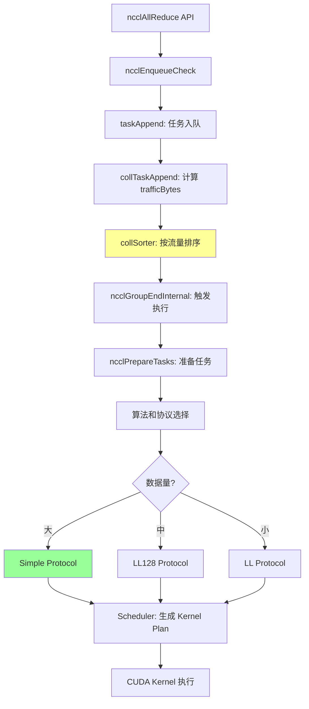

# NCCL Simple Protocol 深度解析：从 API 到设备端的完整旅程

## 一、开篇：为什么需要三种协议？

想象你经营一家物流公司，客户有各种各样的运输需求：

- 有人要寄一份紧急文件，1小时内必达，哪怕运费贵点也没关系
- 有人要运一车货物，不急，但希望运费便宜，充分利用车辆空间
- 有人的需求介于两者之间

对应到 NCCL 的场景，这就是三种协议的设计初衷：

- **LL Protocol（Low Latency）**: "特快专递"—— 延迟优先，适合小数据量
- **LL128 Protocol**: "标准快递"—— 延迟和带宽的平衡
- **Simple Protocol**: "大宗货运专线"—— 带宽优先，适合大数据量

今天我们要深入剖析的 Simple Protocol，就是那条"大宗货运专线"。它的核心设计哲学是：**我可以慢一点启动，但一旦跑起来，要以最大速度全速前进。**

### Simple Protocol 的核心权衡

来看一组真实数字（来自 [tuning.cc](https://github.com/NVIDIA/nccl/blob/v2.28.7-1/src/graph/tuning.cc#L142-L147)）：

```c
// 基础延迟（单位：微秒）
.baseLatencies = {
  { 6.8, 14.0,  8.4 },  // Tree: LL, LL128, Simple
  { 6.6, 14.0,  8.4 },  // Ring: LL, LL128, Simple
  ...
}
```

看到这组数字，你可能会问：Simple 的基础延迟（8.4μs）比 LL（6.6μs）还要高，那为什么还要用它？

**关键洞察：这是个延迟与带宽的权衡。**

LL Protocol 为了实现低延迟，采用了 flag-based 的流控机制，每 8 字节数据就要附带 8 字节的 flag。这就像快递员每送一个包裹都要拍照、签字、确认，虽然保证了每一步都可控，但吞吐量被直接打了五折。

而 Simple Protocol 采用了粗粒度的 step counter 流控，就像高速公路的 ETC 系统，车辆可以全速通过，只在关键节点（每隔 8 个 slot）检查一次。启动时可能慢一点，但一旦进入巡航状态，就是100%的带宽利用率。

在代码中能看到这个差异（[tuning.cc:304-305](https://github.com/NVIDIA/nccl/blob/v2.28.7-1/src/graph/tuning.cc#L304-L305)）：

```c
if (a == NCCL_ALGO_RING && p == NCCL_PROTO_LL) {
  busBw = std::min(llMaxBw, busBw * .5);  // LL 打五折
}
if (a == NCCL_ALGO_RING && p == NCCL_PROTO_LL128)
  busBw = std::min(busBw * 0.92, ...);    // LL128 打九二折
// Simple 没有折扣，100% 带宽
```

当数据量足够大（比如深度学习训练中常见的梯度AllReduce，动辄几百MB到几GB），那点延迟差异（2μs）完全可以忽略，带宽才是王道。

---

## 二、从 ncclAllReduce 说起：一个看似简单的入口

让我们从用户最熟悉的 API 开始这趟旅程。打开 [collectives.cc:109-117](https://github.com/NVIDIA/nccl/blob/v2.28.7-1/src/collectives.cc#L109-L117)，你会看到：

```c
ncclResult_t ncclAllReduce(const void* sendbuff, void* recvbuff, size_t count,
    ncclDataType_t datatype, ncclRedOp_t op, ncclComm* comm, cudaStream_t stream) {

  struct ncclInfo info = { ncclFuncAllReduce, "AllReduce",
    sendbuff, recvbuff, count, datatype, op, 0, comm, stream,
    ALLREDUCE_CHUNKSTEPS, ALLREDUCE_SLICESTEPS };

  return ncclEnqueueCheck(&info);
}
```

整个函数只有区区几行！所有的输入参数被打包成一个 `ncclInfo` 结构体，然后转手交给 `ncclEnqueueCheck`。

### 一个自然的疑问：为什么不直接启动 kernel？

如果你写过 CUDA 程序，可能会觉得奇怪：为什么不直接 `cudaLaunchKernel` 就完事了？为什么要这么"绕"地放到队列里？

**这背后隐藏着一个重要的性能优化策略：操作聚合（Operation Aggregation）。**

想象这样一个场景：你在训练一个大模型，每个 GPU 上有 100 层网络，每一层的梯度都需要做一次 AllReduce。如果每次都立即启动一个 kernel：

- 100 次 kernel 启动开销（每次几微秒）
- 100 次 PCIe 事务（CPU 与 GPU 通信）
- GPU 调度器需要处理 100 个 kernel

而如果我们把这些操作"攒一攒"，等凑够一批再一起处理：

- 1 次 kernel 启动开销
- 1 次 PCIe 事务
- GPU 内部可以做更多优化（比如跨层的数据合并）

这就像外卖平台的"凑单"策略：骑手不是接到一个订单就立马出发，而是在附近等几分钟，把顺路的订单凑在一起送，虽然单个订单可能慢了一点，但整体效率大大提高。

**关键洞察：NCCL 不只是一个通信库，更是一个智能的通信调度器。**

---

## 三、Simple Protocol 的调度入口

### 3.1 从 API 到调度系统

在第二章我们看到用户调用 `ncclAllReduce`，函数内部会调用 `ncclEnqueueCheck`（[enqueue.cc:2620](https://github.com/NVIDIA/nccl/blob/v2.28.7-1/src/enqueue.cc#L2620)）。这个函数是进入 NCCL 调度系统的入口：

```c
ncclResult_t ncclAllReduce(...) {
  struct ncclInfo info = { ncclFuncAllReduce, "AllReduce", ... };
  return ncclEnqueueCheck(&info);  // ← 进入调度系统
}
```

`ncclEnqueueCheck` 做三件事：
1. **合法性检查**：验证参数、communicator 状态
2. **任务入队**：调用 `taskAppend` 把操作加入 Planner
3. **触发执行**：调用 `ncclGroupEndInternal` 启动执行（如果不在 Group 中）

### 3.2 任务入队与流量计算

任务通过 `collTaskAppend` 函数进入 Planner（[enqueue.cc:2453-2495](https://github.com/NVIDIA/nccl/blob/v2.28.7-1/src/enqueue.cc#L2453-2495)）：

```c
static ncclResult_t collTaskAppend(struct ncclComm* comm, struct ncclInfo* info, ...) {
  struct ncclTaskColl* t = ncclMemoryPoolAlloc<struct ncclTaskColl>(...);

  // 填充任务信息
  t->func = info->coll;         // ncclFuncAllReduce
  t->count = info->count;       // 元素数量
  t->datatype = info->datatype; // 数据类型

  // ← 关键：计算流量字节数
  t->trafficBytes = t->count * elementSize * ncclFuncTrafficPerByte(t->func, comm->nRanks);

  // 插入到 Planner 的桶排序器（按流量大小排序）
  ncclTaskCollSorterInsert(&planner->collSorter, t, t->trafficBytes);

  return ncclSuccess;
}
```

**trafficBytes 的计算**：

对于 Ring AllReduce，`ncclFuncTrafficPerByte` 返回 2.0（因为每个 GPU 需要发送和接收总数据量的 2 倍）：

```
示例：1GB AllReduce（8 GPU，Ring 算法）
  - count = 256M (1GB / 4 bytes)
  - elementSize = 4 (float32)
  - trafficBytes = 256M × 4 × 2.0 = 2GB

这意味着整个 Ring 通信过程总共需要传输 2GB 的数据。
```

### 3.3 Simple Protocol 在调度中的优势

**为什么 Simple Protocol 的任务容易排在前面？**

因为 Simple Protocol 通常用于大数据量场景，而 NCCL 的 Planner 使用**流量优先排序**（大任务优先）：

```
任务队列（按 trafficBytes 降序）：
1. [2GB AllReduce, Simple]  ← Simple Protocol，大数据量
2. [500MB AllReduce, Simple]
3. [100MB AllGather, Simple]
4. [10MB AllReduce, LL128]  ← LL128，中等数据量
5. [1MB AllReduce, LL]      ← LL，小数据量
```

**Simple Protocol 在调度中的特点**：

1. **高 trafficBytes**：大数据量 → 排序靠前 → 优先执行
2. **更容易聚合**：NCCL 会聚合 4X 以内的相似任务，Simple 的任务通常规模相近
3. **占用更多通道**：大任务需要更多通道并行，能更好地利用 GPU 资源
4. **协议选择稳定**：对于 1GB+ 的数据，成本模型几乎总是选择 Simple

### 3.4 完整的调度流程（简要）



**关键洞察：Simple Protocol 的大数据量特性让它在调度系统中自然获得优先级。NCCL 的"大任务优先"策略与 Simple Protocol 的"带宽优先"设计相得益彰，确保大规模通信能够快速占用资源、充分利用带宽。**

### 3.5 深入理解 NCCL 调度系统

本章只是简要介绍了 Simple Protocol 如何进入调度系统。如果你想深入理解 NCCL 的完整调度机制，包括：

- **操作聚合（Operation Aggregation）**：如何使用 Group API 聚合多个操作
- **collSorter 的详细实现**：81 个桶的对数级分桶策略
- **任务聚合（4X 规则）**：如何合并相似大小的任务
- **成本模型驱动的算法选择**：为什么大数据量选择 Simple
- **调度器与 Kernel Plan**：如何分配通道和生成执行计划

请参考：**[NCCL_调度系统深度解析.md](NCCL_调度系统深度解析.md)**

该文档详细讲解了从 API 调用到 Kernel 执行的完整流程，涵盖 Planner、Scheduler、Group API、阻塞/非阻塞模式等核心概念，并提供了丰富的实战案例。

---

## 四、数据类型的影响：从 fp32 到 fp8 ⚡

在深度学习训练中，我们会使用各种数据类型：fp32（全精度训练）、fp16/bf16（混合精度训练）、fp8（极致量化）、int8（推理加速）等。这些数据类型对 Simple Protocol 有什么影响？

### 4.1 支持的数据类型

NCCL 通过 `ncclTypeSize` 函数（[collectives.h:42-63](https://github.com/NVIDIA/nccl/blob/v2.28.7-1/src/include/collectives.h#L42-L63)）定义了类型大小映射：

```c
inline int ncclTypeSize(ncclDataType_t type) {
  switch (type) {
  case ncclInt8:
  case ncclUint8:
  case ncclFloat8e4m3:    // FP8 E4M3 格式
  case ncclFloat8e5m2:    // FP8 E5M2 格式
    return 1;              // 1 字节
  case ncclFloat16:        // IEEE FP16
  case ncclBfloat16:       // Google BFloat16
    return 2;              // 2 字节
  case ncclInt32:
  case ncclUint32:
  case ncclFloat32:
    return 4;              // 4 字节
  case ncclInt64:
  case ncclUint64:
  case ncclFloat64:
    return 8;              // 8 字节
  default:
    return -1;
  }
}
```

**NCCL 支持的数据类型全景**：
- **1 字节类型**：int8, uint8, fp8e4m3, fp8e5m2（共 4 种）
- **2 字节类型**：fp16, bf16（共 2 种）
- **4 字节类型**：int32, uint32, fp32（共 3 种）
- **8 字节类型**：int64, uint64, fp64（共 3 种）
- **总计**：12 种数据类型

### 4.2 数据类型如何影响协议选择？

#### 关键发现：数据类型**不直接**决定协议选择

打开协议选择的核心函数 `getAlgoInfo`（[enqueue.cc:1918-1927](https://github.com/NVIDIA/nccl/blob/v2.28.7-1/src/enqueue.cc#L1918-L1927)）：

```c
static ncclResult_t getAlgoInfo(
    struct ncclComm* comm, struct ncclTaskColl* info,
    int collNetSupport, int nvlsSupport, int numPipeOps, ncclSimInfo_t* simInfo) {

  size_t elementSize = ncclTypeSize(info->datatype);  // 获取元素大小
  size_t nBytes = elementSize * ncclFuncMaxSendRecvCount(info->func, comm->nRanks, info->count);

  // ... 协议选择基于 nBytes，而不是 datatype ...
  NCCLCHECK(topoGetAlgoInfo(comm, info, nBytes, (float **)collCostTable, simInfo));
}
```

**协议选择的真实逻辑**：

```
nBytes = elementSize × count
协议选择 = f(nBytes, 硬件拓扑, 算法类型)
```

这意味着：
- 1000 个 fp32（4 字节）= 4000 字节
- 2000 个 fp16（2 字节）= 4000 字节
- 4000 个 int8（1 字节）= 4000 字节

**这三种情况的 nBytes 相同，会选择相同的协议！**

**为什么这样设计？**

因为协议的性能瓶颈在于**网络带宽**，而网络传输的是字节，不关心这些字节代表什么数据类型。1000 个 fp32 和 4000 个 int8 在网络上传输的时间是一样的（都是 4000 字节）。

#### 一个反直觉的案例

假设你在训练一个模型，有以下两个 AllReduce 操作：

**场景 A**：梯度是 fp32，256K 个元素
```python
tensor_fp32 = torch.randn(256*1024, dtype=torch.float32, device='cuda')
# nBytes = 256K × 4 = 1 MB
dist.all_reduce(tensor_fp32)
```

**场景 B**：梯度是 fp16，512K 个元素
```python
tensor_fp16 = torch.randn(512*1024, dtype=torch.float16, device='cuda')
# nBytes = 512K × 2 = 1 MB
dist.all_reduce(tensor_fp16)
```

**NCCL 会为这两个操作选择相同的协议**，因为它们的 `nBytes` 都是 1 MB。

**关键洞察：NCCL 的协议选择是 "字节驱动" 而非 "类型驱动"。数据类型通过影响总字节数来间接影响协议选择。**

### 4.3 数据类型对设备端代码的影响：编译期模板实例化

虽然协议选择不直接区分数据类型，但设备端的 kernel 代码是**针对每种数据类型专门生成的**。

#### 设备函数 ID 的计算

看 `ncclDevFuncId` 函数（[device.h:562-615](https://github.com/NVIDIA/nccl/blob/v2.28.7-1/src/include/device.h#L562-L615)），对于 AllReduce：

```c
if (coll == ncclFuncAllReduce) {
  int nAlgos = 6;  // TREE, RING, COLLNET_DIRECT, COLLNET_CHAIN, NVLS, NVLS_TREE
  // row = ((归约操作 * 12 + 数据类型) * 6 + 算法) * 3 + 协议
  row += ((devRedOp*NumTypes + type)*nAlgos + algo)*NCCL_NUM_PROTOCOLS + proto;
  break;
}
```

这里 `type` 是数据类型的索引（0-11，对应 12 种类型）。这个公式意味着：
- **每种 (redop, type, algo, proto) 组合都有一个唯一的函数 ID**
- Sum + fp32 + Ring + Simple 和 Sum + fp16 + Ring + Simple 是**两个不同的 kernel**

#### 为什么要为每种类型生成单独的 kernel？

**答案：编译期优化**

看设备端代码的模板定义（[all_reduce.h:13](https://github.com/NVIDIA/nccl/blob/v2.28.7-1/src/device/all_reduce.h#L13)）：

```c
template<typename T, typename RedOp, typename Proto>
__device__ __forceinline__ void runRing(int tid, int nthreads,
                                         struct ncclDevWorkColl* work) {
  // T 是具体的类型，如 float、__half 等
  Primitives<T, RedOp, FanSymmetric<1>, /*Direct=*/1, Proto, /*P2p=*/0> prims(
    tid, nthreads, &ring->prev, &ring->next,
    work->sendbuff, work->recvbuff, work->redOpArg, 0, 0, 0, work);

  // ... 使用 T 的操作 ...
}
```

因为 `T` 是编译期常量，编译器可以做：
1. **常量折叠**：`sizeof(T)` 在编译期计算，变成立即数
2. **循环展开**：根据 `sizeof(T)` 展开不同次数的循环
3. **寄存器分配优化**：根据 T 的大小优化寄存器使用
4. **向量化指令**：fp16 可以用 `__half2`，一次处理 2 个元素

如果用运行时分派（switch-case），这些优化都会失去。

#### 代码生成的规模

generate.py 脚本（[device/generate.py:6-10](https://github.com/NVIDIA/nccl/blob/v2.28.7-1/src/device/generate.py#L6-L10)）定义了所有组合：

```python
all_colls =  ["Broadcast","Reduce","AllGather","ReduceScatter","AllReduce","SendRecv"]
all_redops = ["Sum","Prod","MinMax","PreMulSum","SumPostDiv"]
all_tys =    ["i8","u8","i32","u32","i64","u64","f16","f32","f64","bf16","f8e4m3","f8e5m2"]
all_protos = ["LL","LL128","SIMPLE"]
all_algos =  ["TREE","RING","COLLNET_DIRECT","COLLNET_CHAIN","NVLS","NVLS_TREE","PAT"]
```

**理论上的组合数**：
- AllReduce: 5 (redops) × 12 (types) × 6 (algos) × 3 (protos) = **1080 个 kernel**
- 所有 collective 加起来：**几千个 kernel**

实际上，NCCL 只生成常用的组合（通过 `func_filter` 过滤），并且使用共享代码减少重复，最终二进制大小在可控范围内（~10-20 MB）。

### 4.4 特殊的数据类型处理

#### 案例 1：AllGather 和 Broadcast 的类型转换

看 `collTaskAppend` 函数（[enqueue.cc:2475-2480](https://github.com/NVIDIA/nccl/blob/v2.28.7-1/src/enqueue.cc#L2475-L2480)）：

```c
size_t elementSize = ncclTypeSize(t->datatype);
if (t->func == ncclFuncAllGather || t->func == ncclFuncBroadcast) {
  t->count *= elementSize;      // 元素个数 × 元素大小 = 总字节数
  t->datatype = ncclInt8;       // 类型改为 int8（1 字节）
  elementSize = 1;              // 元素大小变为 1
}
t->trafficBytes = t->count*elementSize*ncclFuncTrafficPerByte(t->func, comm->nRanks);
```

**为什么 AllGather 和 Broadcast 要转为 int8？**

因为这两个操作**不需要归约**（reduction），只是数据搬运（data movement）。对于 Simple Protocol：
- 缓冲区就是字节数组：`T* connEltsFifo = (T*)conn->buffs[NCCL_PROTO_SIMPLE]`
- 不关心数据的语义，只关心字节流
- 转为 int8 可以**统一处理所有类型**，减少 kernel 数量

例如：
- AllGather 1000 个 fp32 → 转为 AllGather 4000 个 int8
- AllGather 2000 个 fp16 → 转为 AllGather 4000 个 int8
- 两者使用**同一个 kernel**，大幅减少代码重复

**但为什么 AllReduce 不这样做？**

因为 AllReduce 需要对数据做求和（或其他归约操作），必须知道数据类型：
- fp32 的加法：`a + b`（浮点运算）
- int8 的加法：`a + b`（整数运算，会溢出）
- fp16 的加法：需要用 `__hadd` 或转 fp32 加

所以 AllReduce 必须为每种类型生成专门的 kernel。

#### 案例 2：fp16/bf16 的精度提升

在归约操作中，fp16/bf16 可能会转换为 fp32 以提高精度。看 reduce_kernel.h（[reduce_kernel.h:219-227](https://github.com/NVIDIA/nccl/blob/v2.28.7-1/src/device/reduce_kernel.h#L219-L227)）：

```c
template<>
struct Apply_Cast<__half, float, /*EltPerPack=*/1> {
  __device__ __forceinline__ static BytePack<sizeof(float)> cast(BytePack<sizeof(__half)> a) {
    return toPack(__half2float(fromPack<__half>(a)));
  }
};
```

**为什么要转换？**

fp16 的动态范围有限（±65504），在 AllReduce 中累加多个值容易溢出或精度损失。转为 fp32 可以：
- 扩大动态范围（±3.4×10³⁸）
- 提高尾数精度（23 位 vs 10 位）

**性能开销**：类型转换需要额外的计算，但收益是数值稳定性。NCCL 会根据场景自动决定是否转换。

#### 案例 3：fp8 的特殊支持

fp8 是 NVIDIA Hopper 架构引入的新类型，有两种格式：
- **fp8e4m3**：4 位指数，3 位尾数（动态范围大）
- **fp8e5m2**：5 位指数，2 位尾数（精度高）

NCCL 对 fp8 有专门的归约实现（[reduce_kernel.h:23-25](https://github.com/NVIDIA/nccl/blob/v2.28.7-1/src/device/reduce_kernel.h#L23-25)）：

```c
#if defined(__CUDA_FP8_TYPES_EXIST__)
template<>
struct IsFloatingPoint<__nv_fp8_e4m3>: std::true_type {};
```

fp8 的归约通常会先转换为 fp16 或 fp32，做归约后再转回 fp8。

### 4.5 内存访问优化：向量化与对齐

数据类型的大小直接影响内存访问的向量化策略。

#### 向量化访问的选择

看 `reduceCopy` 函数（[common_kernel.h:228-267](https://github.com/NVIDIA/nccl/blob/v2.28.7-1/src/device/common_kernel.h#L228-L267)）：

```c
IntBytes nBytesAhead = nElts*sizeof(T);

// 尝试使用 BigPackSize（通常是 16 字节）
if constexpr (BigPackSize > sizeof(T)) {
  // 检查所有指针是否对齐到 BigPackSize
  bool aligned = true;
  if (lane < nSrcs) aligned &= 0 == cvta_to_global(srcPtrFn(lane)) % (BigPackSize + !BigPackSize);
  if (lane < nDsts) aligned &= 0 == cvta_to_global(dstPtrFn(lane)) % (BigPackSize + !BigPackSize);
  aligned = __all_sync(~0u, aligned);

  if (aligned) {
    // 使用 16 字节打包传输
    reduceCopyPacks<RedFn, T, Unroll, BigPackSize, ...>(...);
  }
}

// 回退到按元素大小传输
reduceCopyPacks<RedFn, T, Unroll*(16/sizeof(T))/2, /*BytePerPack=*/sizeof(T), ...>(...);
```

**不同类型的向量化效果**：

| 数据类型 | sizeof(T) | BigPackSize=16 时一次传输元素数 | 128位寄存器利用率 |
|---------|-----------|-------------------------------|------------------|
| fp8     | 1 字节    | 16 个元素                       | 100%             |
| fp16    | 2 字节    | 8 个元素                        | 100%             |
| fp32    | 4 字节    | 4 个元素                        | 100%             |
| fp64    | 8 字节    | 2 个元素                        | 100%             |

**关键：如果指针未对齐到 16 字节**，无法使用 BigPackSize，回退到按 `sizeof(T)` 传输：

- fp8：按 1 字节传输（性能下降 16 倍）
- fp16：按 2 字节传输（性能下降 8 倍）
- fp32：按 4 字节传输（性能下降 4 倍）

这就是为什么 NCCL 的 User Buffer Registration API 强调内存对齐的重要性。

#### 实际案例：fp16 vs fp32 的带宽差异

假设在 NVLink 系统上做 AllReduce：

**理想情况（指针对齐）**：
- fp32：每次传输 16 字节（4 个 fp32），带宽 = 300 GB/s
- fp16：每次传输 16 字节（8 个 fp16），带宽 = 300 GB/s
- **结论**：两者带宽相同

**但实际传输的元素数不同**：
- fp32：1 秒内传输 300GB / 4B = 75G 个元素
- fp16：1 秒内传输 300GB / 2B = 150G 个元素

**所以 fp16 的"吞吐量"（元素/秒）是 fp32 的 2 倍**，这就是为什么混合精度训练能提速。

### 4.6 数据类型的性能对比实测

假设在 8-GPU DGX 系统（NVLink 互联）上做 AllReduce，测试不同类型的带宽：

| 数据类型 | 元素大小 | 100M 元素的总字节数 | Simple Protocol 带宽 | 元素吞吐量 |
|---------|---------|---------------------|---------------------|-----------|
| fp64    | 8 字节  | 800 MB              | ~280 GB/s           | 35 G元素/s|
| fp32    | 4 字节  | 400 MB              | ~290 GB/s           | 72 G元素/s|
| fp16    | 2 字节  | 200 MB              | ~295 GB/s           | 147 G元素/s|
| bf16    | 2 字节  | 200 MB              | ~295 GB/s           | 147 G元素/s|
| int8    | 1 字节  | 100 MB              | ~298 GB/s           | 298 G元素/s|
| fp8     | 1 字节  | 100 MB              | ~298 GB/s           | 298 G元素/s|

**观察**：
1. **字节带宽趋于一致**：所有类型都接近 300 GB/s（NVLink 的理论峰值）
2. **元素吞吐量成反比**：类型越小，单位时间传输的元素越多
3. **小类型略有优势**：fp8/int8 比 fp64 快约 6%，因为内存访问的粒度更细

### 4.7 实战建议：如何选择数据类型

#### 原则 1：数据类型不改变协议选择的大方向

如果你在纠结"用 fp32 还是 fp16"对协议选择的影响：
- **别纠结了**，NCCL 的协议选择主要看总字节数
- 1000 个 fp32 和 2000 个 fp16 会得到相同的协议

#### 原则 2：小类型提升元素吞吐量，但要注意精度

- **训练**：fp16/bf16 是甜点（2 倍元素吞吐量，精度够用）
- **推理**：int8/fp8 更激进（4-8 倍元素吞吐量，但需要量化）
- **科学计算**：fp64 保证精度，接受较低的元素吞吐量

#### 原则 3：对齐对性能至关重要

无论什么类型，**确保内存对齐到 16 字节**：

```python
# PyTorch 示例：创建对齐的 tensor
tensor = torch.empty(size, dtype=torch.float16, device='cuda').contiguous()
# .contiguous() 确保内存连续，但不保证对齐

# 使用 NCCL 的 ncclMemAlloc（通过 C++ 扩展）
ptr = ncclMemAlloc(size * sizeof(dtype), alignment=16)
```

#### 原则 4：理解数值稳定性的权衡

- **fp16 AllReduce**：在大规模训练（>1000 GPU）中可能累积误差
  - 解决方案：梯度累积、损失缩放（loss scaling）
- **fp8 AllReduce**：更激进，需要配合量化感知训练（QAT）
- **int8 AllReduce**：只适用于不需要精确梯度的场景（如某些强化学习算法）

**关键洞察：数据类型通过影响总字节数来间接影响协议选择，但在设备端代码生成和内存访问优化中起直接作用。选择数据类型时，要在元素吞吐量和数值精度之间权衡。**

---

## 五、协议选择的核心逻辑：成本模型驱动的决策 ⭐

现在我们来到了整个流程中最关键的一步：如何决定用 Simple Protocol 还是 LL Protocol？

很多人可能以为是简单的阈值判断："数据量超过 XX KB 就用 Simple"。但真实的实现要精妙得多。

### 5.1 成本模型：不只是简单的"大小判断"

打开 [enqueue.cc:1822-1840](https://github.com/NVIDIA/nccl/blob/v2.28.7-1/src/enqueue.cc#L1822-L1840)，这里是协议选择的核心逻辑：

```c
static ncclResult_t topoGetAlgoInfo(...) {
  float (*table)[NCCL_NUM_PROTOCOLS] = (float (*)[NCCL_NUM_PROTOCOLS])collCostTable;

  float minTime = 3600000000.0;  // 初始化为一个很大的值
  int algorithm = NCCL_ALGO_UNDEF;
  int protocol = NCCL_PROTO_UNDEF;

  // 遍历所有 算法×协议 组合
  for (int a=0; a<NCCL_NUM_ALGORITHMS; a++) {
    for (int p=0; p<NCCL_NUM_PROTOCOLS; p++) {
      if (table[a][p] == NCCL_ALGO_PROTO_IGNORE) continue;

      // 选择预估时间最短的组合
      if (table[a][p] >= 0.0 && table[a][p] < minTime) {
        algorithm = a;
        protocol = p;  // ← Simple 在这里被选中
        minTime = table[a][p];
      }
    }
  }
  // ...
}
```

关键在于 `table[algorithm][protocol]` 里存的是什么 —— **这是每种组合的预估执行时间**。

那这个时间是怎么算出来的？答案在 [tuning.cc](https://github.com/NVIDIA/nccl/blob/v2.28.7-1/src/graph/tuning.cc) 的性能模型中。

### 5.2 性能模型的数学基础

NCCL 的性能模型本质上是这个公式：

```
预估时间 = 基础延迟 + 硬件延迟 + 数据量 / (有效带宽 × 通道数)
```

每一项都有实际的数字支撑，来自 [tuning.cc:142-199](https://github.com/NVIDIA/nccl/blob/v2.28.7-1/src/graph/tuning.cc#L142-L199)：

```c
static const ncclTunerConstants_t ncclTunerConstantsDefaults = {
  .baseLatencies = {
    {  6.8, 14.0,  8.4 },  // Tree:  LL, LL128, Simple (微秒)
    {  6.6, 14.0,  8.4 },  // Ring:  LL, LL128, Simple (微秒)
    ...
  },
  .hwLatencies = {
    /* NVLink 环境 */
    { { .6, 1.25, 4.0 }, { .6, 1.9, 3.4 }, ... },
    //  Tree: LL/LL128/Simple,  Ring: LL/LL128/Simple (微秒)

    /* PCI 环境 */
    { { 1.0, 1.9, 4.0 }, { 1.0, 2.5, 5.7 }, ... },
    //  Tree: LL/LL128/Simple,  Ring: LL/LL128/Simple (微秒)
    ...
  },
  ...
};
```

让我们具体分析一下 **Ring + Simple** 在不同硬件上的延迟：

| 硬件类型 | 基础延迟 | 硬件延迟 | 总延迟 |
|---------|---------|---------|--------|
| NVLink  | 8.4μs   | 3.4μs   | 11.8μs |
| PCI     | 8.4μs   | 5.7μs   | 14.1μs |

而 **Ring + LL** 的延迟：

| 硬件类型 | 基础延迟 | 硬件延迟 | 总延迟 |
|---------|---------|---------|--------|
| NVLink  | 6.6μs   | 0.6μs   | 7.2μs  |
| PCI     | 6.6μs   | 1.0μs   | 7.6μs  |

看到了吗？**Simple 的启动延迟确实比 LL 高得多（NVLink 上相差 4.6μs）**。但这只是故事的一半。

### 5.3 带宽的决定性作用

延迟只是固定成本，带宽才是变量成本。来看代码中的带宽折扣（[tuning.cc:304-308](https://github.com/NVIDIA/nccl/blob/v2.28.7-1/src/graph/tuning.cc#L304-L308)）：

```c
// 各协议的有效带宽计算
if (a == NCCL_ALGO_RING && p == NCCL_PROTO_LL) {
  busBw = std::min(llMaxBw, busBw * .5);     // LL: 50% 带宽
}
if (a == NCCL_ALGO_RING && p == NCCL_PROTO_LL128)
  busBw = std::min(busBw * 0.92, ...);       // LL128: 92% 带宽
// Simple 没有折扣代码，意味着 100% 带宽
```

**为什么 LL 只有 50% 带宽？**

因为 LL 协议每 8 字节数据要附带 8 字节 flag，实际有效载荷只有一半。这就像快递包裹里装了一半货物、一半泡沫填充物。

**为什么 LL128 是 92% 带宽？**

LL128 每 128 字节的数据行（line）中，有 120 字节是有效数据，8 字节是 flag：120/128 ≈ 0.9375，代码中取了 0.92 作为实测的保守值。

**Simple 为什么是 100%？**

Simple 不需要 per-byte 或 per-line 的 flag，完全是纯净的数据传输。它的流控是在 slot 级别（8 个 slot 构成环形缓冲），粒度大得多。

### 5.4 临界点在哪里？

假设我们有一个 NVLink 连接的 8-GPU 系统，单通道带宽 25 GB/s：

**使用 LL 协议**：
- 固定延迟：7.2μs
- 有效带宽：25 × 0.5 = 12.5 GB/s
- 传输 N 字节的总时间：`7.2μs + N / 12.5GB/s`

**使用 Simple 协议**：
- 固定延迟：11.8μs
- 有效带宽：25 GB/s（无折扣）
- 传输 N 字节的总时间：`11.8μs + N / 25GB/s`

什么时候 Simple 更快？求解不等式：

```
11.8 + N/25 < 7.2 + N/12.5
4.6 < N/12.5 - N/25
4.6 < N × (1/12.5 - 1/25)
4.6 < N × (2/25 - 1/25)
4.6 < N / 25
N > 115 字节
```

理论上，**当数据量超过约 115 字节时，Simple 就开始展现优势**。但实际中 NCCL 会设置更大的阈值，因为还要考虑其他开销（kernel 启动、同步等）。

**关键洞察：协议选择不是拍脑袋定的阈值，而是基于延迟-带宽模型的精确计算。不同硬件、不同拓扑，临界点都不一样。**

### 5.5 动态资源调整：通道数和线程数

选定协议后，NCCL 还要决定用多少个通道、每个通道用多少线程。这个逻辑也很精妙（[enqueue.cc:1887-1906](https://github.com/NVIDIA/nccl/blob/v2.28.7-1/src/enqueue.cc#L1887-L1906)）：

```c
// Ring/Tree 的通道调整
while (nBytes < nc * nt * threadThreshold) {
  if (nc >= 2) nc--;  // 数据量不够，减少通道
  else break;
}

// 线程调整
if (info->algorithm != NCCL_ALGO_NVLS && ...) {
  while (nBytes < nc * nt * threadThreshold) {
    if (nt % 128 == 0) nt /= 2;  // 减少线程
    else break;
  }
}

// Simple 协议需要额外的同步线程
if (info->protocol == NCCL_PROTO_SIMPLE) {
  if (info->algorithm == NCCL_ALGO_RING) nt += WARP_SIZE;     // +32 线程
  if (info->algorithm == NCCL_ALGO_TREE) nt += 4*WARP_SIZE;   // +128 线程
}
```

这里有几个有意思的设计：

**为什么小消息要减少通道？**

每个通道是一个独立的 CUDA block，启动和同步都有开销。如果数据量很小，开那么多通道就像用 10 辆卡车运 1 吨货物 —— 车辆调度的时间比运输时间还长，得不偿失。

条件 `nBytes < nc * nt * threadThreshold` 的意思是：**如果数据量还不够每个线程处理足够多的数据，就减少并行度**。这个 `threadThreshold` 就是让每个线程"吃饱"的阈值。

**为什么 Simple 需要额外的线程？**

注意代码中 Ring 加了 1 个 warp（32 个线程），Tree 加了 4 个 warp（128 个线程）。这是因为：

Simple 协议的流控需要专门的线程去做 `waitPeer` 和 `postPeer` 操作（我们后面会详细讲）。LL 协议的流控是内嵌在数据传输中的（每个数据都带 flag），不需要额外线程。Tree 算法因为拓扑更复杂（有多个children/parent节点），需要更多线程来处理同步。

**线程数的上下界**（来自 [tuning.cc:231-239](https://github.com/NVIDIA/nccl/blob/v2.28.7-1/src/graph/tuning.cc#L231-L239)）：

```c
// Simple 协议在 Ring 算法上的默认线程数
int simpleDefaultThreads = (graphs[NCCL_ALGO_RING]->bwIntra *
                            graphs[NCCL_ALGO_RING]->nChannels <= PCI_BW)
                           ? 256    // PCI 受限系统
                           : NCCL_SIMPLE_MAX_NTHREADS;  // 512，NVLink 系统

// 设置最大线程数
comm->maxThreads[NCCL_ALGO_RING][NCCL_PROTO_SIMPLE] =
  getNthreads("NCCL_NTHREADS", ncclParamNthreads(),
              2*WARP_SIZE,  // 最小 64 线程
              NCCL_SIMPLE_MAX_NTHREADS,  // 最大 512 线程
              simpleDefaultThreads);  // 默认值
```

**洞察：为什么 PCI 系统用 256 线程，NVLink 用 512？**

PCI 的带宽远低于 NVLink（通常 16 GB/s vs 300 GB/s），已经是瓶颈。即使开再多线程，也榨不出更多带宽，反而增加了线程同步开销。这就像一条双车道公路，你派 100 辆车和派 50 辆车，通行能力没区别，车多了反而容易堵。

而 NVLink 带宽充足，多开线程可以充分利用带宽。

---

## 六、内核函数映射：编译期优化的艺术

到这一步，NCCL 已经决定了：
- 使用 AllReduce 集合操作
- Ring 算法
- Simple 协议
- Float32 数据类型
- Sum 归约操作
- 16 个通道，每通道 512 线程

下一个问题：该调用哪个 CUDA kernel？

### 6.1 设备函数 ID 的计算

NCCL 为所有可能的组合预先生成了内核函数。这个映射通过 `ncclDevFuncId` 完成（[device.h:562-615](https://github.com/NVIDIA/nccl/blob/v2.28.7-1/src/include/device.h#L562-L615)）：

```c
inline int ncclDevFuncId(int coll, int devRedOp, int type, int algo, int proto) {
  constexpr int NumTypes = ncclNumTypes;  // 12 种数据类型
  int row;

  // ... 复杂的索引计算 ...

  if (coll == ncclFuncAllReduce) {
    int nAlgos = 6;  // TREE, RING, COLLNET_DIRECT, COLLNET_CHAIN, NVLS, NVLS_TREE
    // row = 基础偏移 + ((归约操作 * 12 + 数据类型) * 6 + 算法) * 3 + 协议
    row += ((devRedOp*NumTypes + type)*nAlgos + algo)*NCCL_NUM_PROTOCOLS + proto;
    break;
  }

  // 映射行号到实际函数 ID
  return ncclDevFuncRowToId[row];
}
```

这个函数本质上是个**多维索引映射**，把 (collective, redop, type, algo, proto) 这个五元组映射到一个唯一的 row number，再通过查表得到函数 ID。

**为什么要这么复杂？**

因为 NCCL 支持的组合数非常多：
- 6 种 collective（AllReduce, AllGather, ReduceScatter...）
- 5 种 reduction 操作（Sum, Prod, Min, Max...）
- 12 种数据类型（int8, int32, float16, float32...）
- 7 种算法（TREE, RING, NVLS...）
- 3 种协议（LL, LL128, Simple）

如果都预先实例化，那就是几千个 kernel 函数。NCCL 通过 [device/generate.py](https://github.com/NVIDIA/nccl/blob/v2.28.7-1/src/device/generate.py) 这个 Python 脚本，在编译时自动生成需要的组合，避免二进制膨胀。

**关键洞察：这是编译期优化，不是运行时分派。**

每个具体组合（比如 AllReduce + Sum + Float32 + Ring + Simple）都有一个专门的模板实例化版本，编译器可以针对这个特定组合做深度优化（常量折叠、循环展开等）。如果用运行时分派（switch-case），就失去了这些优化机会。

---

## 七、设备端执行：流水线的艺术 ⭐

现在我们终于来到了设备端 —— GPU 上真正执行通信的地方。

### 7.1 Ring AllReduce 的算法拆解

打开 [all_reduce.h:13-83](https://github.com/NVIDIA/nccl/blob/v2.28.7-1/src/device/all_reduce.h#L13-L83)，这里是 Ring AllReduce 的核心实现：

```c
template<typename T, typename RedOp, typename Proto>
__device__ __forceinline__ void runRing(int tid, int nthreads,
                                         struct ncclDevWorkColl* work) {
  ncclRing *ring = &ncclShmem.channel.ring;
  int ringIx = ring->index;  // 我在环上的位置
  const int nranks = ncclShmem.comm.nRanks;  // 总共多少个 rank

  // 计算我这个通道负责的数据范围
  ssize_t gridOffset, channelCount, chunkCount;
  ncclCollCbdPart(work, ncclShmem.channelId, Proto::Id, sizeof(T),
                  nullptr, &gridOffset, &channelCount, &chunkCount);

  // *** 实例化 Simple Protocol 的通信原语 ***
  Primitives<T, RedOp, FanSymmetric<1>, /*Direct=*/1, Proto, /*P2p=*/0> prims(
    tid, nthreads, &ring->prev, &ring->next,
    work->sendbuff, work->recvbuff, work->redOpArg, 0, 0, 0, work);

  // ... AllReduce 的两阶段算法 ...
}
```

注意第 17-19 行，这里实例化了 `Primitives` 类，模板参数 `Proto` 就是我们的 `ProtoSimple`。这是 **Simple Protocol 真正发挥作用的地方**。

Ring AllReduce 算法分为两个阶段：

#### 阶段一：Reduce-Scatter（规约散射）

想象 8 个 GPU 围成一个环，每个 GPU 有一份完整的数据（比如 8MB），我们要把这 8 份数据加起来。

最直观的做法是：让所有 GPU 把数据发给 GPU 0，让它来加。但这样 GPU 0 会成为瓶颈。

Ring AllReduce 的巧妙之处在于：**把数据切成 N 份（N = rank 数量），每个 GPU 负责规约一份**。

看代码中的 Reduce-Scatter 阶段（[all_reduce.h:42-64](https://github.com/NVIDIA/nccl/blob/v2.28.7-1/src/device/all_reduce.h#L42-L64)）：

```c
// step 0: 把我负责的那份数据发给下一个 GPU
chunk = (ringIx + nranks - 1) % nranks;
chunkOffset = chunk * chunkCount;
offset = gridOffset + elemOffset + chunkOffset;
prims.directSend(offset, offset, nelem);

// step 1 到 nranks-2: 接收、规约、转发
for (int j = 2; j < nranks; ++j) {
  chunk = (ringIx + nranks - j) % nranks;
  chunkOffset = chunk * chunkCount;
  offset = gridOffset + elemOffset + chunkOffset;
  prims.directRecvReduceDirectSend(offset, offset, nelem);
}

// step nranks-1: 最后一次接收并规约，得到最终结果
chunk = ringIx;
chunkOffset = chunk * chunkCount;
offset = gridOffset + elemOffset + chunkOffset;
prims.directRecvReduceCopyDirectSend(offset, offset, nelem, /*postOp=*/true);
```

**用一个具体例子**（4 个 GPU，数据切成 4 块 [A, B, C, D]）：

| Step | GPU 0 | GPU 1 | GPU 2 | GPU 3 |
|------|-------|-------|-------|-------|
| 0 | 持有 D | 持有 A | 持有 B | 持有 C |
| 1 | 收到D并加 | 收到A并加 | 收到B并加 | 收到C并加 |
| 2 | 收到C并加 | 收到D并加 | 收到A并加 | 收到B并加 |
| 3 | 收到B并加 | 收到C并加 | 收到D并加 | 收到A并加 |
| 结束 | **sum(B)** | **sum(C)** | **sum(D)** | **sum(A)** |

经过 N 步后，每个 GPU 手里都有一份完整规约的数据块，但是在不同的 GPU 上。

#### 阶段二：AllGather（全聚集）

现在把规约好的数据块广播到所有 GPU，让每个 GPU 都有完整的规约结果。

看代码（[all_reduce.h:66-82](https://github.com/NVIDIA/nccl/blob/v2.28.7-1/src/device/all_reduce.h#L66-L82)）：

```c
// k-2 steps: 接收并转发
for (int j = 1; j < nranks - 1; ++j) {
  chunk = (ringIx + nranks - j) % nranks;
  chunkOffset = chunk * chunkCount;
  offset = gridOffset + elemOffset + chunkOffset;
  prims.directRecvCopyDirectSend(offset, offset, nelem);
}

// 最后一步：接收最后一块
chunk = (ringIx + 1) % nranks;
chunkOffset = chunk * chunkCount;
offset = gridOffset + elemOffset + chunkOffset;
prims.directRecv(offset, nelem);
```

继续上面的例子：

| Step | GPU 0 | GPU 1 | GPU 2 | GPU 3 |
|------|-------|-------|-------|-------|
| 初始 | sum(B) | sum(C) | sum(D) | sum(A) |
| 1 | 收到sum(A) | 收到sum(B) | 收到sum(C) | 收到sum(D) |
| 2 | 收到sum(D) | 收到sum(A) | 收到sum(B) | 收到sum(C) |
| 3 | 收到sum(C) | 收到sum(D) | 收到sum(A) | 收到sum(B) |
| 结束 | **ABCD** | **ABCD** | **ABCD** | **ABCD** |

**关键洞察：Ring AllReduce 把一个中心化的操作（所有数据发给一个节点）变成了流水线式的环形传递，每个节点的负载完全一样，没有瓶颈。**

### 7.2 Simple Protocol 的流控机制

现在我们深入 Simple Protocol 的核心 —— 它的流控机制。

打开 [prims_simple.h](https://github.com/NVIDIA/nccl/blob/v2.28.7-1/src/device/prims_simple.h)，先看 Primitives 类的构造函数（简化版）：

```c
template<...>
class Primitives<T, RedOp, Fan, Direct, ProtoSimple<...>, ...> {
  const int stepSize;  // 每步的数据量
  uint64_t *connStepPtr;  // 对端的 step counter 指针
  uint64_t connStepCache;  // 缓存的对端 step 值
  int connStepSize;  // 连接的 step 大小
  T* connEltsFifo;  // 环形缓冲区
  uint64_t step;  // 当前步数

  __device__ Primitives(...)
    : stepSize(ncclShmem.comm.buffSizes[NCCL_PROTO_SIMPLE]/NCCL_STEPS) {
    // NCCL_STEPS = 8，缓冲区分成 8 个 slot

    this->connStepPtr = conn->head;  // 对端的 head 指针
    this->connStepCache = loadStepValue(connStepPtr);
    this->connStepSize = conn->stepSize;
    this->connEltsFifo = (T*)conn->buffs[NCCL_PROTO_SIMPLE];
    this->step = conn->step;
    // ...
  }
};
```

**NCCL_STEPS = 8** 是关键常量（定义在 [device.h:24](https://github.com/NVIDIA/nccl/blob/v2.28.7-1/src/include/device.h#L24)）：

```c
#define NCCL_STEPS 8
```

这意味着通信缓冲区被分成 8 个 slot，形成一个环形缓冲。每个 slot 的大小是：

```c
slotSize = buffSizes[NCCL_PROTO_SIMPLE] / 8
```

假设 `buffSizes[NCCL_PROTO_SIMPLE]` 是 8MB，那每个 slot 就是 1MB。

#### waitPeer：等待对端准备好

现在看流控的核心 —— `waitPeer` 函数（[prims_simple.h:109-170](https://github.com/NVIDIA/nccl/blob/v2.28.7-1/src/device/prims_simple.h#L109-L170)）：

```c
template <int DirectRecv, int DirectSend, int Recv, int Send, int Src, int Dst>
__device__ __forceinline__ void waitPeer(
    intptr_t srcIx, intptr_t dstIx, int offset, int nelts) {

  const bool isSendNotRecv = (Send && Recv) ? (flags & RoleWaitSend) : Send;

  if ((flags & (Recv * RoleWaitRecv)) || (flags & (Send * RoleWaitSend))) {
    int spins = 0;

    // *** 核心流控逻辑 ***
    while (connStepCache + (isSendNotRecv ? NCCL_STEPS : 0) < step + StepPerSlice) {
      connStepCache = loadStepValue(connStepPtr);
      if (checkAbort(flags, Aborted, spins)) break;
    }
  }

  // 设置缓冲区指针
  // ...

  step += StepPerSlice;
}
```

第 11 行的这个 while 循环看起来很抽象，让我们翻译成人话：

**如果我是发送方**（`isSendNotRecv = true`）：
```c
while (接收方的step + 8 < 我的step) {
  等待...  // 意思是：缓冲区满了，接收方还没消费完
}
```

**如果我是接收方**（`isSendNotRecv = false`）：
```c
while (发送方的step < 我的step) {
  等待...  // 意思是：缓冲区空了，发送方还没生产
}
```

**为什么发送方要加 8（NCCL_STEPS）？**

因为缓冲区有 8 个 slot。假设：
- 接收方当前在 step 10
- 我是发送方，在 step 15

那我要写入的 slot 是 `15 % 8 = 7`。接收方在 step 10，已经消费到 slot `10 % 8 = 2`。

我可以安全写入吗？slot 7 和 slot 2 之间隔了 5 个 slot，没有重叠，安全！

但如果我在 step 20 呢？`20 % 8 = 4`，而接收方还在 step 10（slot 2）。虽然 slot 4 和 slot 2 不重叠，但问题是：**我上一次写入 slot 4 是在 step 12，接收方还没读完它**！

所以发送方的条件是：`接收方step + 8 >= 我的step`，确保接收方至少消费了一轮，我才能覆盖写。

**类比：这就像一个停车场，有 8 个车位。我要停车（写入），必须确保我上次停在这个位置的车已经开走了（被消费了）。**

#### postPeer：通知对端完成

数据传输完成后，调用 `postPeer` 更新 step counter（[prims_simple.h:172-181](https://github.com/NVIDIA/nccl/blob/v2.28.7-1/src/device/prims_simple.h#L172-L181)）：

```c
template<int Recv, int Send>
inline __device__ void postPeer(bool dataStored) {
  if (flags & (Recv*RolePostRecv | Send*RolePostSend)) {
    step += StepPerSlice;

    if (Send && (flags & RolePostSend) && dataStored) {
      fence_acq_rel_sys();  // 确保内存写入对其他 GPU 可见
    }

    // 更新 step counter，通知对端
    st_relaxed_sys_global(connStepPtr, step);
  }
}
```

第 7 行的 `fence_acq_rel_sys()` 是关键：

- **发送方在更新 step 之前，必须确保数据写入对对端可见**
- 这是一个 acquire-release 内存屏障，保证内存序
- 接收方读到新的 step 值时，就能安全地读取数据了

**关键洞察：Simple Protocol 的流控是 slot 级别的，而不是 byte 级别的。**

- LL Protocol：每 8 字节数据都有 flag，接收方读每个数据前都检查 flag
- Simple Protocol：只在 slot 边界检查 step counter，slot 内部的数据可以全速传输

这就是为什么 Simple 能达到 100% 带宽：**牺牲了细粒度的控制（每个数据都有 flag），换来了粗粒度的高吞吐（slot 级流控）**。

### 7.3 数据传输：genericOp 的流水线设计

现在看实际的数据传输逻辑 —— `genericOp` 函数（[prims_simple.h:184-350](https://github.com/NVIDIA/nccl/blob/v2.28.7-1/src/device/prims_simple.h#L184-L350)）。

这个函数有点长，但核心逻辑很清晰：

```c
template <int DirectRecv, int DirectSend, int Recv, int Send, int SrcBuf, int DstBuf>
__device__ __forceinline__ void genericOp(
    intptr_t srcIx, intptr_t dstIx, int nelem, bool postOp) {

  nelem = nelem < 0 ? 0 : nelem;

  // 计算 slice 大小
  int sliceSize = stepSize * StepPerSlice;
  sliceSize = max(divUp(nelem, 16*SlicePerChunk)*16, sliceSize/32);

  int slice = 0;
  int offset = 0;

  if (tid < nworkers && offset < nelem && !isNetOffload) {
    #pragma unroll 1  // 不展开循环，避免寄存器压力
    do {
      sliceSize = min(sliceSize, nelem - offset);

      // 线程 0 设置源和目的地指针
      if (tid == 0) {
        T* userInput = (T*)ncclShmem.groups[group].userInput;
        T* userOutput = (T*)ncclShmem.groups[group].userOutput;
        if (Src) ncclShmem.groups[group].srcs[0] = ... + srcIx + offset;
        if (Dst) ncclShmem.groups[group].dsts[0] = ... + dstIx + offset;
      }

      // *** 等待对端 ***
      waitPeer<DirectRecv, DirectSend, Recv, Send, Src, Dst>(
        srcIx, dstIx, offset, sliceSize);

      // 同步所有 worker 线程
      subBarrier();

      // *** 执行 reduce/copy ***
      int workSize = ncclShmem.aborted ? 0 : sliceSize;

      // ... 各种优化路径（DirectRecv、DirectSend 等）...

      reduceCopy<Unroll, RedOp, T, ...>(
        tid, nworkers, redOpArg, ..., workSize);

      // 全局 barrier
      barrier();

      // *** 通知对端完成 ***
      postPeer<Recv, Send>(0 < workSize);

      offset += sliceSize;
      slice += 1;
    } while (slice < SlicePerChunk && offset < nelem);
  }

  // ... 处理剩余 slices ...
}
```

**这是一个精心设计的流水线**：

1. **waitPeer**: 等待对端准备好（发送方等缓冲区有空位，接收方等数据就绪）
2. **subBarrier**: 同步所有 worker 线程（确保大家都看到了最新的指针）
3. **reduceCopy**: 实际的数据传输和归约
4. **barrier**: 全局同步（确保数据传输完成）
5. **postPeer**: 更新 step counter，通知对端

**为什么需要两次 barrier（subBarrier 和 barrier）？**

- `subBarrier()` 只同步 worker 线程（通常是 nthreads - 32，留一个 warp 做其他事）
- `barrier()` 同步所有线程（包括那个额外的 warp）

还记得前面讲的 Simple 协议需要额外的同步线程吗？那个额外的 warp 可能在做一些异步的工作（比如准备下一个 slice 的元数据），不参与数据传输，但需要在 postPeer 前同步。

#### 关于 sliceSize 的自适应计算

注意第 8-9 行：

```c
int sliceSize = stepSize * StepPerSlice;
sliceSize = max(divUp(nelem, 16*SlicePerChunk)*16, sliceSize/32);
```

这里有个微妙的设计：**slice 大小会根据总数据量自适应调整**。

- 大消息：`sliceSize = stepSize * StepPerSlice`，可能几百 KB 到几 MB
- 小消息：`sliceSize = max(..., sliceSize/32)`，最小不低于 stepSize 的 1/32

**为什么不能切太细？**

因为每个 slice 都要经历 `waitPeer → barrier → reduceCopy → barrier → postPeer` 的流程，这些同步操作都有固定开销。如果 slice 太小，同步开销会占主导。

这就像物流配送：如果一次只送一个小包裹，骑手大部分时间都在等电梯、等客户开门，实际搬运时间很少。把包裹凑大一点，摊薄固定开销。

---

## 八、性能特性：数字背后的故事

### 8.1 为什么 Simple 能达到近 100% 带宽？

现在我们可以回答这个问题了。Simple Protocol 达到 100% 带宽的原因是：

**1. 零元数据开销**

LL Protocol 的数据结构（[device.h:70-83](https://github.com/NVIDIA/nccl/blob/v2.28.7-1/src/include/device.h#L70-L83)）：

```c
union ncclLLFifoLine {
  struct {
    uint32_t data1;  // 4 字节数据
    uint32_t flag1;  // 4 字节 flag
    uint32_t data2;  // 4 字节数据
    uint32_t flag2;  // 4 字节 flag
  };
  uint64_t v[2];
};
```

每 16 字节的 line 中，只有 8 字节是有效数据，另外 8 字节是 flag。**有效载荷比：50%**。

而 Simple Protocol 的缓冲区就是纯粹的数据数组：

```c
T* connEltsFifo = (T*)conn->buffs[NCCL_PROTO_SIMPLE];
```

没有任何 flag 或元数据。**有效载荷比：100%**。

**2. 大块传输摊薄延迟**

每个 slice 的大小是 `stepSize * StepPerSlice`，而 `stepSize = buffSizes[NCCL_PROTO_SIMPLE] / 8`。

假设 `buffSizes[NCCL_PROTO_SIMPLE] = 8MB`，`StepPerSlice = 1`，那每个 slice 就是 1MB。

1MB 数据在 25 GB/s 的带宽下传输只需要 40 微秒，而 `waitPeer` 的同步开销可能只有 1-2 微秒，占比很小。

**3. 流水线重叠**

8 个 slot 的环形缓冲允许发送和接收重叠：

- Slot 0: GPU 0 → GPU 1（正在传输）
- Slot 1: GPU 1 → GPU 2（正在传输）
- Slot 2: GPU 2 → GPU 3（正在传输）
- ...

不同的 GPU 对可以同时在不同的 slot 上工作，形成流水线，充分利用网络带宽。

### 8.2 带宽上限的实测数据

在 [tuning.cc:169-198](https://github.com/NVIDIA/nccl/blob/v2.28.7-1/src/graph/tuning.cc#L169-L198) 中，NCCL 维护了不同硬件的带宽上限：

```c
.llMaxBws = {
  {39.0, 39.0, 20.4},    // Volta (单节点/Intel 2节点/Intel 4节点)
  {87.7, 22.5, 19.0},    // Ampere
  {141.0, 45.0, 35.0},   // Hopper
  {282.0, 90.0, 70.0},   // Blackwell (2x Hopper)
},
.perChMaxTreeBws = {
  {26.5, 18.5, 10.0},    // Volta 每通道 Tree/Simple 带宽
  {24.0, 23.6, 17.8},    // Ampere
  {38.7, 41.4, 36.0},    // Hopper
  {70.0, 42.8, 24.0},    // Blackwell
},
```

**为什么 LL 协议有 llMaxBws 上限？**

这些是实测的带宽上限，即使理论上可以更高（比如 Hopper 的 NVLink 带宽是 900 GB/s），但由于 LL 协议的 flag 开销、CPU 轮询开销等，实际达不到。141 GB/s 是在 Hopper 单节点上 LL 协议能达到的实测最高带宽。

**为什么 Simple/Tree 有 perChMaxTreeBws 上限？**

Tree 算法的拓扑复杂度更高，每个节点要同时处理多个 children 和 parent，同步开销更大。每个通道能达到的带宽也有上限（Hopper 上约 38.7 GB/s）。

这些数字都是 NVIDIA 在实际硬件上跑出来的，写死在代码里作为性能模型的输入。

### 8.3 线程数配置的智慧

再看一遍线程数配置（[tuning.cc:231-239](https://github.com/NVIDIA/nccl/blob/v2.28.7-1/src/graph/tuning.cc#L231-L239)）：

```c
int simpleDefaultThreads = (graphs[NCCL_ALGO_RING]->bwIntra *
                            graphs[NCCL_ALGO_RING]->nChannels <= PCI_BW)
                           ? 256
                           : NCCL_SIMPLE_MAX_NTHREADS;
```

这里 `PCI_BW` 是一个常量（定义在其他地方），大概是 12-16 GB/s。

**为什么以 PCI 带宽为分界线？**

如果 `bwIntra * nChannels <= PCI_BW`，意味着系统的瓶颈在 PCIe 总线上（GPU 之间通过 PCIe连接，而不是 NVLink）。此时：

- 即使开 512 个线程，也榨不出更多带宽
- 更多线程反而增加同步开销（barrier、共享内存竞争）
- 256 个线程（8 个 warp）已经足够

而如果带宽充足（NVLink 系统），那就开足 512 个线程，充分利用带宽。

**最大线程数的上界**（[device.h:88-90](https://github.com/NVIDIA/nccl/blob/v2.28.7-1/src/include/device.h#L88-L90)）：

```c
#define NCCL_MAX_NTHREADS 640
#define NCCL_SIMPLE_MAX_NTHREADS 512
#define NCCL_LL_MAX_NTHREADS 512
```

为什么 Simple 和 LL 是 512，而全局最大是 640？

因为某些算法（比如 NVLS、CollNet）可能需要更多线程。但对于常规的 Ring/Tree + Simple，512 已经足够，超过这个数字收益递减。

**关键洞察：线程数不是越多越好，而是要匹配带宽。**

---

## 九、实战场景与调优建议

### 9.1 Simple Protocol 的典型使用场景

根据前面的分析，Simple Protocol 适用于：

**1. 大数据量通信**
- 深度学习训练中的梯度 AllReduce（通常几百 MB 到几 GB）
- 大模型的参数同步
- 科学计算中的大规模数据聚合

**2. 带宽充足的系统**
- NVLink 互联的多 GPU 服务器（DGX, HGX 系列）
- InfiniBand 高速网络连接的多节点集群
- PCIe 4.0/5.0 高带宽环境

**3. 延迟不敏感的场景**
- 批处理训练（batch size 大，单步时间长，几微秒延迟可忽略）
- 离线数据处理
- 模型并行中的大块数据交换

### 9.2 何时不适合用 Simple？

**1. 小数据量、高频通信**
- Tensor 并行中的小 activation 传递（几 KB 到几十 KB）
- Pipeline 并行的细粒度通信
- 这种情况 LL Protocol 更合适（延迟低）

**2. PCIe 带宽受限的系统**
- 旧服务器（PCIe 3.0 x8 或更低）
- CPU-GPU 通信（通过 PCIe）
- 此时 LL 或 LL128 可能更优（Simple 的优势发挥不出来）

**3. 需要精确流控的场景**
- 实时系统（需要确定性延迟）
- 细粒度的进度控制
- LL 的 per-byte flag 提供更细粒度的控制

### 9.3 性能调优实战

#### 问题1：带宽达不到预期

**症状**：在 NVLink 系统上，AllReduce 带宽只有 100 GB/s，远低于理论的 300 GB/s。

**排查步骤**：

1. **确认协议选择**
```bash
export NCCL_DEBUG=INFO
export NCCL_DEBUG_SUBSYS=COLL,TUNING
./your_program
```

看输出中的 `Algo X proto Y` 部分。如果 proto 不是 2（Simple），可能是：
- 数据量太小，NCCL 自动选了 LL
- 环境变量被错误设置（`NCCL_PROTO=LL`）

2. **检查通道数**

在 NCCL_DEBUG 输出中查找 `nChannels=X`。如果只有 1-2 个通道，可能是：
- 数据量太小，被自动降低了通道数
- 可以尝试 `export NCCL_MIN_NCHANNELS=16` 强制最小通道数

3. **检查线程数**

查找 `nThreads=X`。如果是 256 而不是 512，可能是：
- NCCL 检测到 PCI 带宽受限
- 可以尝试 `export NCCL_NTHREADS=512` 强制线程数（但要确认系统确实是 NVLink）

4. **检查内存注册**

未注册的内存（普通 cudaMalloc）需要 NCCL 内部拷贝，性能差。使用：
- `ncclCommRegister()` 注册用户内存
- 或使用 NCCL 的 `ncclMemAlloc()` 分配已注册内存

#### 问题2：延迟比预期高

**症状**：8 GPU AllReduce，256 KB 数据，延迟达到 100 μs，远超预期的 20 μs。

**可能原因**：

1. **GPU 时钟被降频**
```bash
nvidia-smi -q -d CLOCK
```
检查 GPU 和内存时钟是否在最高频率。如果不是：
```bash
sudo nvidia-smi -pm 1  # 开启持久模式
sudo nvidia-smi -lgc <max_clock>  # 锁定 GPU 时钟
```

2. **CPU 频率管理**
NCCL 的 bootstrap 和 proxy 线程运行在 CPU 上，如果 CPU 睡眠会增加延迟：
```bash
sudo cpupower frequency-set -g performance
```

3. **NUMA 亲和性**
确保每个 GPU 绑定到最近的 CPU socket：
```bash
numactl --cpunodebind=0 --membind=0 ./your_program
```

#### 问题3：多节点性能差

**症状**：单节点 8 GPU 性能很好，但扩展到 2 节点 16 GPU 后性能掉很多。

**排查步骤**：

1. **网络带宽测试**
```bash
iperf3 -c <remote_host> -P 8
```
确认网络带宽是否达标（InfiniBand 应该有 100+ Gbps）

2. **NCCL 网络选择**
```bash
export NCCL_DEBUG=INFO
export NCCL_DEBUG_SUBSYS=NET
```
查看 NCCL 选择的网络接口。如果选错了（比如选了 Ethernet 而不是 InfiniBand）：
```bash
export NCCL_SOCKET_IFNAME=ib0  # 强制使用 InfiniBand
export NCCL_IB_HCA=mlx5_0:1    # 指定 InfiniBand 设备
```

3. **CollNet/SHARP 优化**
如果交换机支持 SHARP（Scalable Hierarchical Aggregation and Reduction Protocol）：
```bash
export NCCL_COLLNET_ENABLE=1
```
这能显著提升多节点 AllReduce 性能。

### 9.4 环境变量速查表

| 变量 | 用途 | 示例值 |
|------|------|--------|
| `NCCL_PROTO` | 强制协议选择 | `Simple`, `LL`, `LL128` |
| `NCCL_ALGO` | 强制算法选择 | `Ring`, `Tree`, `NVLS` |
| `NCCL_NTHREADS` | 设置线程数 | `256`, `512` |
| `NCCL_MIN_NCHANNELS` | 最小通道数 | `16` |
| `NCCL_MAX_NCHANNELS` | 最大通道数 | `32` |
| `NCCL_DEBUG` | 调试输出级别 | `INFO`, `WARN`, `TRACE` |
| `NCCL_DEBUG_SUBSYS` | 调试子系统 | `COLL`, `NET`, `TUNING`, `ALL` |
| `NCCL_SOCKET_IFNAME` | 网络接口 | `eth0`, `ib0` |
| `NCCL_IB_HCA` | InfiniBand 设备 | `mlx5_0:1` |

**注意**：强制设置（如 `NCCL_PROTO=Simple`）会覆盖 NCCL 的自动选择，只在确定知道自己在做什么时使用。大多数情况下，NCCL 的默认选择已经是最优的。

---

## 十、总结：Simple Protocol 的设计哲学

回顾整个旅程，从 `ncclAllReduce` API 到 GPU 上的 `reduceCopy`，Simple Protocol 的设计贯穿着几个核心思想：

### 1. 简洁而不简单

代码看起来很"简单"（没有复杂的 flag 机制），但背后是精心的权衡：

- 用粗粒度的 step counter 替代细粒度的 flag
- 用固定的 8-slot 环形缓冲实现流控
- 牺牲启动延迟，换取巡航带宽

这就像高铁和飞机的选择：飞机启动慢（登机、滑行、爬升），但巡航速度快；高铁启动快但速度有限。Simple Protocol 是"飞机"，LL Protocol 是"高铁"。

### 2. 性能模型驱动，而非经验主义

协议选择不是靠"经验值"（如 "> 64KB 用 Simple"），而是：

```
成本 = f(延迟基数, 硬件类型, 拓扑, 带宽, 数据量)
```

这个函数的每个参数都有实测数据支撑（tunerConstants），每次操作都动态计算，选择最优解。

NCCL 的开发者显然深谙"过早优化是万恶之源"的反面：**正确的优化必须建立在精确的性能模型之上**。

### 3. 自适应的智慧

线程数、通道数都不是固定的，而是根据：
- 数据量大小
- 硬件带宽（PCI vs NVLink）
- 算法类型（Ring vs Tree）
- 实时负载

动态调整。这种自适应让 NCCL 能在各种硬件（从单机 PCIe GPU 到千卡 NVLink 集群）上都表现良好。

### 4. 流水线思维

Simple Protocol 不是"批次处理"（发一批、等确认、再发一批），而是"流水线"（8 个 slot 像流水线的 8 个工位，数据持续流动）。

这种思维在整个 NCCL 架构中随处可见：
- Ring AllReduce 的环形传递
- 多通道并行（每个通道是独立的流水线）
- 发送和接收的重叠

**数据不应该"等待"，应该"流动"。**

---

### 最后的思考

当你在训练大模型时，一句 `torch.distributed.all_reduce(tensor)` 背后，发生了：

1. PyTorch 调用 NCCL 的 `ncclAllReduce`
2. NCCL 的 planner 排队、聚合操作
3. 成本模型分析，选择 Simple Protocol
4. 计算通道数、线程数，生成 kernel 参数
5. 启动 CUDA kernel
6. GPU 上 16 个 channel 并行运行 Ring AllReduce
7. 每个 channel 内，512 个线程协同，通过 8-slot 环形缓冲流水线式传输
8. Step counter 流控，确保发送和接收不冲突
9. 几十毫秒后，所有 GPU 拿到规约结果

这一切在你无感知的情况下完成，性能接近硬件极限。

**这就是系统设计的艺术：把复杂度隐藏在抽象之下，把性能榨到极致。**

Simple Protocol，看似简单，实则精妙。

---

## 附录：关键代码位置索引

| 功能 | 文件 | 行号范围 |
|------|------|---------|
| **API 与任务调度** | | |
| ncclAllReduce API | [collectives.cc](https://github.com/NVIDIA/nccl/blob/v2.28.7-1/src/collectives.cc#L109-L117) | 109-117 |
| collTaskAppend（kernel路径） | [enqueue.cc](https://github.com/NVIDIA/nccl/blob/v2.28.7-1/src/enqueue.cc#L2453-L2495) | 2453-2495 |
| ceCollTaskAppend（CE路径） | [enqueue.cc](https://github.com/NVIDIA/nccl/blob/v2.28.7-1/src/enqueue.cc#L2497-L2545) | 2497-2545 |
| 任务路径选择逻辑 | [enqueue.cc](https://github.com/NVIDIA/nccl/blob/v2.28.7-1/src/enqueue.cc#L2577-L2612) | 2577-2612 |
| **桶排序器（Planner）** | | |
| ncclTaskCollSorter 定义 | [comm.h](https://github.com/NVIDIA/nccl/blob/v2.28.7-1/src/include/comm.h#L299-L317) | 299-317 |
| ncclTaskCollSorterInsert | [comm.h](https://github.com/NVIDIA/nccl/blob/v2.28.7-1/src/include/comm.h#L319-L348) | 319-348 |
| ncclTaskCollSorterDequeueAll | [comm.h](https://github.com/NVIDIA/nccl/blob/v2.28.7-1/src/include/comm.h#L355-L359) | 355-359 |
| **Copy Engine** | | |
| ncclCeColl 结构体 | [ce_coll.h](https://github.com/NVIDIA/nccl/blob/v2.28.7-1/src/include/ce_coll.h#L18-L28) | 18-28 |
| ncclCeImplemented 检查 | [ce_coll.cc](https://github.com/NVIDIA/nccl/blob/v2.28.7-1/src/ce_coll.cc#L82-L95) | 82-95 |
| ncclCeInit 初始化 | [ce_coll.cc](https://github.com/NVIDIA/nccl/blob/v2.28.7-1/src/ce_coll.cc#L22-L50) | 22-50 |
| **数据类型** | | |
| ncclTypeSize 定义 | [collectives.h](https://github.com/NVIDIA/nccl/blob/v2.28.7-1/src/include/collectives.h#L42-L63) | 42-63 |
| AllGather/Broadcast 类型转换 | [enqueue.cc](https://github.com/NVIDIA/nccl/blob/v2.28.7-1/src/enqueue.cc#L2475-L2480) | 2475-2480 |
| ncclDevFuncId 类型映射 | [device.h](https://github.com/NVIDIA/nccl/blob/v2.28.7-1/src/include/device.h#L562-615) | 562-615 |
| generate.py 类型定义 | [device/generate.py](https://github.com/NVIDIA/nccl/blob/v2.28.7-1/src/device/generate.py#L6-L10) | 6-10 |
| fp16/fp32 转换 | [reduce_kernel.h](https://github.com/NVIDIA/nccl/blob/v2.28.7-1/src/device/reduce_kernel.h#L219-L227) | 219-227 |
| fp8 类型支持 | [reduce_kernel.h](https://github.com/NVIDIA/nccl/blob/v2.28.7-1/src/device/reduce_kernel.h#L23-L25) | 23-25 |
| 向量化访问选择 | [common_kernel.h](https://github.com/NVIDIA/nccl/blob/v2.28.7-1/src/device/common_kernel.h#L228-L267) | 228-267 |
| **协议选择** | | |
| 协议选择（成本模型） | [enqueue.cc](https://github.com/NVIDIA/nccl/blob/v2.28.7-1/src/enqueue.cc#L1822-L1912) | 1822-1912 |
| 性能常量 | [tuning.cc](https://github.com/NVIDIA/nccl/blob/v2.28.7-1/src/graph/tuning.cc#L142-L199) | 142-199 |
| 线程/通道调整 | [enqueue.cc](https://github.com/NVIDIA/nccl/blob/v2.28.7-1/src/enqueue.cc#L1887-L1906) | 1887-1906 |
| **设备端实现** | | |
| 内核函数 ID 映射 | [device.h](https://github.com/NVIDIA/nccl/blob/v2.28.7-1/src/include/device.h#L562-L615) | 562-615 |
| Ring AllReduce 算法 | [all_reduce.h](https://github.com/NVIDIA/nccl/blob/v2.28.7-1/src/device/all_reduce.h#L13-L83) | 13-83 |
| Simple Protocol 定义 | [primitives.h](https://github.com/NVIDIA/nccl/blob/v2.28.7-1/src/device/primitives.h#L24-L43) | 24-43 |
| Primitives 类（Simple） | [prims_simple.h](https://github.com/NVIDIA/nccl/blob/v2.28.7-1/src/device/prims_simple.h#L16-L71) | 16-71 |
| waitPeer 流控 | [prims_simple.h](https://github.com/NVIDIA/nccl/blob/v2.28.7-1/src/device/prims_simple.h#L109-L170) | 109-170 |
| postPeer 通知 | [prims_simple.h](https://github.com/NVIDIA/nccl/blob/v2.28.7-1/src/device/prims_simple.h#L172-L181) | 172-181 |
| genericOp 数据传输 | [prims_simple.h](https://github.com/NVIDIA/nccl/blob/v2.28.7-1/src/device/prims_simple.h#L184-L350) | 184-350 |
| NCCL_STEPS 定义 | [device.h](https://github.com/NVIDIA/nccl/blob/v2.28.7-1/src/include/device.h#L24) | 24 |
| ProtoGrainSize | [device.h](https://github.com/NVIDIA/nccl/blob/v2.28.7-1/src/include/device.h#L309-L314) | 309-314 |

---

**全文完。**

如果你对 NCCL 的其他协议（LL, LL128）或算法（Tree, NVLS）感兴趣，可以用类似的视角去剖析它们，你会发现每一个设计选择背后都有深刻的考量。

理解这些，不仅能帮你优化分布式训练性能，更能让你领悟到系统设计的精髓：**在约束中寻找最优解，在复杂中创造简洁。**
