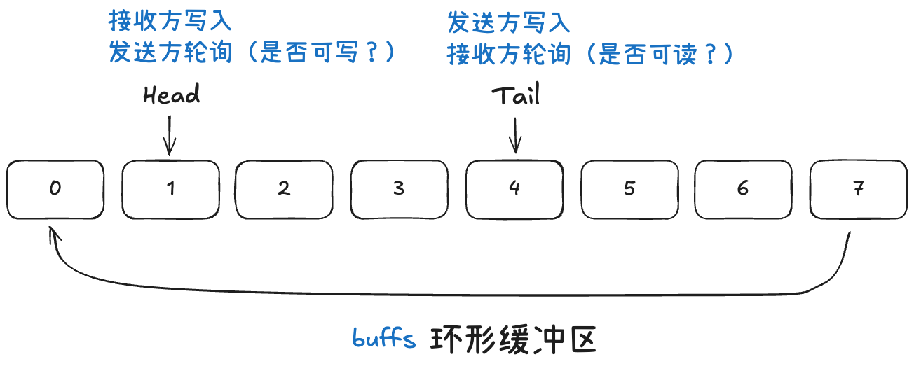
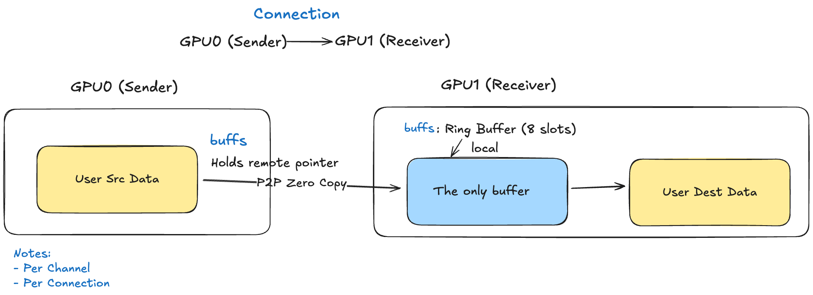
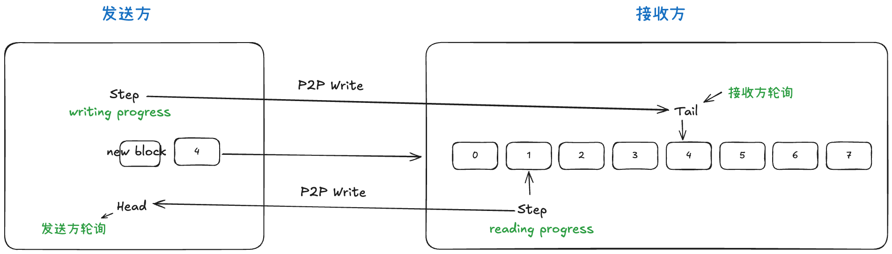
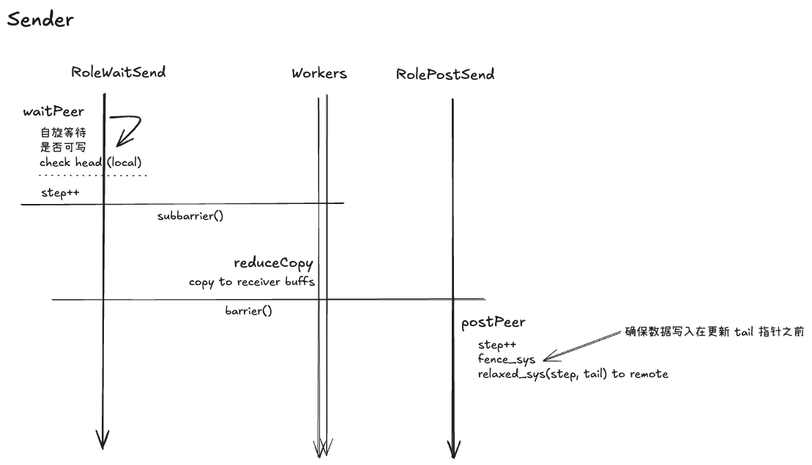
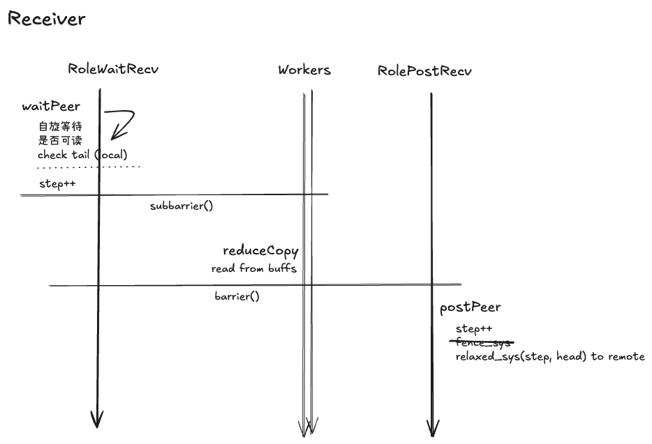
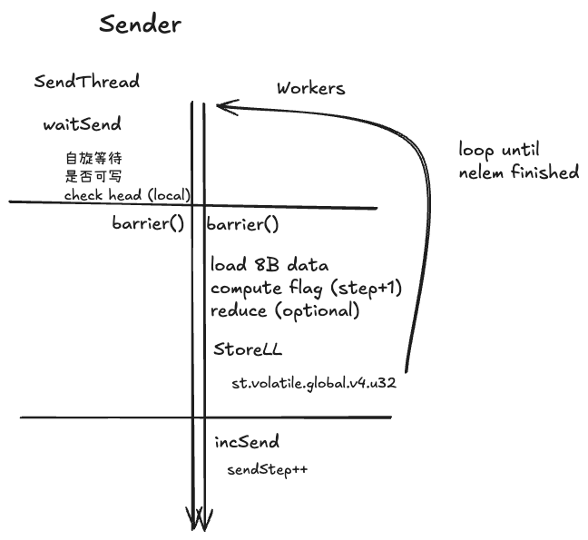
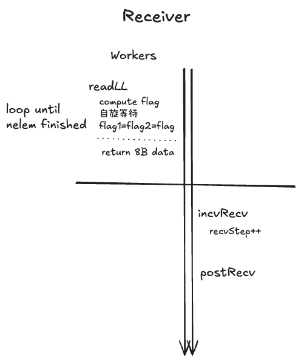
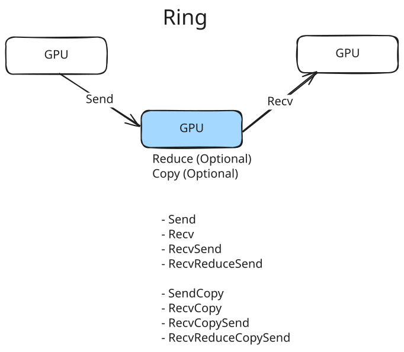
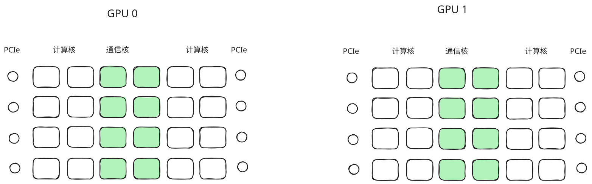

## Ring Buffer - 流控

基本概念:


考虑到GPU0和GPU1的连接：





```c
struct ncclConnInfo {
  // 缓冲区指针数组（每种协议一个）
  char *buffs[NCCL_NUM_PROTOCOLS]; // Local for recv, remote for send
  void* mhandles[NCCL_NUM_PROTOCOLS];

  // 流控计数器
  uint64_t *tail;     // Local for recv, remote for send
  uint64_t *head;     // Local for send, remote for recv

  // 元信息
  int flags;          // 直接通信 / 其他标志
  int shared;         // 缓冲区是否共享
  int stepSize;       // SIMPLE 协议的 step 大小

  // 直接通信相关（暂时忽略）
  void **ptrExchange;
  uint64_t* redOpArgExchange;
  struct ncclConnFifo* connFifo;

  // 本地状态
  uint64_t step;      // 当前的 step
  uint64_t llLastCleaning;
  ncclNetDeviceHandle_t netDeviceHandle;
};
```

## Simple

- 默认缓冲区大小：4MB
- 每个 slot：4MB/8 = 512KB






变种：
- 如果 thread 够多（data 够大），单独分配有 WARP 做 post
- Ring 只有一个 Send/Recv，但是 Tree 会维护多个

## LL

从外到内,LL Protocol 的数据结构如下:

```
🔷 环形缓冲区 (Ring Buffer)
  ├─ 总大小: buffSizes[NCCL_PROTO_LL] (默认 512 KB)
  ├─ 作用: 支持流水线传输,让发送/接收异步工作
  └─ 划分成 8 个 slot (NCCL_STEPS = 8)
      ↓
    🔶 Step (流控单元)
      ├─ 大小: buffSize / NCCL_STEPS (默认 64 KB)
      ├─ 作用: 粗粒度流控单元 (waitSend/postRecv)
      └─ 包含 stepLines 个 line (默认 4096 个)
          ↓
        🔹 Line (传输单元)
          ├─ 大小: 16 字节
          ├─ 组成: 8 字节数据 + 8 字节标志
          ├─ 作用: LL 的原子传输单元,readLL/storeLL 的操作对象
          └─ 包含 EltPerLine 个元素 = 8 / sizeof(T)
              ↓
            🔸 Element (用户数据)
              ├─ 大小: sizeof(T) (如 float32 = 4 字节)，一个 Line 包含 2 个 float32
              └─ 作用: 用户数据的基本单位
```


```
╔═══════════════════════════════════════════════════════════════╗
║  Ring Buffer: buffSizes[NCCL_PROTO_LL]                        ║
║  (Default: 512 KB)                                            ║
╠═══════════════════════════════════════════════════════════════╣
║ ┌─────┬─────┬─────┬─────┬─────┬─────┬─────┬─────┐             ║
║ │slot0│slot1│slot2│slot3│slot4│slot5│slot6│slot7│─┐           ║
║ └─────┴─────┴─────┴─────┴─────┴─────┴─────┴─────┘ │           ║
║   └───────────────────────────────────────────────┘(circular) ║
║   each slot = 1 Step (Default: 64 KB)                         ║
╚═══════════════════════════════════════════════════════════════╝
          ↓ zoom into one Step (slot 0)
╔═══════════════════════════════════════════════════════════════╗
║  Step: stepLines lines                                        ║
║  (Default: 4,096 lines = 64 KB)                               ║
╠═══════════════════════════════════════════════════════════════╣
║ line 0  ┌────────┐                                            ║
║ line 1  ├────────┤                                            ║
║ line 2  ├────────┤                                            ║
║  ...    │  ...   │                                            ║
║ line N  └────────┘                                            ║
║                                                               ║
║ offset = (step % NCCL_STEPS) × stepLines                      ║
╚═══════════════════════════════════════════════════════════════╝
          ↓ zoom into one Line
╔═══════════════════════════════════════════════════════════════╗
║  Line: ncclLLFifoLine (16 B)                                  ║
╠═══════════════════════════════════════════════════════════════╣
║  ┌────────┬───────┬────────┬───────┐                          ║
║  │ data1  │-flag1-│ data2  │-flag2-│                          ║
║  │  4B    │  4B   │  4B    │  4B   │                          ║
║  └────────┴───────┴────────┴───────┘                          ║
║  payload ratio: 50%                                           ║
╚═══════════════════════════════════════════════════════════════╝
          ↓ Element mapping
╔═══════════════════════════════════════════════════════════════╗
║  Element to Line: EltPerLine = 8 / sizeof(T)                  ║
╠═══════════════════════════════════════════════════════════════╣
║  float32 (4B):  ┌───────┬───────┐                             ║
║                 │ elt0  │ elt1  │ (2 per line)                ║
║                 └───────┴───────┘                             ║
║                                                               ║
║  float16 (2B):  ┌────┬────┬────┬────┐                         ║
║                 │ e0 │ e1 │ e2 │ e3 │ (4 per line)            ║
║                 └────┴────┴────┴────┘                         ║
║                                                               ║
║  float8 (1B):   ┌──┬──┬──┬──┬──┬──┬──┬──┐                     ║
║                 │e0│e1│e2│e3│e4│e5│e6│e7│ (8 per line)        ║
║                 └──┴──┴──┴──┴──┴──┴──┴──┘                     ║
╚═══════════════════════════════════════════════════════════════╝
```





## Ring



```

```

```
Initial State
Input Buffer
GPU0: 00/01/02/03
GPU1: 10/11/12/13
GPU2: 20/21/22/23
GPU3: 30/31/32/33

Output Buffer
GPU0: N/A
GPU1: N/A
GPU2: N/A
GPU3: N/A

---
Step 0: directSend
Output Buffer
GPU0(chunk3): __/__/32/__
GPU1(chunk0): __/__/__/03
GPU2(chunk1): 10/__/__/__
GPU3(chunk2): __/21/__/__

---
Step 1: directRecvReduceDirectSend
Output Buffer
GPU0(chunk2): __/(21+31)/32/__
GPU1(chunk3): __/__/(02+32)/03
GPU2(chunk0): 10/__/__/(03+13)
GPU3(chunk1): (10+20)/21/__/__

---
Step 2: directRecvReduceDirectSend
Output Buffer
GPU0(chunk1): (30+10+20)/21+31/32/__
GPU1(chunk2): __/01+21+31/02+32/03
GPU2(chunk3): 10/__/(12+02+32)/03+13
GPU3(chunk0): (10+20)/21/__/(23+13+03)

---
Step 3: directRecvReduceCopyDirectSend
Output Buffer
GPU0(chunk0): (30+10+20)/(31+21)/32/sum3/
GPU1(chunk1): sum0/(01+31+21)/(02+32)/03
GPU2(chunk2): 10/sum1/(12+02+32)/(13+03)
GPU3(chunk3): (10+20)/21/sum2/(23+13+03)

recvbuff:
GPU0: sum0/__/__/__
GPU1: __/sum1/__/__
GPU2: __/__/sum2/__
GPU3: __/__/__/sum3

---
AllGather
---
Step 4: directRecvCopyDirectSend
Output Buffer
GPU0(chunk3): (30+10+20)/(31+21)/sum2/sum3
GPU1(chunk0): sum0/(01+31+21)/(02+32)/sum3
GPU2(chunk1): sum0/sum1/(12+02+32)/(13+03)
GPU3(chunk2): (10+20)/sum1/sum2/(23+13+03)

recvbuff:
GPU0: sum0/__/__/sum3
GPU1: sum0/sum1/__/__
GPU2: __/sum1/sum2/__
GPU3: __/__/sum2/sum3

---
Step 5: directRecvCopyDirectSend
Output Buffer
GPU0(chunk2): (30+10+20)/sum1/sum2/sum3
GPU1(chunk3): sum0/(01+31+21)/sum2/sum3
GPU2(chunk0): sum0/sum1/(12+02+32)/sum3
GPU3(chunk1): sum0/sum1/sum2/(23+13+03)

recvbuff:
GPU0: sum0/__/sum2/sum3
GPU1: sum0/sum1/__/sum3
GPU2: sum0/sum1/sum2/__
GPU3: __/sum1/sum2/sum3

---
Step 6: directRecv
Output Buffer
GPU0(chunk1): sum0/sum1/sum2/sum3
GPU1(chunk2): sum0/sum1/sum2/sum3
GPU2(chunk3): sum0/sum1/sum2/sum3
GPU3(chunk0): sum0/sum1/sum2/sum3

recvbuff:
GPU0: sum0/sum1/sum2/sum3
GPU1: sum0/sum1/sum2/sum3
GPU2: sum0/sum1/sum2/sum3
GPU3: sum0/sum1/sum2/sum3
```

