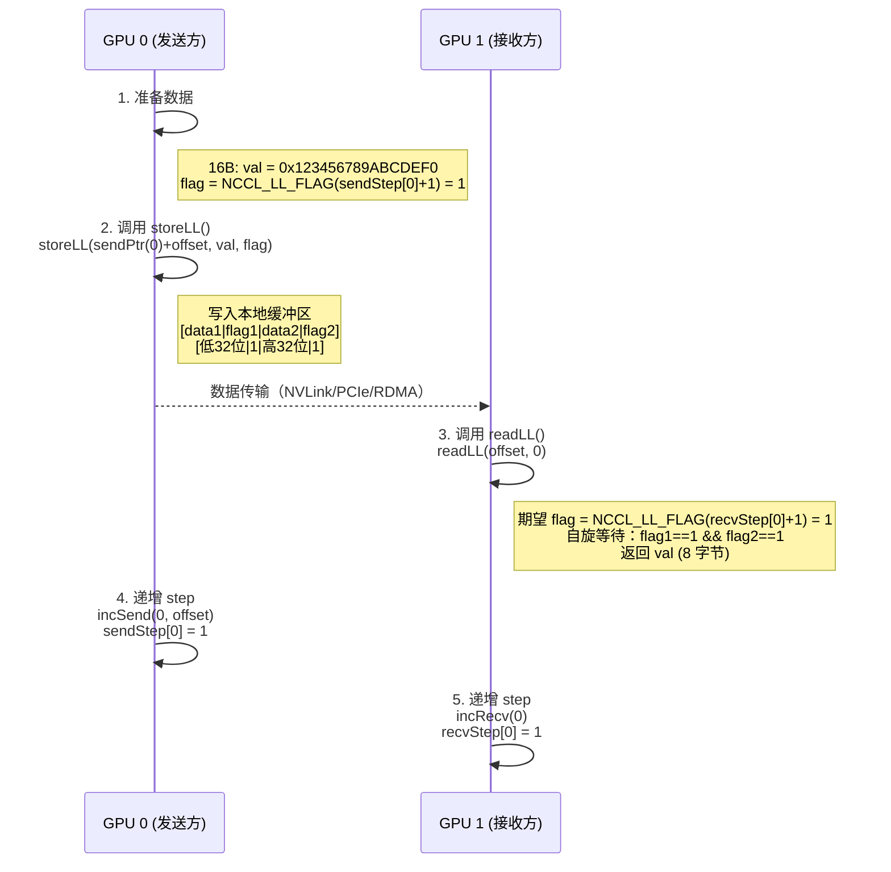
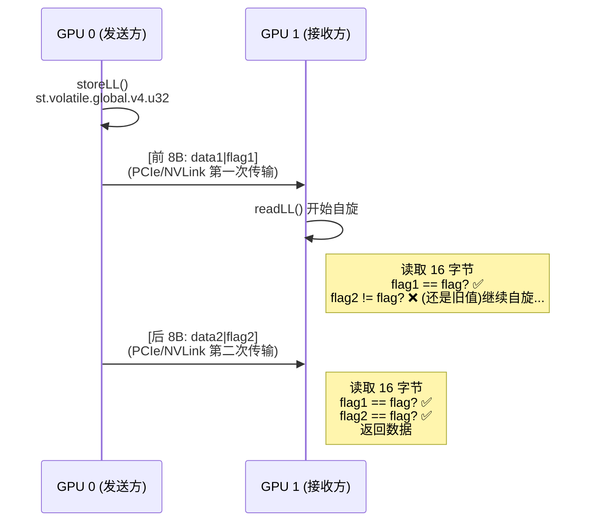
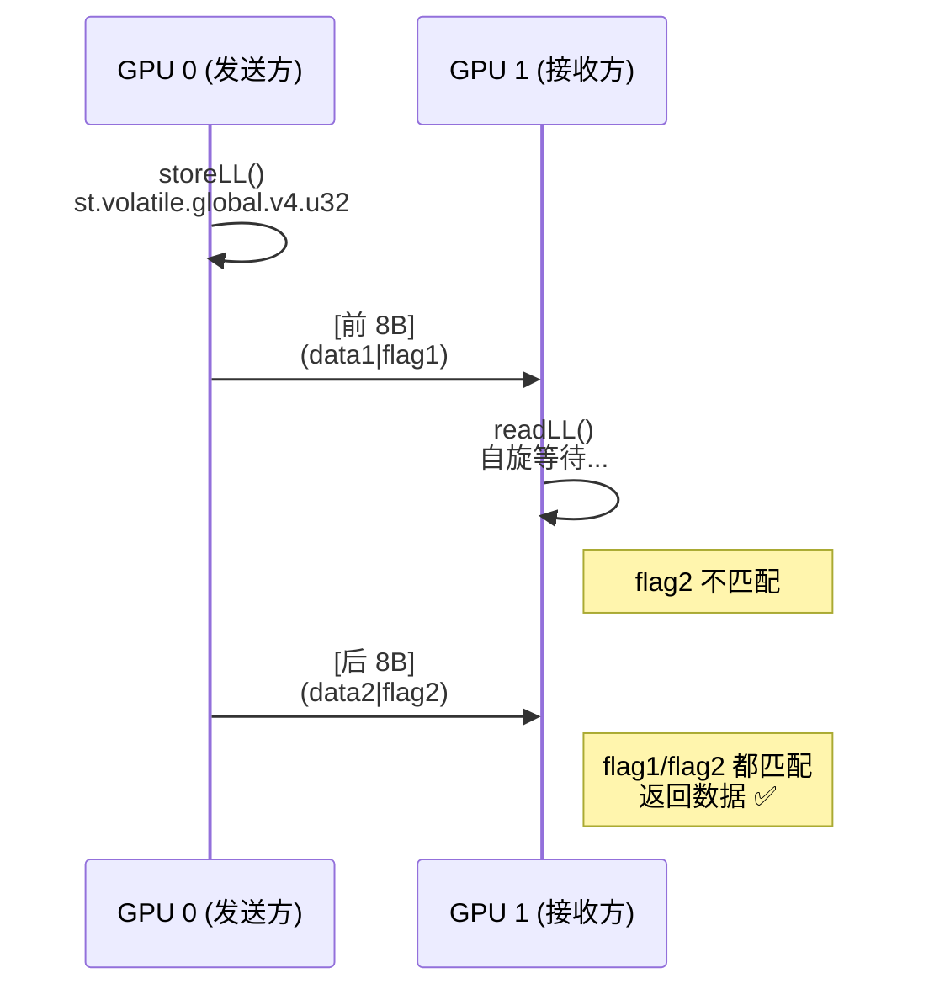
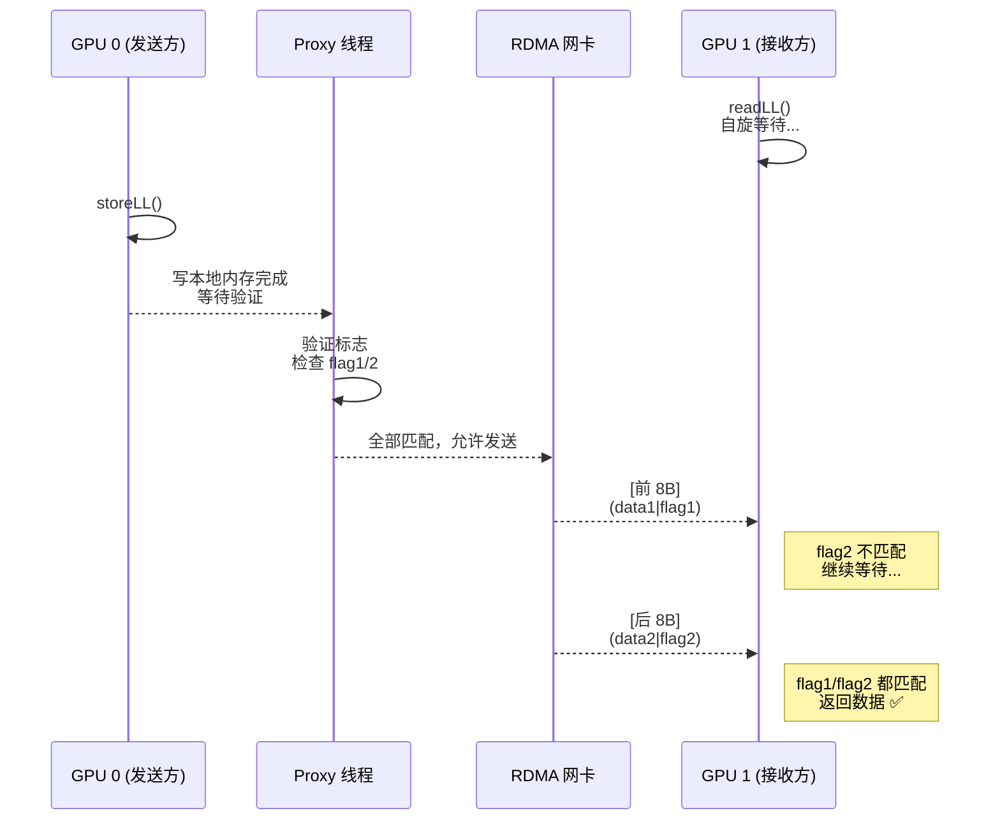

# 03 - 双标志位机制详解

## 引言

第二章建立了 LL Protocol 的"数据地图"：16 字节 line、交错布局的双标志位、stepLines 桥梁作用。本章深入**实现细节**：一个 line 如何从发送方安全地到达接收方？

**本章的三个核心问题**：
1. storeLL 如何保证"写入的数据和标志是配对的"？
2. readLL 如何保证"读到的是完整数据"？
3. 节点内和节点间有什么差异？

---

## 第一部分：从问题出发 - 为什么需要双标志位？

### 场景设定：一个 line 的旅程

假设 GPU 0 要向 GPU 1 发送一个 line（16 字节）。

**什么是 storeLL 和 readLL？**

- **storeLL**：发送方用来写入一个 line 的函数
  - 函数签名：`__device__ void storeLL(union ncclLLFifoLine* dst, uint64_t val, uint32_t flag)`
  - 输入：目标地址、8 字节数据、标志值
  - 作用：将数据和标志写入 line

- **readLL**：接收方用来读取一个 line 的函数
  - 函数签名：`__device__ uint64_t readLL(int offset, int i)`
  - 输入：line 的偏移量、peer 索引
  - 作用：读取 line，验证标志，返回 8 字节数据

**通信流程**：



**关键点**：
   - 发送方写入的 flag 和接收方期望的 flag **必须匹配**
   - 这保证了接收方读到的是"当前 step 的数据"，而不是"旧数据"

**核心挑战**：如何保证接收方读到的是"完整的 16 字节"，而不是"部分数据"？

### 原子性的约束

**节点间（RDMA）**：只承诺 8 字节写的原子性，16 字节数据可能会被拆成两个 8 字节写入。

**节点内（NVLink/PCIe）**：可能硬件支持 16 字节原子写入，但 LL 的实现刻意不依赖超过 8 字节的原子语义，仍按“两次 8 字节”来组织写入与校验。

要在这种前提下保证整条 16B line 的完整性，答案就是：双标志位 + 半行交错布局。

NCCL 在类型定义旁的注释明确了这一设计取向（要么“连续块可见”，要么“8B 原子”）：
[src/include/device.h:70-82](https://github.com/NVIDIA/nccl/blob/v2.28.7-1/src/include/device.h#L70-L82)：

```c
union ncclLLFifoLine {
  /* Flags have to be *after* data, because otherwise, an incomplete receive
     from the network may receive the flag but not the data.
     Note this is assuming that either we receive contiguous chunks of data
     (sockets) or data is written with an atomicity of 8 bytes (IB/RDMA). */
```

## 第二部分：storeLL - 如何写入一个 line？

### 设计目标

- **节点内和节点间**：使用相同的代码
- **保证配对**：每个 8 字节数据都有自己的标志
- **便于验证**：接收方可以通过双标志位验证完整性

### 实现：PTX 向量写指令

**代码**（[src/device/prims_ll.h:126-128](https://github.com/NVIDIA/nccl/blob/v2.28.7-1/src/device/prims_ll.h#L126-L128)）：
```cpp
__device__ void storeLL(union ncclLLFifoLine* dst, uint64_t val, uint32_t flag) {
  asm volatile("st.volatile.global.v4.u32 [%0], {%1,%2,%3,%4};"
    :: "l"(&dst->i4),
       "r"((uint32_t)val),      // data1 (低 32 位)
       "r"(flag),                // flag1
       "r"((uint32_t)(val>>32)), // data2 (高 32 位)
       "r"(flag)                 // flag2
    : "memory");
}
```

**逐步拆解**：

**1. 输入参数**：
- `dst`：目标 line 的地址
- `val`：8 字节有效数据（`uint64_t`）
- `flag`：当前 step 的标志值

**2. PTX 指令**：`st.volatile.global.v4.u32`
- `st`：store（写入）
- `volatile`：禁止编译器优化，保证每次都真实写入，确保对其他观察者可见
- `global`：写入全局内存（GPU 内存）
- `v4.u32`：向量操作，一次发出 4 个 `uint32_t` 写入请求（总共 16 字节）

**3. 参数顺序**：`{data1, flag1, data2, flag2}`
- 与 `ncclLLFifoLine` 的内存布局完全一致
- `val` 被拆成低 32 位（`data1`）和高 32 位（`data2`）
- 两个标志都是同一个值（`flag`）

**4. 实际传输行为**：
- 节点间（RDMA）：拆成两个 8B RDMA 写（前 8B：`data1|flag1`；后 8B：`data2|flag2`）。
- 节点内（NVLink/PCIe）：实现按 8B 粒度设计，不依赖 16B 原子；常见实现同样体现为两个 8B 事务可见。

**关键洞察**：
- storeLL 不保证"16 字节原子写入"
- 它只保证"数据和标志是配对的"
- 完整性验证交给 readLL

### GPU 端的内存语义：依赖 volatile PTX 指令

LL Protocol 的 `storeLL` 和 `readLL` 使用 `volatile` PTX 指令（`st.volatile.global` 和 `ld.volatile.global`），但**不使用显式的 `__threadfence()` 或 `__threadfence_system()`**。

**节点内（NVLink/PCIe）**：
- `volatile` 指令防止编译器优化（不会合并写、不会缓存读）
- 底层硬件（NVLink/PCIe）自然提供写入的最终可见性
- 接收方通过自旋轮询观察到写入完成

**节点间（RDMA）**：
- `volatile` 同样防止编译器优化
- 但 GPU 写入对 RDMA 网卡的可见性**不由 GPU 保证**
- **Proxy 线程**在 CPU 侧轮询双标志，这本身就是一个隐式的内存可见性屏障
- 只有当 Proxy 在 CPU 侧观察到标志更新后，才发起 RDMA，确保网卡读到的是最新数据

**关键点**：不使用 `__threadfence_system()` 的设计考量：
- 如果在 GPU 侧每次 `storeLL` 都调用 `__threadfence_system()`，会显著增加延迟
- NCCL 将**内存可见性同步**推迟到 Proxy 线程：Proxy 在 CPU 侧轮询标志本身就构成了可见性保证
- 这种"延迟同步"策略让 GPU 侧的 `storeLL` 保持高效，同时确保 RDMA 发送前数据已刷新到对 CPU/网卡可见的内存层次

---

## 第三部分：readLL - 如何验证数据完整性？

### Flag 的计算：把 step 映射为“版本号”

在讲 readLL 的实现之前，我们需要理解**期望的 flag 是怎么算出来的**。

**代码**（[src/device/prims_ll.h:43-44](https://github.com/NVIDIA/nccl/blob/v2.28.7-1/src/device/prims_ll.h#L40-L44)）：
```cpp
inline __device__ uint32_t recvFlag(int i) {
  return NCCL_LL_FLAG(recvStep[i] + 1);
}
inline __device__ uint32_t sendFlag(int i) {
  return NCCL_LL_FLAG(sendStep[i] + 1);
}
```

**NCCL_LL_FLAG 的定义**（[src/include/device.h:100](https://github.com/NVIDIA/nccl/blob/v2.28.7-1/src/include/device.h#L99-L103)）：
```cpp
#define NCCL_LL_FLAG(a) ((uint32_t)(a))  // 正常模式：直接转换为 uint32_t
```

#### 为什么是 `step + 1`？

- `recvStep[i]` 和 `sendStep[i]` 记录的是**已完成的 step 数量**
- flag 代表**正在处理的 step**，也就是 `step + 1`
- 从 1 开始（而非 0）避免与初始化值混淆

**例子**：
```
recvStep[0] = 0（未读过数据） → recvFlag(0) = 1（期望第一个 step 的 flag）
recvStep[0] = 1（读完 step 0）→ recvFlag(0) = 2（期望第二个 step 的 flag）
recvStep[0] = 2（读完 step 1）→ recvFlag(0) = 3（期望第三个 step 的 flag）
```

每次递增后，flag 自然加 1，保证发送方和接收方对同一个 step 使用相同的 flag 值。

#### step 递增的时机

**接收方**（[src/device/prims_ll.h:72-74](https://github.com/NVIDIA/nccl/blob/v2.28.7-1/src/device/prims_ll.h#L72-L74)）：
```cpp
inline __device__ void incRecv(int i) {
  recvStep[i] += 1;
}
```
- 在 `readLL` **之后**调用
- 表示"已读完当前 step"

**发送方**（[src/device/prims_ll.h:80-87](https://github.com/NVIDIA/nccl/blob/v2.28.7-1/src/device/prims_ll.h#L80-L87)）：
```cpp
inline __device__ void incSend(int i, int offset) {
  // LL Cleanup : write all flags in the slice to make sure we don't have
  // data corruption when flag loops over.
  if ((sendStep[i] & NCCL_LL_CLEAN_MASK) == NCCL_LL_CLEAN_MASK) {
    for (int o = offset; o<stepLines; o+=nthreads)
      storeLL(sendPtr(i)+o, 0, sendFlag(i));
  }
  sendStep[i]++;
}
```

#### 清理机制：防止 flag 回绕造成的数据污染 <TBD>

在发送方 `incSend` 函数中，我们看到一段特殊的清理代码：

```cpp
if ((sendStep[i] & NCCL_LL_CLEAN_MASK) == NCCL_LL_CLEAN_MASK) {
  for (int o = offset; o<stepLines; o+=nthreads)
    storeLL(sendPtr(i)+o, 0, sendFlag(i));
}
```

你可能会问：为什么要写入一堆 0？这看起来像是在"清空"数据，但实际目的完全不同。

#### 问题的根源：flag 会回绕

让我们先理解问题的核心：

1. **flag 是 32 位整数**（`uint32_t`），最大值是 `0xffffffff`（约 42.9 亿）
2. **step 是 64 位计数器**（`uint64_t`），实际上永远不会回绕，需要很久很久
3. **环形缓冲区只有 8 个 slot**，会不断重复使用

现在考虑这个场景：
```
初始状态：step = 0, flag = 1, 写入 slot 0
... 42.9 亿个 step 后 ...
当前状态：step = 0x100000000（2^32），flag 回绕变成 1，又要写入 slot 0
```

**问题来了**：slot 0 中可能还残留着 42.9 亿个 step 之前的 flag = 1！

如果我们只更新了部分 line（比如只发送了 8 字节），剩余的 line 中仍保留着旧的 flag = 1。当接收方检查时，会误以为这些 line 的数据"已就绪"，但实际上读到的是 42.9 亿个 step 之前的垃圾数据。

#### 解决方案：定期"刷新"所有 flag

清理机制的核心思想很简单：**在 flag 回绕之前，把缓冲区中所有的 flag 都刷新一遍**。

具体做法：
```cpp
storeLL(sendPtr(i)+o, 0, sendFlag(i));
```
- **数据部分写 0**：无所谓写什么，反正不是有效数据（"we don't really care about the data"）
- **flag 部分写当前值**：这才是关键！用当前的 flag 值覆盖可能残留的旧 flag

#### 清理的时机：为什么是 0x7ffffff8？

`NCCL_LL_CLEAN_MASK = 0x7ffffff8` 看起来是个奇怪的数字，让我们拆解它：

```
二进制：0111 1111 1111 1111 1111 1111 1111 1000
        ↑                                    ↑
        最高位是0                            低3位是000
```

这个掩码的巧妙之处：
1. **低 3 位是 000**：确保能被 8 整除（与 `NCCL_STEPS = 8` 对齐）
2. **在 32 位周期内会匹配两次**：
   - 第一次：`sendStep = 0x7ffffff8` 到 `0x7fffffff`（2^31 附近）
   - 第二次：`sendStep = 0xfffffff8` 到 `0xffffffff`（2^32 回绕前）

为什么要清理两次？**双重保险**。NVIDIA 开发者的原话："This will reset flags twice in the complete 32-bit cycle"。即使第一次清理因为某种原因失败了，第二次还有机会补救。

#### 清理窗口：连续 8 个 step

当触发清理条件时，实际上会连续 8 个 step 都执行清理：
```
sendStep = 0x7ffffff8：清理 slot 0 的所有 line
sendStep = 0x7ffffff9：清理 slot 1 的所有 line
...
sendStep = 0x7fffffff：清理 slot 7 的所有 line
```

这确保了环形缓冲区的所有 8 个 slot 都被完整清理一次。代码中的断言验证了这个对齐：
```cpp
static_assert(NCCL_LL_CLEAN_MASK % NCCL_STEPS == 0);  // 确保能被 8 整除
```

#### 开销分析

你可能担心清理的开销。实际上：
- **频率极低**：每 2^31 个 step（约 21.5 亿）才清理一次
- **分摊到线程**：`for (int o = offset; o<stepLines; o+=nthreads)` 由多个线程并行执行
- **必要的代价**：这是保证正确性的最小开销

**关键洞察**：
- flag 是 step 的"版本号"，通过 flag 匹配确保读到的是当前 step 的数据
- `step + 1` 的设计让 flag 从 1 开始（避免与初始化值 0 混淆）
- **清理机制防止 flag 回绕污染**：32 位 flag 会回绕，但 64 位 step 不会，需要定期刷新防止读到旧数据
- **双重清理提供双保险**：在 2^31 和 2^32 附近各清理一次，即使第一次失败也有补救机会
- **清理的本质**：不是清空数据，而是用当前 flag 覆盖所有可能残留的旧 flag

---

现在我们理解了 flag 的计算，接下来看 readLL 如何使用 flag 验证数据完整性。

### `readLL` 的设计目标

- **自旋等待**：直到双标志位都匹配
- **原子读取**：一次读取 16 字节
- **返回有效数据**：只返回 8 字节（`data1 + data2`）

### 实现：PTX 向量读指令 + 自旋循环

**代码**（[src/device/prims_ll.h:89-100](https://github.com/NVIDIA/nccl/blob/v2.28.7-1/src/device/prims_ll.h#L89-L100)）：
```cpp
__device__ uint64_t readLL(int offset, int i) {
  union ncclLLFifoLine* src = recvPtr(i) + offset;  // 1. 定位 line
  uint32_t flag = recvFlag(i);                       // 2. 期望的标志值
  uint32_t data1, flag1, data2, flag2;
  int spins = 0;
  do {
    asm volatile("ld.volatile.global.v4.u32 {%0,%1,%2,%3}, [%4];"  // 3. 读取 16 字节
      : "=r"(data1), "=r"(flag1), "=r"(data2), "=r"(flag2)
      : "l"(&src->i4) : "memory");
    if (checkAbort(abort, 1, spins)) break;          // 4. 检查中止
  } while ((flag1 != flag) || (flag2 != flag));      // 5. 自旋条件
  uint64_t val64 = data1 + (((uint64_t)data2) << 32); // 6. 组合数据
  return val64;
}
```

**逐步拆解**：

**1. 定位 line**：
```cpp
union ncclLLFifoLine* src = recvPtr(i) + offset;
```
- `recvPtr(i)`：获取 recv peer `i` 的缓冲区起始地址
- `+ offset`：加上当前 line 的偏移量
- 回顾第二章：`offset = (recvStep[i] % NCCL_STEPS) × stepLines + 线程内偏移`

**2. 计算期望的标志值**：
```cpp
uint32_t flag = recvFlag(i);
```
- 前面已经讲过：`recvFlag(i) = NCCL_LL_FLAG(recvStep[i] + 1)`
- 这个值代表"我期望读到的是哪个 step 的数据"

**3. 读取 16 字节**：
```cpp
asm volatile("ld.volatile.global.v4.u32 {%0,%1,%2,%3}, [%4];"
  : "=r"(data1), "=r"(flag1), "=r"(data2), "=r"(flag2)
  : "l"(&src->i4) : "memory");
```
- PTX 指令：`ld.volatile.global.v4.u32`
- 一次读取 4 个 `uint32_t`：`data1, flag1, data2, flag2`
- `volatile`：每次都从内存读取，不使用缓存

**4. 检查中止**：
```cpp
if (checkAbort(abort, 1, spins)) break;
```
- 检测超时或用户中止
- `spins`：自旋次数计数器

**5. 自旋条件**：`(flag1 != flag) || (flag2 != flag)`
```cpp
} while ((flag1 != flag) || (flag2 != flag));
```
- **只要有一个标志不匹配，就继续等待**
- 这是双标志位的核心：双重验证

**6. 组合数据**：
```cpp
uint64_t val64 = data1 + (((uint64_t)data2) << 32);
return val64;
```
- `data1`（低 32 位）+ `data2`（高 32 位）→ `uint64_t`
- 只返回有效数据（8 字节），标志不返回

---

## 第四部分：节点内通信 - 同样按 8B 语义设计

### 为什么节点内也需要双标志位？

很多人会认为"节点内通信应该更简单"，但实际上：

**节点内和节点间使用完全相同的 storeLL/readLL 代码，原因不是"为了统一接口"，而是 correctness 本身需要。**

#### 设计前提

LL 在节点内也不依赖 16B 原子写入；`st.volatile.global.v4.u32` 发出的 16B 写在可见性上通常体现为两次 8B 事务，中间可能存在极短延迟。readLL 必须等待两个标志同时匹配后再返回。

**具体流程**：



#### CUDA 不提供 128 位原子性保证

**CUDA 编程指南明确说明**：
- 只保证 32 位和 64 位的原子操作
- **没有** 128 位原子操作的保证
- `st.volatile.global.v4.u32` 只是一次性发出 4 个 32 位写入请求
- **不保证** 4 个写入会被原子地提交

参考注释：
```c
/* Note this is assuming that either we receive contiguous chunks of data
   (sockets) or data is written with an atomicity of 8 bytes (IB/RDMA). */
```

关键点：实现只依赖 **8 字节** 粒度的可见性设计，不依赖 16B 原子。

#### 节点内的自旋会发生吗？

**会的**。节点内延迟虽然更小，但 GPU 侧依然只能观察到 8 字节粒度的完成事件，所以 readLL 必须循环检查，直到 `flag1/flag2` 同时更新。通常这只是几次轮询，但设计上不能省略。

#### 对比节点间

节点间（RDMA）同样遵循 8 字节原子性，不过传输途径更长，两个半行数据的到达间隔可能被网络因素拉长。因此 readLL 的自旋循环在节点间场景下可能执行更多次，但逻辑完全一致。

### 数据流

**发送方（GPU 0）**：
```
1. 调用 storeLL(dst, val, flag)
2. PTX 指令：st.volatile.global.v4.u32
3. 发出两次 8 字节写入请求
   - 第一次：data1 + flag1（前 8 字节）
   - 第二次：data2 + flag2（后 8 字节）
4. volatile 语义确保写入最终可见
```

**接收方（GPU 1）**：
```
1. 调用 readLL(offset, 0)
2. PTX 指令：ld.volatile.global.v4.u32
3. 读取 16 字节
4. 检查 flag1 == flag && flag2 == flag
 5. 如果不匹配，继续自旋
6. 如果匹配，返回 data1 + data2
```

### 时序图



**关键点**：
- 延迟极短，但逻辑与节点间完全相同
- 双标志位是必需的，不是可选的
- 这是 correctness，不是优化

---

## 第五部分：节点间通信 - RDMA 与 Proxy 把关

节点间通信与节点内的**逻辑完全相同**，但增加了 **Proxy 验证**这一关键步骤。

### 发送路径的三个阶段

#### 阶段 1：GPU 写本地缓冲区

```
GPU 0 调用 storeLL()
  ↓
写入本地 GPU 内存（分两次 8 字节，与节点内相同）
  ↓
[data1|flag1|data2|flag2] 已在本地缓冲区
  ↓
volatile 语义确保写入最终可见
```

**关键点**：
- `storeLL` 写入的是本地 GPU 缓冲，不是直接远端写
- GPU 端不使用显式 `__threadfence_system()`（避免每次写入的同步开销）
- RDMA 由 Proxy 在确保内存可见性后才触发

#### 阶段 2：Proxy 线程确保可见性

**为什么需要 Proxy？**
GPU 写入完成后，**不保证对 CPU/RDMA 网卡的可见性**。GPU 的写操作可能还停留在 GPU 内部的写缓冲或 L2 缓存中，如果直接发起 RDMA，网卡通过 PCIe 读取时可能看到的是旧数据。

**Proxy 的双重作用**：
1. **内存可见性屏障**：在 CPU 侧轮询标志，当 CPU 能读到更新后的标志时，意味着 GPU 写入已刷新到对 CPU/网卡可见的内存层次
2. **正确性验证**：检查双标志位匹配，确保 16 字节完整写入（与 GPU 侧的 readLL 逻辑对应）

**代码**（[src/transport/net.cc:1296-1326](https://github.com/NVIDIA/nccl/blob/v2.28.7-1/src/transport/net.cc#L1296-L1326)，省略无关逻辑）：
```cpp
// 1. 计算期望的 flag（与 GPU 侧的 sendFlag 完全对应）
uint32_t flag = NCCL_LL_FLAG(sub->base + sub->transmitted + 1);

// 2. 遍历所有 line，检查双标志
int nFifoLines = DIVUP(size, sizeof(union ncclLLFifoLine));
union ncclLLFifoLine* lines = (union ncclLLFifoLine*)buff;
int ready = 1;
for (int i=0; i<nFifoLines; i++) {
  volatile uint32_t *f1 = &lines[i].flag1;
  volatile uint32_t *f2 = &lines[i].flag2;
  if (f1[0] != flag || f2[0] != flag) {
    ready = 0;  // 任何一个 line 不匹配，标记为未就绪
    break;
  }
}

// 3. 验证通过才发送 RDMA
if (ready) {
  ncclNetIsend(...);  // 发起 RDMA 写
  sub->transmitted += args->sliceSteps;  // 递增已传输 step 数（LL 协议中 sliceSteps 恒为 1）
}
// 否则下次轮询重新验证
```

**关键点**：
- Proxy 的 flag 计算与 GPU 侧的 `sendFlag(i)` **完全同步**
- 验证失败 → 不发送 RDMA → 下次轮询重试
- 验证通过 → 发送 RDMA → 递增 `sub->transmitted`
- 这是 GPU-CPU-RDMA 内存一致性的桥梁

#### 阶段 3：RDMA 传输

```
RDMA 网卡读取 GPU 内存
  ↓
分两次 8 字节传输：
  第一次：[data1|flag1] (前 8 字节)
  第二次：[data2|flag2] (后 8 字节)
  ↓
写入远端 GPU 内存
```

**关键点**：
- RDMA 只保证 8 字节原子性
- 两次传输的**到达顺序无法保证**
- 这与节点内的逻辑完全相同，只是延迟更长

### 接收路径

```
GPU 1 调用 readLL()
  ↓
自旋等待：while ((flag1 != flag) || (flag2 != flag))
  ↓
场景 1：只有前 8 字节到达
  - flag1 == flag ✅
  - flag2 != flag ❌ (还是旧值)
  - 继续等待
  ↓
场景 2：16 字节完整到达
  - flag1 == flag ✅
  - flag2 == flag ✅
  - 返回数据
```

**与节点内的差异**：
- **逻辑完全相同**（都是自旋等待双标志位）
- **延迟更长**（跨节点链路涉及网卡/交换机）
- **自旋次数更多**（可能需要等待多个网络往返）

### 时序图



**关键观察**：
- Proxy 验证通过后，RDMA 才开始传输；
- 接收方可能先看到“前 8B 到达”的中间态；
- 双标志校验确保不会误读部分数据；
- 逻辑与节点内一致，仅延迟范围不同。

### 网络中断的容错

**问题场景**：第一个 8 字节到达，第二个 8 字节延迟（网络拥塞、丢包重传）

**LL 的处理**：
```
1. 第一个 8 字节到达：[data1|flag1]
   接收方看到：flag1 == flag ✅, flag2 != flag ❌
   → 继续等待

2. 网络延迟...

3. 第二个 8 字节到达：[data2|flag2]
   接收方看到：flag1 == flag ✅, flag2 == flag ✅
   → 返回数据
```

**关键洞察**：
- 接收方不会读到部分数据，**天然容错**
- 无论网络延迟多久，只要最终数据到达，就能正确读取
- 双标志位机制屏蔽了网络的不可靠性
- **这与节点内的逻辑完全相同**，只是延迟范围不同

---

## 总结：双标志位机制的精髓

**核心机制**：
1. **storeLL**：一条 PTX 指令（`st.volatile.global.v4.u32`）发出 4×32 位写入，交错排列为 `{data1, flag1, data2, flag2}`，底层分两次 8B 传输，不保证 16B 原子。
2. **readLL**：一条 PTX 指令（`ld.volatile.global.v4.u32`）读取 16B，自旋等待 `flag1 == flag && flag2 == flag`，只返回 8B 有效数据。
3. **Flag 计算**：`flag = NCCL_LL_FLAG(step + 1)`，作为版本号防止读到旧数据。
4. **清理机制**：`incSend` 在 flag 回绕前定期清理，防止旧 flag 污染新数据。

**节点内 vs 节点间**：
- **逻辑完全相同**（都是双标志验证 + 自旋等待）
- **节点内**：底层依赖 8B 原子语义，延迟纳秒级
- **节点间**：增加 Proxy 验证（确保 GPU 写对 RDMA 可见），延迟微秒级

**关键洞察**：
- 实现只依赖 8B 粒度的原子性与可见性
- 双标志为两个半行（我们称每个 8 字节为"半行"，便于理解；代码中并无此术语）各自建立就地确认，屏蔽底层乱序/部分完成
- Proxy 验证失败则不发送 RDMA，天然容错
- 节点内与节点间沿用同一实现是 correctness 需要，非仅为统一接口

---

**代码验证位置（GitHub 链接）**：
- storeLL 实现：[src/device/prims_ll.h:126-128](https://github.com/NVIDIA/nccl/blob/v2.28.7-1/src/device/prims_ll.h#L126-L128)
- readLL 主循环：[src/device/prims_ll.h:89-100](https://github.com/NVIDIA/nccl/blob/v2.28.7-1/src/device/prims_ll.h#L89-L100)
- recvFlag/sendFlag 定义：[src/device/prims_ll.h:40-44](https://github.com/NVIDIA/nccl/blob/v2.28.7-1/src/device/prims_ll.h#L40-L44)
- incRecv 实现：[src/device/prims_ll.h:72-74](https://github.com/NVIDIA/nccl/blob/v2.28.7-1/src/device/prims_ll.h#L72-L74)
- incSend 实现（含清理触发）：[src/device/prims_ll.h:80-87](https://github.com/NVIDIA/nccl/blob/v2.28.7-1/src/device/prims_ll.h#L80-L87)
- Proxy 双标志验证：[src/transport/net.cc:1296-1303](https://github.com/NVIDIA/nccl/blob/v2.28.7-1/src/transport/net.cc#L1296-L1303)
- Proxy 发送与步进（上下文）：[src/transport/net.cc:1310-1340](https://github.com/NVIDIA/nccl/blob/v2.28.7-1/src/transport/net.cc#L1310-L1340)
- ncclLLFifoLine 与注释：[src/include/device.h:70-82](https://github.com/NVIDIA/nccl/blob/v2.28.7-1/src/include/device.h#L70-L82)
- 清理相关宏与断言：[src/include/device.h:95-103](https://github.com/NVIDIA/nccl/blob/v2.28.7-1/src/include/device.h#L95-L103)

# Appendix

## 辅助函数: 从 step 到 line 的映射

LL Primitives 提供了几个关键的辅助函数,用于从 step 计算 offset 和指针([prims_ll.h:39-44](https://github.com/NVIDIA/nccl/blob/v2.28.7-1/src/device/prims_ll.h#L39-L44))。

### recvOffset / sendOffset

```cpp
inline __device__ int recvOffset(int i) {
  return (recvStep[i] % NCCL_STEPS) * stepLines;
}
inline __device__ int sendOffset(int i) {
  return (sendStep[i] % NCCL_STEPS) * stepLines;
}
```

**作用**: 计算当前 step 在环形缓冲区中的起始 offset (以 line 为单位)。

**参数 `i`**: peer 索引 (因为 `recvStep`/`sendStep` 是数组)

**例子**:
```
recvStep[0] = 0  → offset = (0 % 8) × 4096 = 0
recvStep[0] = 1  → offset = (1 % 8) × 4096 = 4096
recvStep[0] = 8  → offset = (0 % 8) × 4096 = 0 (重新开始)
```

### recvPtr / sendPtr

```cpp
inline __device__ union ncclLLFifoLine* recvPtr(int i) {
  return recvBuff[i] + recvOffset(i);
}
inline __device__ union ncclLLFifoLine* sendPtr(int i) {
  return sendBuff[i] + sendOffset(i);
}
```

**作用**: 获取当前 step 的起始 line 指针。这是 `readLL`/`storeLL` 的基地址。
注意返回值是 `union ncclLLFifoLine*`。

**例子**:
```cpp
// 从 peer 0 读取当前 step 的第 10 个 line
union ncclLLFifoLine* base = recvPtr(0);  // 当前 step 的起始地址
uint64_t data = readLL(10, 0);             // 读取偏移 10 的 line
```
