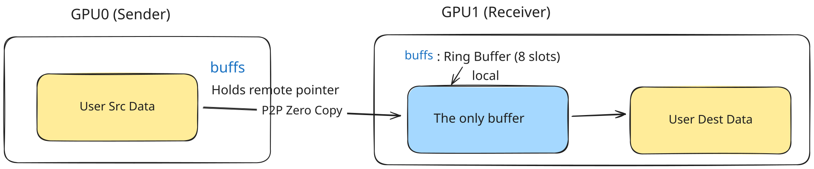
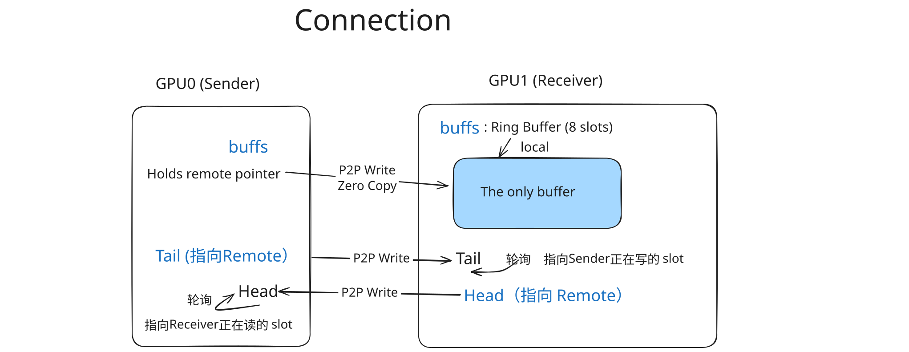

# NCCL Simple Protocol 数据结构详解

## 这篇文档要解决什么问题？

在第一章，我们建立了对 Simple Protocol 的整体认知：大块传输 + 粗粒度同步 = 高带宽。但这些概念还停留在"理论层面"。

**这一章要解决的核心问题**：
- **谁持有哪块内存？**（ring buffer 在哪个 GPU？）
- **谁在轮询谁？**（发送方看什么计数器？接收方看什么计数器？）
- **谁在更新谁？**（写入哪个计数器来通知对方？）

建立这个"内存与计数器"的清晰模型后，后续讲环形缓冲区与流控就会非常顺畅。

---

## 理解"连接"的概念

在 NCCL 中，**Connection 是从一个 GPU 到另一个 GPU 的单向通信通道**。

GPU 0 和 GPU 1 互相通信需要**两个独立的连接**：
- **GPU 0 → GPU 1**：GPU 0 的 Send Connection，GPU 1 的 Recv Connection
- **GPU 1 → GPU 0**：GPU 1 的 Send Connection，GPU 0 的 Recv Connection

这两个连接是独立的，各有各的缓冲区、各有各的计数器。

在 Ring AllReduce 中，每个 GPU 通常有：
- 1 个 Recv Connection（从前一个 GPU 接收）
- 1 个 Send Connection（向后一个 GPU 发送）

**关键**：`ncclConnInfo` 结构描述的是"一个方向"的连接。同样的字段（如 `buffs`、`tail`、`head`），在 Send Connection 和 Recv Connection 中的含义**完全不同**。

---

## ncclConnInfo：连接的核心信息

`ncclConnInfo` 是**描述一个单向 GPU 连接的所有信息**的结构体（[device.h:128-146](https://github.com/NVIDIA/nccl/blob/v2.28.7-1/src/include/device.h#L128-L146)）。

### P2P 传输模式说明

NCCL 支持两种 P2P 数据传输模式：
1. **P2P Write 模式**（默认，本文档描述）：ring buffer 在**接收方**内存，发送方通过 P2P **写入**
2. **P2P Read 模式**（Ampere+NVLink 优化）：ring buffer 在**发送方**内存，接收方通过 P2P **读取**
   - 通过 `NCCL_P2P_READ_ENABLE` 环境变量控制（[p2p.cc:308](https://github.com/NVIDIA/nccl/blob/v2.28.7-1/src/transport/p2p.cc#L308)）

**本文档统一使用 P2P Write 模式进行讲解**，因为它是更通用的模式，适用于所有硬件。如果你在 Ampere+NVLink 环境下调试时观察到不同的行为（如 buffs 指向发送方），那是因为 NCCL 使用了 P2P Read 优化。核心原理是相同的，只是数据流动方向相反。
### 结构定义

```c
struct ncclConnInfo {
  // 缓冲区指针数组（每种协议一个）
  char *buffs[NCCL_NUM_PROTOCOLS]; // Local for recv, remote for send
  void* mhandles[NCCL_NUM_PROTOCOLS];

  // 流控计数器
  uint64_t *tail;     // Local for recv, remote for send
  uint64_t *head;     // Local for send, remote for recv

  // 元信息
  int flags;          // 直接通信 / 其他标志
  int shared;         // 缓冲区是否共享
  int stepSize;       // SIMPLE 协议的 step 大小

  // 直接通信相关（暂时忽略）
  void **ptrExchange;
  uint64_t* redOpArgExchange;
  struct ncclConnFifo* connFifo;

  // 本地状态
  uint64_t step;      // 当前的 step
  uint64_t llLastCleaning;
  ncclNetDeviceHandle_t netDeviceHandle;
};
```

### 核心字段：指针方向性

注意代码注释中的关键信息：
- `buffs`：`Local for recv, remote for send`
- `tail`：`Local for recv, remote for send`
- `head`：`Local for send, remote for recv`

| 字段              | Description | Location |
| --------------- | ----------- | -------- |
| `buffs[SIMPLE]` | 缓冲区         | 接收方      |
| `tail`          | 写入计数器       | 接收方      |
| `head`          | 读取计数器       | 发送方      |

**为什么 tail 存储在接收方，head 存储在发送方？**

答案是：**让高频的轮询操作读取本地内存，让低频的更新操作写入远端内存**。

让我们看看操作频率：

- **轮询操作**（高频）：
  - 接收方需要**不断轮询** tail，看是否有新数据 → 如果 tail 在远端，需要频繁 P2P 读取，**很慢**
  - 发送方需要**不断轮询** head，看 slot 是否可重用 → 如果 head 在远端，需要频繁 P2P 读取，**很慢**

- **更新操作**（低频）：
  - 发送方**偶尔更新** tail（每传输一个 slice） → P2P 写入远端，可以接受
  - 接收方**偶尔更新** head（每读取一个 slice） → P2P 写入远端，可以接受

**如果设计反了会怎样**（错误设计）：
假如 tail 存储在发送方
- 接收方轮询**远端** tail（慢！P2P 读取）
- 发送方更新**本地** tail（虽然快但没用）
- 流控的性能瓶颈会非常严重

**这就是为什么这个设计如此精妙**：通过"反直觉"的存储位置，让轮询（高频操作）访问本地内存，最大化性能。

**另外，还需要注意的是**：GPU 0 → GPU 1 这个连接**只有 1 个 ring buffer**，位于 GPU 1（接收方）的内存中。



GPU 0 的 `buffs` 和 GPU 1 的 `buffs` 指向**同一块物理内存**：
- GPU 0 通过 P2P 直接写入 GPU 1 的内存
- **零拷贝**：没有中间缓冲，数据只传输一次



### 其他重要字段

- **`stepSize`**：每个 slot 的大小（**字节数**），通常是 `buffSizes[NCCL_PROTO_SIMPLE] / 8`（默认 512KB）
  - 设置位置：[p2p.cc:504](https://github.com/NVIDIA/nccl/blob/v2.28.7-1/src/transport/p2p.cc#L504)、[p2p.cc:547](https://github.com/NVIDIA/nccl/blob/v2.28.7-1/src/transport/p2p.cc#L547)
- **`step`**：当前的 step 计数器（本地副本，单调递增）

- **`ptrExchange` / `redOpArgExchange`**：用户缓冲区注册后，用于直接读写模式的指针交换（[prims_simple.h:737-820](https://github.com/NVIDIA/nccl/blob/v2.28.7-1/src/device/prims_simple.h#L737-L820)）

- **`connFifo`**：与 Host 侧 Proxy 的通信队列，用于网络传输（[collectives.h:70-78](https://github.com/NVIDIA/nccl/blob/v2.28.7-1/src/include/collectives.h#L70-L78)）

## ncclConnFifo：GPU ↔ Proxy 的通信队列

`ncclConnFifo` 是 Simple/LL/LL128 在“跨节点（经由网卡或代理线程）”路径上用于传递元数据的环形 FIFO，大小为 `NCCL_STEPS`。它与“数据缓冲区”（`buffs[NCCL_PROTO_*]`）并行存在，专门承担 GPU 与 Proxy 之间的轻量通信（大小、偏移等）。

### 结构与存放位置

```c
#define NCCL_MODE_NORMAL 0
#define NCCL_MODE_OFFSET 1
#define NCCL_MODE_PTR    2
struct ncclConnFifo {
  int     mode;   // 解释该槽位的寻址方式
  int     offset; // 字节偏移（mode=OFFSET 时生效）
  ssize_t size;   // 本步（或切片）的有效字节数；-1 表示空/已消费
  void*   ptr;    // 预留（mode=PTR），SIMPLE 路径当前未使用
};
```

- 物理位置：`connFifo` 位于接收方的 `ncclRecvMem` 中（`ncclRecvMem.connFifo[NCCL_STEPS]`，见 `src/include/comm.h:64`）。
- 指针绑定：在建立连接时，发送/接收两侧的 `ncclConnInfo.connFifo` 都会指向同一块内存（例如 `src/transport/net.cc:496, 573`）。
- 启用条件：只有在存在 Proxy/Net 路径时才非空；设备端通过 `conn->connFifo != nullptr` 打开 `ConnFifoEnabled`（`src/device/prims_simple.h:508-510, 543-544`）。

### 字段语义

| 字段     | 取值/范围            | 说明                                                                                                                                                                                                                        |
| ------ | ---------------- | ------------------------------------------------------------------------------------------------------------------------------------------------------------------------------------------------------------------------- |
| mode   | NCCL_MODE_NORMAL | 默认模式，数据按“slot 基址 + step 偏移”寻址。                                                                                                                                                                                            |
|        | NCCL_MODE_OFFSET | 通过 `offset` 提供共享缓冲偏移，设备端在 `waitPeer` 阶段读取并重定向读写地址（`src/device/prims_simple.h:141, 354`）。网络连接在握手时按是否共享设置该模式（`src/transport/net.cc:496, 573`；CollNet 固定为 OFFSET，见 `src/transport/coll_net.cc:267, 299`）。                    |
|        | NCCL_MODE_PTR    | 预留，Simple 常见路径未使用。                                                                                                                                                                                                        |
| offset | 有效于 mode=OFFSET  | 由 Proxy 写入，指向共享设备缓冲中的实际起始位置；GPU 在 `waitPeer` 时读取使用（`src/device/prims_simple.h:141`）。                                                                                                                                      |
| size   | 字节数（或切片字节数）      | GPU 写、Proxy 读，表示本 step（或切片）需要发送/接收的字节数。GPU 端在发送等待路径写入：`connFifo[step%NCCL_STEPS].size = nelts*sizeof(T)`（`src/device/prims_simple.h:123`）；Proxy 端轮询读取并在完成后重置为 `-1` 表示该槽位已消费（`src/transport/net.cc:1268-1316, 1336-1346`）。 |
| ptr    | 适用于 mode=PTR（预留） | 预留以支持指针寻址，当前 Simple 路径未用到。                                                                                                                                                                                                |


### 与 SIMPLE 数据缓冲区的关系

- `connFifo` 是“元数据”，仅承载“本步有效字节数”和（可选）“共享缓冲偏移”。
- 与之并行的“数据缓冲区”（`conn->buffs[NCCL_PROTO_SIMPLE]`）存放真实 payload。
- 在纯 GPU 同节点 P2P 路径中通常不会用到 `connFifo`；一旦跨节点或走 Net/CollNet/代理复制路径，它才会启用。

---

## ncclShmem：Block 级共享内存总控

在设备端，每个 CUDA Block 都有一份名为 `ncclShmem` 的共享内存对象（`__shared__ ncclShmemData ncclShmem;`）。它相当于协议运行时的“高速快照”，把算法需要的上下文集中放在片上共享内存中，供本 Block 内所有线程快速访问：

- `comm`：通信器的设备侧镜像（rank、nRanks、各协议 `buffSizes`、abortFlag 等）
- `channel`：当前 channel 的拓扑与 peer 指针（ring/tree/collnet 等）
- `groups[]`：线程协作的“小工作台”，Simple 在每个 step 内会就地填充 `srcs/dsts/recvConns/sendConns`（下一节详述）
- `workStorage`：当前批次 work 的设备侧描述缓存
- 其他：内核参数 `args`、工作计数、profiler 标志、NVLS/插件临时区等

声明与结构位置：

```c
// 每个 Block 一份（设备侧共享内存）
__shared__ ncclShmemData ncclShmem;             // src/device/common.cu:11

// 结构体定义（节选）
struct ncclShmemData {                           // src/device/common.h:42
  ncclDevKernelArgs args;                        // 启动参数
  int channelId, aborted;                        // 通道/终止标志
  alignas(16) ncclKernelComm   comm;             // 通信器快照
  alignas(16) ncclDevChannel   channel;          // 当前通道拓扑/peer
  int nWorks, workSize; uint64_t workCounter;    // 批次/工作计数
  ncclShmemGroup groups[NCCL_MAX_GROUPS];        // 线程协作“工作台”
  alignas(16) char workStorage[1024];            // 批次工作缓冲
  ...
};

// 动态共享内存：每个 warp 的 scratch 区
extern __shared__ ulong2 ncclShmemPerWarp[/*...*/]; // src/device/common.h:69
// 大小由 ncclShmemDynamicSize(cudaArch) 决定         // src/include/device.h:526
```

谁来填充它？何时可见？
- Host 不直接写 `ncclShmem`。Host 只把 `comm+channels` 的“设备内存镜像”准备好，并以指针形式作为参数传给内核。
- 内核启动后，前两个 warp 负责把 `comm` 和本 Block 对应的 `channel` 从全局内存拷贝到 `ncclShmem`，并读入首批 `work`；随后 `__syncthreads()` 让 Block 内所有线程看到一致快照。
- 之后设备端代码优先从 `ncclShmem.*` 读取上下文，例如用 `ncclShmem.comm.buffSizes[NCCL_PROTO_SIMPLE]` 计算 `stepSize/chunkSize`，或从 `ncclShmem.channel.ring/tree` 取前后向 peer。

---

## ncclShmemGroup：线程协作的桥梁

`ncclShmemGroup` 是**存储在 kernel 的 `ncclShmem` 中的结构体**，用于**同一个 kernel 内的多个线程共享数据**（[common.h:29-40](https://github.com/NVIDIA/nccl/blob/v2.28.7-1/src/device/common.h#L29-L40)）。

```c
struct ncclShmemGroup {
  ncclConnInfo *recvConns[NCCL_MAX_ARITY];
  ncclConnInfo *sendConns[NCCL_MAX_ARITY];
  void* userInput;
  void* userOutput;
  void* srcs[NCCL_MAX_ARITY+1];
  void* dsts[NCCL_MAX_ARITY+1];
  union {
    unpackGroupShmem unpack;
  } devicePlugin;
  int32_t dstSizes[NCCL_MAX_ARITY+1];
};
```

现在我们只关注核心字段：

#### 1. `recvConns` 和 `sendConns`：连接信息数组

- **`recvConns[i]`**：指向第 i 个接收 peer 的 `ncclConnInfo`
- **`sendConns[i]`**：指向第 i 个发送 peer 的 `ncclConnInfo`

在 Ring AllReduce 中，通常只有一个接收 peer 和一个发送 peer：`recvConns[0]` 指向"从上一个 GPU 接收"的连接信息，`sendConns[0]` 指向"向下一个 GPU 发送"的连接信息。
但在更复杂的算法中（比如 Tree AllReduce），可能有多个 peer，所以用数组存储。

#### 2. `userInput` 和 `userOutput`：用户缓冲区

- **`userInput`**：用户传入的输入数据地址（比如 `ncclAllReduce` 的 `sendbuff`）
- **`userOutput`**：用户传入的输出数据地址（比如 `ncclAllReduce` 的 `recvbuff`）

这两个指针是"起点"和"终点"：

- 数据从 `userInput` 读取
- 经过 reduce、传输等操作
- 最终写入 `userOutput`

#### 3. `srcs` 和 `dsts`：实际的源和目标

你可能会问：**既然有 `userInput` 和 `userOutput`，为什么还需要 `srcs` 和 `dsts`？**

答案是：`srcs` 和 `dsts` 是**动态变化**的，它们会在每个 step 中被更新，指向不同的内存位置。

举个例子，在 Ring AllReduce 的 Reduce-Scatter 阶段：

- **第 1 步**：从 `userInput` 读取数据，从 `recvConns[0].buffs` 接收数据，reduce 后写入 `sendConns[0].buffs`
  - `srcs[0]` = `userInput + offset`
  - `srcs[1]` = `recvConns[0].buffs + slot_offset`
  - `dsts[0]` = `sendConns[0].buffs + slot_offset`

- **第 2 步**：offset 变了，slot 也变了
  - `srcs[0]` = `userInput + new_offset`
  - `srcs[1]` = `recvConns[0].buffs + new_slot_offset`
  - `dsts[0]` = `sendConns[0].buffs + new_slot_offset`

**`srcs` 和 `dsts` 是"间接层"**，它们让算法代码不用关心具体的地址计算，只需要在每个 step 开始时更新这些指针，然后按照统一的方式访问数据。

---

## Primitives：把角色与数据拼起来

`Primitives` 是一个**C++ 类模板**，封装了 Simple Protocol 的所有操作。它是**协议层和算法层之间的接口**。

算法代码（如 `allReduceRing`）不需要直接操作 `ncclConnInfo` 和环形缓冲区，只需要创建一个 `Primitives` 对象，然后调用它的方法。

```c
// 优雅的方式：使用 Primitives
Primitives prims(...);
prims.waitPeer(...);
prims.send(...);
prims.postPeer(...);
```

### 核心成员变量

让我们看看 `Primitives` 类的成员变量（[prims_simple.h:37-54](https://github.com/NVIDIA/nccl/blob/v2.28.7-1/src/device/prims_simple.h#L37-L54)）：

```c
template<...>
class Primitives<..., ProtoSimple<...>, ...> {
  // 线程相关
  const int tid, tidInBlock;
  const int nthreads;
  int nworkers;

  // 配置
  const int stepSize;
  Fan fan;
  int index;
  int flags;
  int group;

  // 状态
  uint64_t step;

  // 连接信息
  struct ncclConnInfo* conn;
  struct ncclConnFifo* connFifo;
  T* connEltsFifo;
  uint64_t *connStepPtr;
  uint64_t connStepCache;
  int      connStepSize;

  // 其他
  T* directBuff;
  void* netDeviceHandle;
  uint64_t accSize;
  ...
};
```

我们简单介绍几个核心成员（详细的使用会在后续章节讲解）：

#### 1. 线程相关

- **`tid`**：当前线程在 kernel 中的线程 ID
- **`nthreads`**：kernel 的总线程数
- **`nworkers`**：worker 线程的数量（实际拷贝数据的线程）

#### 2. 配置信息

- **`stepSize`**：每个 slot 的大小（以元素个数为单位，不是字节）
- **`fan`**：`Fan` 对象，记录接收和发送的 peer 数量
- **`index`**：当前线程负责的 peer 索引（在 `recvConns` 或 `sendConns` 数组中的位置）
- **`flags`**：角色标志位（RoleWaitRecv、RoleWaitSend、RolePostRecv、RolePostSend 等）
- **`group`**：当前线程属于哪个 group

**单位澄清**：
- `ncclConnInfo::stepSize`：**字节数**（如 512KB）
- `Primitives::stepSize` 和 `connStepSize`：**元素数**（如 128K 个 float）
- 换算：`connStepSize = conn->stepSize / sizeof(T)`（[prims_simple.h:loadRecvConn:506](https://github.com/NVIDIA/nccl/blob/v2.28.7-1/src/device/prims_simple.h#L506)、[prims_simple.h:loadSendConn:555](https://github.com/NVIDIA/nccl/blob/v2.28.7-1/src/device/prims_simple.h#L555)）


#### 3. 连接状态

**角色分工与指针设置**

`Primitives` 构造函数按 `tid` 把线程划分四类角色（[prims_simple.h:590-720](https://github.com/NVIDIA/nccl/blob/v2.28.7-1/src/device/prims_simple.h#L590-L720)）：

| 角色               | 职责     | `connStepPtr` 指向 | 本地/远端      |
| ---------------- | ------ | ---------------- | ---------- |
| **RoleWaitRecv** | 等待接收   | `conn->tail`     | 本地（轮询）     |
| **RolePostRecv** | 通知接收完成 | `conn->head`     | 远端（P2P 写入） |
| **RoleWaitSend** | 等待发送   | `conn->head`     | 本地（轮询）     |
| **RolePostSend** | 通知发送完成 | `conn->tail`     | 远端（P2P 写入） |

- **`conn`**：指向当前连接的 `ncclConnInfo` 指针
  - 对于 RoleWaitRecv/RolePostRecv 的线程，指向 `recvConns[index]`
  - 对于 RoleWaitSend/RolePostSend 的线程，指向 `sendConns[index]`

- **`connEltsFifo`**：指向环形缓冲区的起始地址（**Elts** = **Elements**）
  - **名称解析**：`connEltsFifo` = **Conn**ection + **Elts**(Elements) + **Fifo**（环形队列）
  - 这是 `conn->buffs[NCCL_PROTO_SIMPLE]` 从字节指针（`char*`）转换为元素类型指针（`T*`）的结果
  - **为什么叫 "Elts"？** 因为这是**元素级别**的指针，不是字节级别：
    - `ncclConnInfo.buffs[]` 是 `char*` 类型（字节指针）
    - `connEltsFifo` 是 `T*` 类型（如 `float*`、`int*`），指针运算以元素大小为单位
    - 例如：`connEltsFifo + 1` 前进 `sizeof(T)` 字节，而不是 1 字节

- **`connStepPtr`**：指向需要轮询或更新的计数器
  - 对于 RoleWaitRecv 线程，指向 `conn->tail`（本地的 tail，轮询发送方是否更新）
  - 对于 RoleWaitSend 线程，指向 `conn->head`（本地的 head，轮询接收方是否更新）
  - 对于 RolePostRecv 线程，指向 `conn->head`（远端的 head，通过 P2P 写入更新）
  - 对于 RolePostSend 线程，指向 `conn->tail`（远端的 tail，通过 P2P 写入更新）
  - **关键**：Wait 角色轮询本地计数器（快），Post 角色更新远端计数器（P2P 写入）

- **`connStepCache`**：缓存的计数器值
  - 避免每次都从远程内存读取，减少访问延迟

参考 [prims_simple.h:loadRecvConn](https://github.com/NVIDIA/nccl/blob/v2.28.7-1/src/device/prims_simple.h#L486-L536)、[prims_simple.h:loadSendConn](https://github.com/NVIDIA/nccl/blob/v2.28.7-1/src/device/prims_simple.h#L538-L580)

#### 4. 本地状态

- **`step`**：当前的 step 计数器（本地副本）
  - 这是一个单调递增的值，每次传输后会增加 `StepPerSlice`

### 核心操作

**waitPeer**：等待对端准备好（[prims_simple.h:111-121](https://github.com/NVIDIA/nccl/blob/v2.28.7-1/src/device/prims_simple.h#L111-121)）

```c
while (connStepCache + (isSendNotRecv ? NCCL_STEPS : 0) < step + StepPerSlice) {
  connStepCache = loadStepValue(connStepPtr);  // 轮询本地计数器
}
```

- 发送方：`connStepCache + 8 < step + 1` → 防止"追尾"（领先 >= 8 步时等待）
- 接收方：`connStepCache < step + 1` → 等待发送方写入数据

**postPeer**：通知对端完成（[prims_simple.h:169-179](https://github.com/NVIDIA/nccl/blob/v2.28.7-1/src/device/prims_simple.h#L169-L179)）

```c
if (Send && (flags & RolePostSend)) {
  fence_acq_rel_sys();  // 确保数据写入完成
}
st_relaxed_sys_global(connStepPtr, step);  // P2P 写入远端计数器
```

- 发送方需要 **fence**：确保数据写入在计数器更新之前可见
- 接收方不需要 fence：只读数据，不写数据

### 高层接口

`Primitives` 提供了一系列高层接口（[prims_simple.h:860-959](https://github.com/NVIDIA/nccl/blob/v2.28.7-1/src/device/prims_simple.h#L860-L959)）：

- **`send(offset, nelem)`**：纯发送
- **`recv(offset, nelem)`**：纯接收
- **`recvCopySend(offset, nelem)`**：接收 + 拷贝 + 发送（用于 Broadcast、AllGather）
- **`recvReduceSend(inpIx, nelem)`**：接收 + reduce + 发送（用于 Reduce-Scatter）
- **`recvReduceCopySend(inpIx, outIx, nelem)`**：接收 + reduce + 拷贝 + 发送

**例子**（Ring AllReduce 的 Reduce-Scatter 阶段）：

```c
// GPU 0 从 GPU 3 接收数据，与本地 reduce，发送给 GPU 1
prims.recvReduceSend(chunkOffset, chunkCount);
```

这一个函数调用内部会：
1. 调用 `waitPeer()` 确认可以接收和发送
2. 调用 `reduceCopy()` 进行实际的数据传输和 reduce
3. 调用 `postPeer()` 通知对端完成

**关键洞察**：Primitives 封装了所有复杂性（环形缓冲区、step/slot 转换、指针设置、barrier、fence），算法层只需调用高层接口。

---

## Fan 结构：描述连接拓扑

`Fan` 是一个简单的结构，用于描述**一个 GPU 有多少个接收 peer 和发送 peer**（[primitives.h:76-106](https://github.com/NVIDIA/nccl/blob/v2.28.7-1/src/device/primitives.h#L76-L106)）。

```c
template<int MaxRecv_, int MaxSend_>
struct FanAsymmetric { int nr, ns; };

template<int MaxArity>
struct FanSymmetric { int n; };
```

- **Ring 算法**：使用 `FanSymmetric<1>`（1 个接收 peer，1 个发送 peer）
- **Tree 算法**：使用 `FanAsymmetric`（收发路数不同）

**关键洞察**：Fan 只是"多少条边"的轻量封装，用于编译时优化和控制并行度，不参与内存与流控语义。

---

## 小结与心智模型

理解 Simple Protocol 的数据结构，关键在于抓住**三个"方向"**：

1. **缓冲区方向**（本地/远端）：
   - Recv Connection：`buffs` 指向本地
   - Send Connection：`buffs` 指向远端（P2P）
   - **只有 1 个 ring buffer**，零拷贝设计

2. **计数器方向**（本地轮询/远端更新）：
   - 接收方：轮询本地 `tail`，更新远端 `head`
   - 发送方：轮询本地 `head`，更新远端 `tail`
   - **高频轮询读本地，低频更新写远端**

3. **数据指针方向**（环形/直连）：
   - 常规：`srcs`/`dsts` 指向 ring buffer 的当前 slot
   - Direct 模式：指向用户缓冲区（绕过 ring buffer）

**核心数据结构的角色**：
- **`ncclConnInfo`**：描述单向连接的所有信息（缓冲区、计数器、stepSize）
- **`ncclShmemGroup`**：线程协作的"临时拼装台"（userInput/Output、srcs/dsts）
- **`Primitives`**：封装所有复杂性，提供高层接口（send/recv/recvReduceSend）
- **`Fan`**：描述连接拓扑（有几路接收/发送）

---

## 生命周期一瞥（以 Simple 路径为主）

初始化（Host）：
- 分配并设置每条连接的 `buffs[NCCL_PROTO_SIMPLE]` 与 `stepSize`，并把 `ncclConnInfo` 从 Host 拷到 Device：
  - [transport.cc:372-376](https://github.com/NVIDIA/nccl/blob/v2.28.7-1/src/transport.cc#L372-L376)
  - [p2p.cc:504](https://github.com/NVIDIA/nccl/blob/v2.28.7-1/src/transport/p2p.cc#L504)、[p2p.cc:547](https://github.com/NVIDIA/nccl/blob/v2.28.7-1/src/transport/p2p.cc#L547)
  - 需要 NET/SHM/CollNet 的场景，会同时初始化 `connFifo`：见 [shm.cc:178-212](https://github.com/NVIDIA/nccl/blob/v2.28.7-1/src/transport/shm.cc#L178-L212)

运行时（Device）：
- 构造 `Primitives`：划分角色、加载连接、建立 `connStepPtr/connEltsFifo`、准备 `srcs/dsts`
- 对每个切片按“等待→barrier→reduceCopy→barrier→发布”推进 step
- 根据是否直连/是否代理，走对应分支设定指针与 fence

销毁/收尾（Device）：
- 析构里把本地 `step` 存回连接（让下一次操作从正确步继续）；若走了 NET 注册直连，还需等待代理把上个 step 的 size 归零后再返回，见 [prims_simple.h:707-718](https://github.com/NVIDIA/nccl/blob/v2.28.7-1/src/device/prims_simple.h#L707-L718)。

关键洞察：Simple 的“状态”极少，核心在 `conn->step` 与 head/tail 的双视图；Host 在初始化时固定缓冲，Device 在每次操作中只做“步进+指针选择”的轻量工作。

---

## 下一步

现在你已经知道了"有哪些数据结构"、"它们大概是干什么的"。但还有很多细节没有深入：

- 环形缓冲区的 8 个 slot 是如何使用的？step 和 slot 的关系是什么？
- `waitPeer` 的等待条件为什么是 `connStepCache + 8 < step`（发送方）和 `connStepCache < step`（接收方）？
- `srcs` 和 `dsts` 指针在每个 step 中是如何更新的？

这些问题会在后续章节中逐一解答：

- **第三章**：环形缓冲区机制 — 深入 8 个 slot 的使用和 step 的语义
- **第四章**：流控机制 — 详解 waitPeer 和 postPeer 的逻辑
- **第五章**：完整流程 — 用具体的 Ring AllReduce 例子展示所有机制如何协同工作

准备好了吗？让我们继续深入！

---

## 参考资料

- [[Ampere/NVLink] [P2P] why choose read not write ? · Issue #512 · NVIDIA/nccl](https://github.com/NVIDIA/nccl/issues/512)
- [src/include/device.h:128-146](https://github.com/NVIDIA/nccl/blob/v2.28.7-1/src/include/device.h#L128-L146) - `ncclConnInfo` 定义
- [src/include/device.h:385-390](https://github.com/NVIDIA/nccl/blob/v2.28.7-1/src/include/device.h#L385-L390) - `ncclDevChannelPeer` 定义
- [src/device/common.h:29-40](https://github.com/NVIDIA/nccl/blob/v2.28.7-1/src/device/common.h#L29-L40) - `ncclShmemGroup` 定义
- [src/device/prims_simple.h:37-54](https://github.com/NVIDIA/nccl/blob/v2.28.7-1/src/device/prims_simple.h#L37-L54) - `Primitives` 类成员变量
- [src/device/prims_simple.h:486-579](https://github.com/NVIDIA/nccl/blob/v2.28.7-1/src/device/prims_simple.h#L486-L579) - `loadRecvConn` 和 `loadSendConn` 函数
- [src/device/prims_simple.h:590-720](https://github.com/NVIDIA/nccl/blob/v2.28.7-1/src/device/prims_simple.h#L590-L720) - `Primitives` 构造函数
- [src/device/primitives.h:76-106](https://github.com/NVIDIA/nccl/blob/v2.28.7-1/src/device/primitives.h#L76-L106) - `Fan` 结构定义
- [src/device/common.cu:11](https://github.com/NVIDIA/nccl/blob/v2.28.7-1/src/device/common.cu#L11) - `__shared__ ncclShmemData ncclShmem` 声明
- [src/device/common.h:42-71](https://github.com/NVIDIA/nccl/blob/v2.28.7-1/src/device/common.h#L42-L71) - `ncclShmemData` 与 per‑warp scratch 声明
- [src/include/device.h:526-527](https://github.com/NVIDIA/nccl/blob/v2.28.7-1/src/include/device.h#L526-L527) - `ncclShmemDynamicSize`（动态共享内存大小）
- docs/ncclShmem.md - `ncclShmem`/`ncclShmemGroup` 生命周期详解
- [src/misc/shmutils.h:13-24](https://github.com/NVIDIA/nccl/blob/v2.28.7-1/src/include/shmutils.h#L13-L24) - Host 侧 OS 共享内存工具（易与设备侧 `ncclShmem` 混淆）

# Appendix

## connEltsFifo：从字节指针到元素指针的转换

`connEltsFifo` 是一个有趣的设计细节，体现了 NCCL 如何在保持类型安全的同时支持泛型数据传输。

### 为什么需要类型转换？

`ncclConnInfo` 中的 `buffs` 是字节指针（`char*`），因为它需要支持所有数据类型：

```c
struct ncclConnInfo {
  char *buffs[NCCL_NUM_PROTOCOLS]; // 字节指针，类型无关
  // ...
};
```

但在 `Primitives` 类中，我们需要以**元素**为单位进行指针运算，所以要转换为元素类型指针 `T*`。

### 代码实现（src/device/prims_simple.h:507）

```c
template<typename T, ...>
struct Primitives {
  T* connEltsFifo;  // 元素类型指针

  __device__ void loadRecvConn(...) {
    // 从字节指针转换为元素指针
    connEltsFifo = (T*)conn->buffs[NCCL_PROTO_SIMPLE];
    //              ^^  ^^^^^^^^^^^^^^^^^^^^^^^^^^^^^
    //              |   从 ncclConnInfo 获取字节指针
    //              强制类型转换为元素指针
  }
};
```

### 为什么叫 "Elts"（Elements）？

这个命名强调了指针的**语义**：

```c
// 对比字节指针和元素指针的指针运算
char* bytePtr = conn->buffs[NCCL_PROTO_SIMPLE];
bytePtr + 1;  // 前进 1 字节

T* connEltsFifo = (T*)conn->buffs[NCCL_PROTO_SIMPLE];
connEltsFifo + 1;  // 前进 sizeof(T) 字节
                   // 如果 T=float，前进 4 字节
                   // 如果 T=double，前进 8 字节
```

命名为 `connEltsFifo` 而不是 `connByteFifo` 或 `connBuff`，清楚地传达了"这是元素级别的指针"。

### 实际使用：计算 Slot 地址

在 `waitPeer` 和数据传输中，`connEltsFifo` 用于计算每个 step 对应的 slot 地址（prims_simple.h:149, 163）：

```c
// 发送方：设置写入目标
int slot = step % NCCL_STEPS;  // 0-7
dsts[index] = connEltsFifo + (slot * connStepSize);
//            ^^^^^^^^^^^^^^   ^^^^^^^^^^^^^^^^^^
//            基地址            偏移（元素个数）
//
// 等价于字节运算：
// (T*)conn->buffs[NCCL_PROTO_SIMPLE] + (slot * connStepSize)
// = conn->buffs[NCCL_PROTO_SIMPLE] + (slot * connStepSize * sizeof(T))
```

**关键点**：
- `connStepSize` 也是以**元素个数**为单位（不是字节数）
- 指针运算自动考虑了元素大小，代码简洁且类型安全
