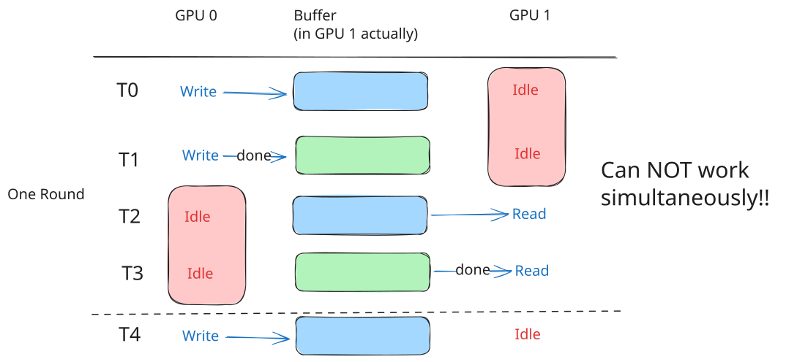

# NCCL Simple Protocol 环形缓冲区机制

## 这篇文档要解决什么问题？

在前两章中,我们建立了对 Simple Protocol 的基本认知：

- **第一章**：Simple Protocol 用大块传输和粗粒度同步实现高带宽，核心是环形缓冲区和流控计数器
- **第二章**：了解了关键数据结构（ncclConnInfo、ncclShmemGroup、Primitives），知道了"有什么"和"在哪里"

但关于环形缓冲区，我们只有一个模糊的概念：

> 有 8 个 slot，发送方写入，接收方读取，循环使用。

现在是时候深入这个"环形缓冲区"了。你可能会有这些疑问：

- **为什么需要 8 个 slot？1 个不行吗？16 个更好吗？**
- **这 8 个 slot 在内存中是如何布局的？**
- **step 和 slot 是什么关系？为什么要区分它们？**
- **发送方和接收方如何在这个环上"追逐"，又不会冲突？**

这篇文档会带你理解环形缓冲区的**本质**、**布局**和**使用方式**。我们会从"为什么需要环形缓冲区"开始，逐步建立起完整的认知。

**本文档的讨论范围**：本文主要讨论**单向连接**的环形缓冲区机制。

对于"GPU 0 → GPU 1"这个单向通信：
- 只有 **1 个** ring buffer，位于 GPU 1（接收方）内存中
- 本文的"发送方"指 GPU 0，"接收方"指 GPU 1
- 当我们说"8 个 slot"、"环形缓冲区"时，特指这一个位于接收方的 buffer

在 Ring AllReduce 等复杂场景中，每个 GPU 既是某个方向的发送方，也是另一个方向的接收方，因此会有多个单向连接。但每个单向连接的机制都遵循本文的描述。

---
## 为什么需要环形缓冲区？

让我们从最根本的问题开始：**为什么要设计一个环形缓冲区？为什么不直接用一个固定的缓冲区？**

### 如果只有一个缓冲区会怎样？

想象一个简化的场景：GPU 0 要向 GPU 1 发送数据，我们在 GPU 1 的内存中分配了一个缓冲区。

**最简单的方式**：
```
GPU 0 写数据到缓冲区 → GPU 1 读数据 → GPU 0 再写下一批数据 → ...
```

这样做会有什么问题？

**问题 1：必须严格串行**

GPU 0 写完第一批数据后，必须等 GPU 1 完全读完，才能写第二批数据。否则，新数据会覆盖旧数据，导致 GPU 1 读到错误的数据。



你会发现，两个 GPU 总有一个在等待，无法同时工作。这就像单车道的马路，车辆无法超车，只能一辆接一辆。

**问题 2：无法形成流水线**

在 Simple Protocol 的设计中，我们希望：
- GPU 0 写完第一批数据后，立即开始写第二批
- 同时，GPU 1 开始读第一批数据
- 当 GPU 1 读完第一批，开始读第二批时，GPU 0 已经在写第三批了

这就是"流水线"效应：发送方和接收方并行工作，互不干扰。但如果只有一个缓冲区，这是做不到的。

### 多个缓冲区的想法

现在问题很清楚了：**我们需要多个缓冲区，让发送方可以"跑在前面"。**

如果有三个缓冲区：


好一些了，但还不够。如果 GPU 1 读得慢一点，GPU 0 很快就会用完两个缓冲区，又要等待。

**关键洞察：缓冲区的数量决定了流水线的"深度"。**

- 缓冲区越多，发送方可以"领先"接收方的步数越多
- 但缓冲区太多，会浪费内存

NCCL 选择了 **8 个缓冲区**（定义在 [device.h:24](https://github.com/NVIDIA/nccl/blob/v2.28.7-1/src/include/device.h#L24)）：

```c
#define NCCL_STEPS 8
```

**为什么是 8？这是一个硬编码的常量，不可配置。**

这个值是 NCCL 团队通过大量实践和性能测试得出的最优值，背后有以下考量：

1. **流水线深度的充分性**：8 个 slot 足够深，让发送方不会频繁等待接收方
2. **内存占用的合理性**：每个连接都需要分配缓冲区，8 个 slot 不会占用过多内存
3. **硬件特性的匹配**：在典型的 GPU 间通信场景（NVLink/PCIe），8 个 slot 能很好地隐藏延迟
4. **实现的简洁性**：2 的幂次，方便用位运算计算索引（`step % 8` 可以优化为 `step & 7`）

**重要**：你不能通过环境变量或 API 修改这个值。虽然你可以通过 `NCCL_BUFFSIZE` 调整缓冲区总大小，但 slot 的数量永远是 8。这是一个经过充分验证的工程决策。

### 为什么是"环形"？

有了 8 个缓冲区，下一个问题是：**用完 8 个之后怎么办？**

**方案 A：分配新的缓冲区**

每次用完 8 个，再分配新的 8 个？这显然不现实，内存会无限增长。

**方案 B：循环使用**

用完 slot 7 后，回到 slot 0。前提是 slot 0 的旧数据已经被读走了。

这就是"环形缓冲区"的本质：**固定数量的缓冲区，循环使用。**

```
<ImageDescription>
环形缓冲区示意图：
- 8 个 slot 排成一个圆环（编号 0-7）
- tail 计数器：表示发送进度，由发送方维护
  - **物理存储**：位于接收方的内存（RecvMem）
  - 发送方通过 P2P 更新远端的 tail，接收方轮询本地的 tail
- head 计数器：表示接收进度，由接收方维护
  - **物理存储**：位于发送方的内存（SendMem）
  - 接收方通过 P2P 更新远端的 head，发送方轮询本地的 head
- tail 计数器指向下一个要写的 slot（tail % 8）
- head 计数器指向下一个要读的 slot（head % 8）
- 如果 tail - head = 8（缓冲区满），发送方要等待
- 如果 tail = head（缓冲区空），接收方要等待
</ImageDescription>
```

**重要澄清**：tail 和 head 是**计数器**，不是指针。它们的值是 step（单调递增的），通过 `% 8` 计算出对应的 slot 索引。tail 存储在接收方内存，head 存储在发送方内存，这个"反直觉"的设计让轮询操作（高频）访问本地内存，性能最优。详见[第二章：tail/head 存储设计](./02_数据结构详解.md#tailhead-存储设计的精妙之处)。

这就是生产者-消费者模型的经典实现。环形缓冲区让我们在有限的内存中，实现无限的数据流传输。

---

## 环形缓冲区的内存布局

现在我们理解了"为什么需要环形缓冲区"，接下来看看它在内存中是如何存在的。

### 总大小从哪来？

环形缓冲区的总大小存储在 `buffSizes[NCCL_PROTO_SIMPLE]` 中。这个值是在 Host 端（CPU）通过环境变量或默认配置确定的。

**两种来源**：

1. 默认值

NCCL 使用一个硬编码的默认值（定义在 `src/init.cc:699`）：

```c
#define DEFAULT_BUFFSIZE (1 << 22) /* 4MiB */
```

**默认总大小是 4MB**。这个值经过充分验证，在大多数场景下已经能提供良好的性能。

2. 环境变量调整

你可以通过环境变量 `NCCL_BUFFSIZE` 手动指定（以字节为单位）：

```bash
export NCCL_BUFFSIZE=33554432  # 32MB（针对高带宽场景的优化配置）
```

**注意**：`NCCL_BUFFSIZE` 只控制总大小，不能改变 slot 的数量（永远是 8）。

### 每个 slot 的大小

有了总大小，每个 slot 的大小就很简单了：

```c
stepSize = buffSizes[NCCL_PROTO_SIMPLE] / NCCL_STEPS;
```

使用默认配置时：

```
stepSize = 4MiB / 8 = 512KiB
```

这个 `stepSize` 存储在 `ncclConnInfo.stepSize` 字段中（我们在第二章讲过）。

**注意**：`stepSize` 的单位是**字节**。在 `Primitives` 类中，会根据数据类型转换为**元素个数**：

```c
// 假设数据类型是 float（4 字节）
int stepSize_in_elements = connInfo->stepSize / sizeof(float);
// stepSize_in_elements = 4MB / 4 = 1M 个 float
```

### 内存布局：连续的 8 个 slot

环形缓冲区在物理内存中是**连续的线性空间**，只是在逻辑上把它看作"环形"。

```
内存布局图（线性视角）：

GPU 内存中的某个地址开始：
[------- Slot 0 -------][------- Slot 1 -------][------- Slot 2 -------] ... [------- Slot 7 -------]
 ^                       ^                       ^                             ^
 buffs                   buffs + stepSize        buffs + 2*stepSize            buffs + 7*stepSize
```
每个 slot 占用 stepSize 字节（例如 4MB）
总共 8 个 slot，连续排列

注：
- buffs 是起始地址（来自 `ncclConnInfo.buffs[NCCL_PROTO_SIMPLE]`）
- 每个 slot 的地址 = `buffs + (slot_index * stepSize)`

**重要的是**：这是一个**线性**的内存块，不是真的"圆形"。"环形"是逻辑概念，通过模运算实现：

```c
int slot = step % 8;  // step 8 回到 slot 0，step 9 回到 slot 1，...
```

### slot 地址的计算

在代码中，计算某个 step 对应的 slot 地址是这样的：

```c
// 假设 connEltsFifo 是缓冲区起始地址（类型为 T*）
// stepSize 是每个 slot 的元素个数（不是字节数）
int slot = step % NCCL_STEPS;  // 0-7
T* slotAddr = connEltsFifo + (slot * stepSize);
```

举个具体例子：
- `connEltsFifo = 0x7f000000`（假设的 GPU 内存地址）
- `stepSize = 1M`（1M 个元素，假设是 float）
- `step = 0`：`slot = 0`，`slotAddr = 0x7f000000 + 0 * 1M * 4 = 0x7f000000`
- `step = 1`：`slot = 1`，`slotAddr = 0x7f000000 + 1M * 4 = 0x7f400000`
- `step = 8`：`slot = 0`，`slotAddr = 0x7f000000`（回到 slot 0）

**关键点**：通过模运算，step 可以无限增长（0, 1, 2, ..., 1000, ...），但 slot 永远在 0-7 之间循环。

---

## step 计数器的语义

现在我们来解决一个非常容易混淆的概念：**step 和 slot 的区别**。

### step 不是 slot 索引

很多人第一次看到代码时，会误以为 `step` 就是 slot 的索引（0-7）。**这是错误的。**

**step 是一个单调递增的计数器**，从 0 开始，每次传输后增加，永不回绕。

**slot 是物理位置的索引**，永远在 0-7 之间。

**它们的关系是**：

```c
slot = step % 8;
```

### 为什么要区分它们？

你可能会问：**既然最终都是用 `step % 8` 得到 slot，为什么不直接用 slot 做计数器？**

答案是：**用 step 可以避免"环绕"带来的比较问题。**

让我们看一个场景。假设我们直接用 slot 索引（0-7）作为计数器：

```
发送方的 tailSlot = 7（写到 slot 7）
接收方的 headSlot = 1（读到 slot 1）
```

现在问题来了：**发送方是"领先"还是"落后"接收方？**

- 如果是 `7 > 1`，看起来发送方领先 6 个 slot
- 但也可能是发送方已经"绕了一圈"，实际只领先 6 个 slot
- 或者发送方"绕了两圈"，实际领先 14 个 slot

**没法判断！** 因为 slot 索引会环绕，丢失了"历史信息"。

**但如果用 step**：

```
发送方的 tail = 23（写到第 23 步）
接收方的 head = 17（读到第 17 步）
```

现在一目了然：`tail - head = 23 - 17 = 6`，发送方领先 6 个 step。

通过 `tail % 8 = 7` 和 `head % 8 = 1`，我们知道它们分别在 slot 7 和 slot 1。

**关键洞察：step 是"逻辑时间"，slot 是"物理位置"。用逻辑时间进行同步判断，用物理位置进行内存访问。这种分离让代码逻辑简单清晰。**

### step 的增长规律

step 不一定每次只增加 1。在 Simple Protocol 中，每次传输后，step 增加的量是 `StepPerSlice`：

```c
step += StepPerSlice;
```

**StepPerSlice 是什么？**

它表示"每个 slice 跨越多少个 step"。通常情况下，`StepPerSlice = 1`，也就是一个 slice 对应一个 step，对应一个 slot。

但在某些场景下，一个 slice 可能跨越多个 step。我们在第五章（[GenericOp 工作流程](./05_GenericOp工作流程.md)）中会详细讨论这个参数。现在你只需要知道：**step 每次增加的不一定是 1，但一定是正数，保证单调递增。**

## 总结

让我们回顾一下这篇文档的核心内容。

### 为什么需要环形缓冲区？

- **单个缓冲区无法流水线**：发送方和接收方必须串行工作，效率低
- **多个缓冲区实现流水线**：发送方可以"跑在前面"，接收方跟在后面
- **环形设计实现循环使用**：固定数量的缓冲区（8 个），无限次使用

### 环形缓冲区的布局

- **总大小**：`buffSizes[NCCL_PROTO_SIMPLE]`，通常是几十 MB（可通过 `NCCL_BUFFSIZE` 调整）
- **slot 数量**：**固定为 8**（`NCCL_STEPS=8`），这是硬编码常量，不可配置
- **每个 slot**：`stepSize = buffSizes / 8`，通常是几 MB
- **物理布局**：连续的线性内存，逻辑上看作"环形"
- **地址计算**：`slotAddr = buffs + (slot * stepSize)`，其中 `slot = step % 8`

### step 和 slot 的区别

- **step 是逻辑计数器**：单调递增，永不回绕（0, 1, 2, ..., 1000, ...）
- **slot 是物理位置**：0-7 之间循环
- **关系**：`slot = step % 8`
- **为什么分离**：避免环绕导致的比较问题，用"逻辑时间"进行同步

### 关键洞察
环形缓冲区是为了在有限的内存中实现无限的流水线传输。8 个 slot 的设计是经过大量实践验证的最优值，它平衡了流水线深度和内存开销。step 的单调递增保证了同步逻辑的简单性，slot 的循环使用保证了内存的高效利用。

---

## 下一步

现在你已经理解了环形缓冲区的本质、布局和使用方式。但还有一个关键问题没有深入：

**发送方和接收方如何"同步"？**

- `waitPeer` 的等待条件是什么？为什么发送方是 `tail - head >= 8`，接收方是 `head >= tail`？
- `postPeer` 为什么需要 `fence`？内存序是什么？
- `connStepPtr` 和 `connStepCache` 是如何配合的？

这些问题会在下一篇文档[流控机制](./04_流控机制.md)中详细解答。我们会逐行分析这两个函数的逻辑，理解发送方和接收方的不对称性，以及为什么这种设计能保证正确性和高性能。

准备好了吗？让我们继续深入流控机制！

---

## 参考代码

- [src/include/device.h:24](https://github.com/NVIDIA/nccl/blob/v2.28.7-1/src/include/device.h#L24) - `NCCL_STEPS` 定义
- [src/device/prims_simple.h:110-164](https://github.com/NVIDIA/nccl/blob/v2.28.7-1/src/device/prims_simple.h#L110-L164) - `waitPeer` 函数（我们下一章详细分析）
- [src/device/prims_simple.h:257-275](https://github.com/NVIDIA/nccl/blob/v2.28.7-1/src/device/prims_simple.h#L257-L275) - `postPeer` 函数（我们下一章详细分析）
- [Implications of increasing NCCL_BUFFSIZE · Issue #559 · NVIDIA/nccl](https://github.com/NVIDIA/nccl/issues/559)
- [Environment Variables — NCCL 2.28.6 documentation](https://docs.nvidia.com/deeplearning/nccl/user-guide/docs/env.html#nccl-buffsize)
- [What are the optimal NCCL buffer sizes for different NVIDIA data center GPUs? - Massed Compute](https://massedcompute.com/faq-answers/?question=What%20are%20the%20optimal%20NCCL%20buffer%20sizes%20for%20different%20NVIDIA%20data%20center%20GPUs?)