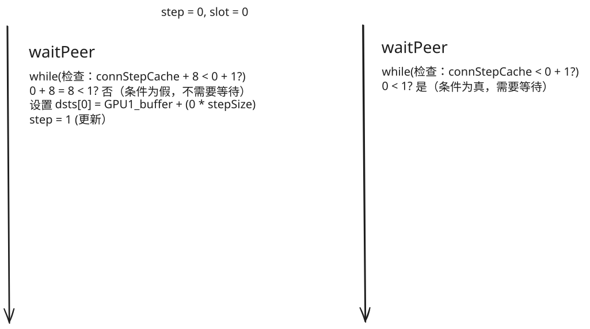

# NCCL Simple Protocol 流控机制

## 这篇文档要解决什么问题？

在前三章中，我们已经理解了 Simple Protocol 的核心概念：

- **第一章**：Simple Protocol 用大块传输和粗粒度同步实现高带宽
- **第二章**：关键数据结构（ncclConnInfo、ncclShmemGroup、Primitives）
- **第三章**：环形缓冲区的 8 个 slot 如何实现流水线

但我们一直在"回避"一个核心问题：**发送方和接收方如何知道什么时候可以读写？**

想象这个场景：
- 发送方要写 slot 3，但 slot 3 里还有上一轮的旧数据，接收方还没读走
- 接收方要读 slot 5，但发送方还没写到 slot 5

**如果不协调，就会出错**：
- 发送方覆盖了旧数据，接收方读到错误的数据
- 接收方读到未写入的数据，结果是垃圾值

这就是 **流控（Flow Control）** 要解决的问题。Simple Protocol 的流控机制非常简洁：**两个计数器（tail 和 head）+ 两个函数（waitPeer 和 postPeer）**。但是由于分散在两个设备（GPU）上，所以需要一些特殊的处理。

这篇文档会带你深入理解：
- 卡间流控的核心思想是什么？
- waitPeer 在等什么？为什么发送方和接收方的等待条件不同？
- postPeer 在做什么？为什么需要内存屏障（fence）？
- GPU 内存一致性模型是什么？为什么它很重要？
- 这套机制如何保证正确性和高性能？

## 流控的核心思想

让我们从最根本的问题开始。

### 生产者-消费者模型

环形缓冲区本质上是一个**生产者-消费者队列**：
- **发送方是生产者**：往队列里写数据
- **接收方是消费者**：从队列里读数据
- **8 个 slot 是队列的容量**

在这个模型中，有两个核心问题需要回答：

**问题 1：生产者（发送方）何时可以写？**

生产者要写 `slot i`，但 `slot i` 可能还有上一轮的旧数据（因为环形缓冲区是循环使用的）。生产者必须确认：**消费者已经读走了 `slot i `的旧数据。**

**问题 2：消费者（接收方）何时可以读？**

消费者要读 `slot i`，但 `slot i` 可能还没有新数据（生产者还没写到这里）。消费者必须确认：**生产者已经写好了 `slot i` 的新数据。**

Simple Protocol 用两个 64-bit 计数器回答这两个问题：

- **tail**：发送方写到哪里了（生产进度）
- **head**：接收方读到哪里了（消费进度）

这两个计数器的关系决定了能不能读写。

### tail/head 存储设计回顾

回忆第二章[数据结构详解](./02_数据结构详解.md#核心字段指针方向性)的关键设计：**tail 和 head 的"反直觉"存储位置**。

**物理存储位置**：
- **tail** 存储在**接收方的 RecvMem**
- **head** 存储在**发送方的 SendMem**

**访问模式（关键！）**：
- **tail**：发送端在写哪个 slot
  - 接收方**轮询本地** tail（看发送方是否更新）
  - 发送方**通过 P2P 写入远端** tail（通知接收方）

- **head**：接收端在读哪个 slot
  - 发送方**轮询本地** head（看接收方是否更新）
  - 接收方**通过 P2P 写入远端** head（通知发送方）

**这个设计实现了"轮询本地，更新远端"的模式**，让高频的轮询操作非常快（本地内存访问），而低频的更新操作通过 P2P（可接受的开销）。

我们需要还需要回忆一下 **Primitives 构造函数中如何设置 connStepPtr** ([Primitives 操作的封装 - 链接状态](./02_数据结构详解.md#3-连接状态))。这是理解流控逻辑的关键。

在 Primitives 的构造函数中，会依据 Role 的不同调用 `loadRecvConn`或`loadSendConn`函数 [prims_simple.h:486-580](https://github.com/NVIDIA/nccl/blob/v2.28.7-1/src/device/prims_simple.h#L486-L580)。

**记住这个规律**：
- Wait 角色的 `connStepPtr` 指向**本地内存**，用于快速轮询
- Post 角色的 `connStepPtr` 指向**对方内存**，用于 P2P 写入
- 虽然 Wait 角色读取本地内存，但这个值是对方通过 P2P 写入的，**反映对方的进度**

现在让我们深入 waitPeer 和 postPeer，看看它们如何利用这两个计数器实现流控。

## waitPeer：等待对端准备好

`waitPeer` 是流控的第一步：**确认可以进行读写操作。**

发送方和接收方都会调用 waitPeer，但它们的逻辑是不对称的。让我们分别看一下。

### 发送方和接收方的统一等待逻辑

在代码中，waitPeer 对发送方和接收方使用同一段代码（[prims_simple.h:waitPeer](https://github.com/NVIDIA/nccl/blob/v2.28.7-1/src/device/prims_simple.h#L115-L119)）：

```c
const bool isSendNotRecv = (Send && Recv) ? (flags & RoleWaitSend) : Send;

while (connStepCache + (isSendNotRecv ? NCCL_STEPS : 0) < step + StepPerSlice) {
    connStepCache = loadStepValue(connStepPtr);  // 从本地内存读取计数器（值是对方写入的）
}
```

这段代码看起来很简洁，但包含了发送方和接收方的不同逻辑。让我们分别展开。

### 发送方的 `waitPeer`

**发送方的核心问题**：我要写 `slot i`，这个 slot 是否已经被对方读走了？

#### 等待条件

对于发送方，`isSendNotRecv = true`，所以条件展开为：

```c
while (connStepCache + NCCL_STEPS < step + StepPerSlice) {
    connStepCache = loadStepValue(connStepPtr);  // 从本地内存读取 head
}
```

结合前面讲的指针设置，对于发送方 Wait 线程：
- `connStepPtr` 指向**本地的 head**（物理存储在发送方）
- `connStepCache` 缓存的是 **head 的值**（表示接收方的读取进度）
- `step` 是**本地的 tail**（发送方要写的位置）
- `StepPerSlice` 通常为 1（每次传输一个 slice）

**理解这个等待条件**：

虽然 `connStepPtr` 指向本地内存，但 head 的值是接收方通过 P2P 写入的，反映接收方的读取进度。所以这个条件可以理解为：

```c
// 一直轮询，直到发送方的进度小于接收方的进度 + 8（假设 StepPerSlice = 1）
while (接收方的读取进度 + 8 < 发送方的写入进度 + 1) {
    接收方的读取进度 = loadStepValue(本地head指针);
}

// **等价条件**（假设 StepPerSlice = 1）：
while (发送方的写入进度 - 接收方的读取进度 >= 8) {
    // 发送方领先太多，需要等待
}
```

**这个条件的含义**：如果发送方领先接收方 8 个或更多 step，就要等待。

#### 等待结束，会做什么？

发送方的 waitPeer 不只是等待，还会做一件事：**设置目标指针（dsts）**。

```c
// 通过等待，确认可以写 slot
int slot = step % NCCL_STEPS;

// 设置目标地址
ncclShmem.groups[group].dsts[index] = connEltsFifo + (slot * stepSize);
```

这样，worker 线程就知道往哪里写数据了。

还记得第二章讲的吗？`connEltsFifo` 对于发送方来说，指向的是**对方的环形缓冲区**。所以 `dsts[index]` 指向的是对方内存中的某个 slot。

### 接收方的 `waitPeer`

**接收方的核心问题**：我要读 `slot i`，这个 slot 是否已经有新数据了？

#### 等待条件

对于接收方，`isSendNotRecv = false`，所以条件展开为：

```c
while (connStepCache < step + StepPerSlice) {
    connStepCache = loadStepValue(connStepPtr);  // 从本地内存读取 tail
}
```

结合指针设置，对于接收方 Wait 线程：
- `connStepPtr` 指向**本地的 tail**（物理存储在接收方）
- `connStepCache` 缓存的是 **tail 的值**（表示发送方的写入进度）
- `step` 是**本地的 head**（接收方要读的位置）

**理解这个等待条件**：

虽然 `connStepPtr` 指向本地内存，但 tail 的值是发送方通过 P2P 写入的，反映发送方的写入进度。所以这个条件可以理解为：

```c
// 一直轮询，直到发送方的进度小于等于接收方的进度
while (发送方的写入进度 < 接收方的读取进度 + StepPerSlice) {
    // 等待发送方写入数据
    发送方的写入进度 = loadStepValue(本地tail指针);
}

// **等价条件**（假设 StepPerSlice = 1）：
while (接收方的读取进度 >= 发送方的写入进度) {
    // 还没有新数据可读，需要等待
}
```

**这个条件的含义**：如果接收方的读取进度追上或超过发送方的写入进度，说明没有新数据，要等待。

#### 为什么不加 8？

注意发送方的条件是 `connStepCache + NCCL_STEPS < step + StepPerSlice`，有个 `NCCL_STEPS`。但接收方的条件是 `connStepCache < step + StepPerSlice`，没有 `NCCL_STEPS`。

**为什么不对称？**

因为两者要回答的问题不同：

- **发送方**：我要写的 slot 是否"已经被读走"？
  - 判断"是否绕圈回来了"
  - 需要考虑环形缓冲区的容量（8 个 slot）
  - 条件：`connStepCache + NCCL_STEPS < step + StepPerSlice`

- **接收方**：我要读的 slot 是否"有新数据"？
  - 判断"发送方是否写到这里了"
  - 只需要比较进度
  - 条件：`connStepCache < step + StepPerSlice`

**关键点**：接收方只需要确认"发送方写到哪里了"，不需要考虑环绕。因为接收方总是"追赶"发送方，不会超过发送方。

#### 等待结束，会做什么？

接收方的 waitPeer 也会设置指针：**源指针（srcs）**，这样接收方就知道读到的 data 要放到哪里。

```c
int slot = step % NCCL_STEPS;
ncclShmem.groups[group].srcs[index] = connEltsFifo + (slot * stepSize);
```

这里 `connEltsFifo` 对于接收方来说，指向的是**本地的环形缓冲区**。所以 `srcs[index]` 指向的是本地内存中的某个 slot。

### `loadStepValue`：如何读取计数器？

waitPeer 需要轮询计数器（tail 或 head）的值。这是通过 `loadStepValue` 函数实现的。

在概念层面，你只需要知道：

```c
uint64_t loadStepValue(uint64_t* ptr) {
    // 从本地内存读取一个 64-bit 值
    // 使用 volatile 或 atomic load 保证不会被优化掉
    return *ptr;
}
```

**为什么需要反复从内存读取？**

因为这个本地内存位置会被对方 GPU 通过 P2P 远程写入：
- 发送方轮询本地 head：接收方会通过 P2P 写入新的 head 值
- 接收方轮询本地 tail：发送方会通过 P2P 写入新的 tail 值

如果不用 volatile 或 atomic，编译器可能会"优化"这个循环：

```c
// 错误的优化
uint64_t cached_value = *connStepPtr;  // 只读取一次
while (cached_value < step + 1) {
    // 死循环！因为 cached_value 不会更新
    // 编译器认为 connStepPtr 指向的值不会变化
}
```

**volatile 或 atomic load 告诉编译器：这个值可能被"外部"修改（对方 GPU 的 P2P 写入），每次循环都要重新从内存读取。**

在实际代码中（[prims_simple.h:95-106](https://github.com/NVIDIA/nccl/blob/v2.28.7-1/src/device/prims_simple.h#L95-L106)），`loadStepValue` 使用 `ld_volatile_global` 实现：

```c
inline __device__ uint64_t loadStepValue(uint64_t* ptr) {
    // volatile is faster than acquire but not as correct. Make sure reduceCopy
    // loads data using volatile so it doesn't see stale data in L1.
    return ld_volatile_global(ptr);
}

// `src/device/op128.h:304-308`
// 普通的全局内存访问可能会被 L1 缓存，导致读取到过时的数据
// ld_volatile_global 确保直接从全局内存（或 L2 缓存）读取最新数据
// volatile 可以防止编译器优化掉重复的内存读取
__device__ __forceinline__ uint64_t ld_volatile_global(uint64_t *ptr) {
  uint64_t ans;
  asm volatile("ld.volatile.global.u64 %0, [%1];" : "=l"(ans) : "l"(cvta_to_global(ptr)) : "memory");
  return ans;
}
```

**关键点**：
- 物理上：从本地内存读取（快速）
- 语义上：读取的是对方通过 P2P 写入的值（反映对方的进度）
- 技术上：使用 volatile global 保证每次都重新从内存读取，不会被编译器或 L1 cache 优化掉

### `waitPeer` 的时机

**何时调用 waitPeer？**

在每次传输**之前**：

```c
// 典型的流程
waitPeer();     // 等待可以读/写
reduceCopy();   // 实际的数据传输
postPeer();     // 通知对端完成
```

**step 何时更新？**

在 waitPeer **结束时**，step 会增加：

```c
// waitPeer 内部，等待结束后
step += StepPerSlice;
```

这样，下次调用 waitPeer 时，就会检查下一个 slot。

---

## `postPeer`：通知对端完成

`postPeer` 是流控的第二步：**告诉对端“我完成了读/写操作”**。实现位于 [src/device/prims_simple.h:172-181](https://github.com/NVIDIA/nccl/blob/v2.28.7-1/src/device/prims_simple.h#L172-L181)。
调用点在各类通用操作循环的末尾，例如 `genericOp` 中的每个 step 之后都会调用（将是否需要 fence 作为参数传入）：[src/device/prims_simple.h:480-481](https://github.com/NVIDIA/nccl/blob/v2.28.7-1/src/device/prims_simple.h#L480-L481)。

#### 代码详解

核心代码非常简洁：

```c
step += StepPerSlice;
if (Send && (flags & RolePostSend) && (dataStored||(flags&ConnFifoEnabled))) {
    fence_acq_rel_sys();
}
st_relaxed_sys_global(connStepPtr, step);
```

其中依赖的指令如下：
```c
__device__ __forceinline__ void fence_acq_rel_sys() {
  asm volatile("fence.acq_rel.sys;" ::: "memory");
}

__device__ __forceinline__ void st_relaxed_sys_global(uint64_t *ptr, uint64_t val) {
  asm volatile("st.relaxed.sys.global.u64 [%0], %1;" :: "l"(cvta_to_global(ptr)), "l"(val) : "memory");
}
```

指令含义
  - acquire：阻止后续访问跑到屏障之前；release：阻止之前访问拖到屏障之后；acq_rel 同时具备两侧约束。
  - relaxed：不额外提供顺序约束，常与“先行的 release/fence”配合使用（本处由 `fence_acq_rel_sys()` 保证“写数据 → 写计数器”的先后）。

更丰富的讲解参考 [GPU 内存一致性模型](#gpu-内存一致性模型)。

### 发送方的 `postPeer`

目标：告诉接收方“本 step 的数据已经写好，可以读了”。

- 指针绑定：发送方 Post 线程的 `connStepPtr` 指向“接收方的 tail”（远端内存）。见 `loadSendConn` 的设置：[src/device/prims_simple.h:546-549](https://github.com/NVIDIA/nccl/blob/v2.28.7-1/src/device/prims_simple.h#L546-L549)。
- 核心步骤（等价伪码）：
  - `step += StepPerSlice;`
  - 如本 step 确有写入或启用了 ConnFifo，则执行系统域 fence：`fence_acq_rel_sys()`
  - 通过 P2P 将新的 `step` 写到远端 `tail`：`st_relaxed_sys_global(connStepPtr, step)`

为什么需要 fence？
- 发送方要保证“数据写入对端缓冲区”在“更新对端 tail（发布完成）”之前对接收方可见；否则接收方可能基于新的 tail 去读到未完成的数据。
- `fence_acq_rel_sys()` 提供系统域的发布/获取语义，禁止这两类写入被重排序并确保可见性。
- 如果本 step 没有实际数据写入（例如空发送或特定直连路径），只有在使用 ConnFifo 与代理/网络交互时仍需 fence 来保证元数据有序。

为什么是“系统域” fence？
- 对端在另一块 GPU 上通过 P2P 直接读取我们的写入结果。要让“对接收方可见”，需要跨 GPU 的可见性保证。`fence_acq_rel_sys()` 是系统域屏障，保证此前对全局内存（包括对方可见的 P2P 区域）的写入在全系统范围内先行，对后续的 `tail` 发布不会乱序：[src/device/op128.h:355-363](https://github.com/NVIDIA/nccl/blob/v2.28.7-1/src/device/op128.h#L355-L363)。
- 与之配套，更新计数器使用 `st.relaxed.sys.global` 即可（顺序由 fence 提供）：[src/device/op128.h:340-349](https://github.com/NVIDIA/nccl/blob/v2.28.7-1/src/device/op128.h#L340-L349)。

为什么 store 用 relaxed？
- 有了先行的系统域 fence，`st.relaxed.sys.global` 不再需要额外的 release 语义即可满足“数据写入 → 计数器更新”的先后关系。接收方通过 `ld_volatile_global` 轮询本地计数器，避免缓存/编译器导致的陈旧值：[src/device/op128.h:304-312](https://github.com/NVIDIA/nccl/blob/v2.28.7-1/src/device/op128.h#L304-L312)。

若省略 fence，会发生什么？
- 可能出现“计数器先更新、数据后可见”的乱序。接收方看到 tail 递增便开始消费该 slot，但实际数据尚未对其可见，导致读到旧/部分数据。系统域 fence 正是为阻止这种跨 GPU 的乱序可见性风险。

`postPeer` 的调用时机在数据传输之后（与 worker 的拷贝阶段用 barrier 隔开），再调用 `postPeer` 完成发布。例如在 `genericOp` 的每个 step 末尾都会调用：[src/device/prims_simple.h:480-481](https://github.com/NVIDIA/nccl/blob/v2.28.7-1/src/device/prims_simple.h#L480-L481)。

### 接收方的 `postPeer`

目标：告诉发送方“本 step 已经读完，可以重用”。

- 指针绑定：接收方 Post 线程的 `connStepPtr` 指向“发送方的 head”（远端内存）。见 `loadRecvConn` 的设置：[src/device/prims_simple.h:497-500](https://github.com/NVIDIA/nccl/blob/v2.28.7-1/src/device/prims_simple.h#L497-L500)。
- 核心步骤（等价伪码）：
  - `step += StepPerSlice;`
  - 无需 fence
  - 通过 P2P 将新的 `step` 写到远端 `head`：`st_relaxed_sys_global(connStepPtr, step)`

为什么不需要 fence？
- 接收方只执行**读操作**，不写入数据到环形缓冲区。接收方的 `postPeer` 只需要通知发送方"我已经读完这个 slot 了，你可以重用它"，这个通知本身不依赖于其他内存操作的顺序。
- **发送方的 fence 已经保证了数据可见性**：当接收方能够读取数据时，说明发送方的 `fence_acq_rel_sys()` 已经确保了数据写入对接收方可见。接收方读取数据的操作本身就隐含了"数据已经可见"这个前提。
- **head 更新的语义很简单**：接收方更新 head 只是一个进度通知，不需要与其他内存操作建立 happens-before 关系。即使 head 的更新稍微延迟，也不会导致正确性问题——最多让发送方多等一会儿。
- **对比发送方**：发送方必须保证"数据写入 → tail 更新"的严格顺序，否则接收方可能读到未完成的数据。但接收方的情况不同：接收方读完数据后，无论 head 何时更新，都不会影响已读取数据的正确性。
- **性能优化**：省略 fence 可以减少接收方的同步开销。由于接收方的 `postPeer` 不需要保证其他操作的顺序，使用 `st_relaxed_sys_global` 直接更新 head 即可，这比 fence + store 更快。

## 线程角色分工

在进入完整的时序图之前，我们需要澄清一个重要的实现细节：**waitPeer 和 postPeer 实际上是由不同的线程执行的。**

`Primitives` 构造函数会先按线程编号写入四种角色标记（[prims_simple.h:619-624](https://github.com/NVIDIA/nccl/blob/v2.28.7-1/src/device/prims_simple.h#L619-L624)）：

```c
if      (tid < nrecv)                 { flags |= RoleWaitRecv; }
else if (tid < nrecv+nsend)           { flags |= RoleWaitSend; }
else if (nthreads-nsend <= tid)       { flags |= RolePostSend; }
else if (nthreads-nrecv-nsend <= tid) { flags |= RolePostRecv; }
```

- **RoleWaitRecv**：负责接收方的 waitPeer（轮询对方的 tail，设置 srcs 指针）
- **RolePostRecv**：负责接收方的 postPeer（P2P 写远端的 head（发送方））
- **RoleWaitSend**：负责发送方的 waitPeer（轮询对方的 head，设置 dsts 指针）
- **RolePostSend**：负责发送方的 postPeer（fence + P2P 写远端的 tail（接收方））

这些标记决定了每条线程要做的事情，但 GPU 的调度以 **warp（32 线程）** 为粒度。Simple 协议在构造 `Primitives` 时还会计算一个 `nworkers`（[prims_simple.h:596-602](https://github.com/NVIDIA/nccl/blob/v2.28.7-1/src/device/prims_simple.h#L596-L602)）：

```
nworkers = nthreads - （MaxSend>0 且 nthreads ≥ 96 ? WARP_SIZE : 0）
```

- 当 block 需要发送路径且线程数 ≥96，就抽出最后一个 warp 作为 **服务 warp**（非 worker），主要承载 Post 角色并隔离高延迟操作；其余 warp 组成 **worker 队列**，既负责数据路径也承担 Wait 角色。
- 如果没有发送路径，或者 block 较小，则不存在服务 warp，所有线程都是 worker 并执行完整流程。
- 常量 `WARP_SIZE` 和 `NCCL_SIMPLE_EXTRA_GROUP_IF_NTHREADS_GE` 分别定义在 `src/include/device.h:85-91`。

存在独立的服务 warp 的好处是把 `fence_acq_rel_sys()`、P2P 写等高延迟操作隔离开，避免拖慢负责数据路径的 warp；这在源码注释中也写得很明确：“For send operations, we need an extra warp to overlap the threadfence and the copy.”（`src/device/prims_simple.h:596`）。同时 `subBarrier()` 只覆盖 `nworkers` 个线程（包含 Wait 线程），服务 warp 走全局 barrier，两套同步互不干扰（`src/device/prims_simple.h:62-76`）。

## 完整的时序图

现在让我们通过一个完整的时序图，把 waitPeer 和 postPeer 串起来，看看 2-3 轮传输的完整过程。

### 场景设置

- GPU 0（发送方）向 GPU 1（接收方）发送数据
- 环形缓冲区：8 个 slot
- `StepPerSlice = 1`（每次传输一个 slot）
- 初始状态：`head = 0, tail = 0, step_send = 0, step_recv = 0`

### 第一轮传输


```
<ImageDescription>
GPU 0 (发送方)                                    | GPU 1 (接收方)
-----------------------------------------------|-----------------------------------------------
**waitPeer**                                    |  **waitPeer**
step = 0, slot = 0                             |    step = 0, slot = 0
检查：connStepCache + 8 < 0 + 1?                |    检查：connStepCache < 0 + 1?
0 + 8 = 8 < 1? 否（条件为假，不需要等待）            |  0 < 1? 是（条件为真，需要等待）
设置 dsts[0] = GPU1_buffer + (0 * stepSize)    |
step = 1 (更新)                                 |
                                               |
**数据传输**                                      |
worker 线程写数据到 dsts[0]                        |  轮询本地 tail（发送方会通过 P2P 更新）...
（实际是 GPU 1 的 ring buffer）                    |
                                               |
**postPeer**                                    |
fence_acq_rel_sys()（确保数据写入完成）                |
tail = 1（更新 GPU 0 本地的 tail）                   |
---------------------------------------------  | ---------------------------------------------
                                               | **waitPeer**
                                               | 轮询本地 tail（发送方会通过 P2P 更新）...
                                               | 发现 tail = 1，1 < 1 为假，条件满足，可以读
                                               | 设置 srcs[0] = GPU1_buffer + (0 * stepSize)
                                               | step = 1 (更新)
                                               |
                                               | **数据传输**
                                               | worker 线程从 srcs[0] 读取数据
                                               | （本地内存）
                                               |
                                               | **postPeer**
                                               | head = 1（更新 GPU 1 本地的 head）

结果：tail = 1, head = 1，slot 0 传输完成
</ImageDescription>
```

**关键点**：
- GPU 1 在 waitPeer 中等待，直到 GPU 0 的 postPeer 更新了 tail
- GPU 0 的 fence 确保了数据写入在 tail 更新之前完成
- GPU 1 读取时，数据已经在本地内存中了（GPU 0 写入的）

### 第二轮传输

```
GPU 0 (发送方)                                    | GPU 1 (接收方)
-----------------------------------------------|-----------------------------------------------
**waitPeer**                                    |
step = 1, slot = 1                             |
检查：connStepCache + 8 < 1 + 1?                |
1 + 8 = 9 < 2? 否（条件为假，不需要等待）            |
设置 dsts[0] = GPU1_buffer + (1 * stepSize)    |
step = 2                                       |
                                               | **waitPeer**（与 GPU 0 同时进行）
**数据传输**                                      | step = 1, slot = 1
写数据到 slot 1                                   | 检查：connStepCache < 1 + 1?
                                               | 1 < 2? 是（条件为真，需要等待）
**postPeer**                                    | 轮询本地 tail...
fence_acq_rel_sys()                            | 发现 tail = 2，2 < 2 为假，条件满足，可以读
tail = 2                                       | 设置 srcs[0] = GPU1_buffer + (1 * stepSize)
                                               | step = 2
---------------------------------------------  | ---------------------------------------------
                                               | **数据传输**
                                               | 读数据从 slot 1
                                               |
                                               | **postPeer**
                                               | head = 2

结果：tail = 2, head = 2，slot 1 传输完成
```

**关键点**：
- 这一轮，GPU 0 和 GPU 1 可能并行工作：GPU 0 写 slot 1 时，GPU 1 可能还在处理 slot 0
- 但 GPU 1 的 waitPeer 会确保 GPU 0 写完 slot 1 后才开始读

### 第八轮到第九轮：环绕

让我们快进到第 8 轮传输完成：

```
tail = 8, head = 8
所有 8 个 slot (0-7) 都被使用过一次
```

现在 GPU 0 要进行第 9 轮传输（重用 slot 0）：

```
GPU 0 (发送方)
--------------------------------------------
**waitPeer**
step = 8, slot = 8 % 8 = 0（回到 slot 0）
检查：connStepCache + 8 < 8 + 1?
8 + 8 = 16 < 9? 否（条件为假，不需要等待）

设置 dsts[0] = GPU1_buffer + (0 * stepSize)
step = 9

**数据传输**
写数据到 slot 0（覆盖第一轮的旧数据）

**postPeer**
fence_acq_rel_sys()
tail = 9
```

**理解计数器的含义**

让我们先理解 head 和 tail 的含义：
- **head = 5**：GPU 1 已经读完 step 0, 1, 2, 3, 4，下一个要读的是 step 5
- **tail = 8**：GPU 0 已经写完 step 0, 1, 2, 3, 4, 5, 6, 7，下一个要写的是 step 8

所以：
- step 0 对应 slot 0，GPU 1 已读完
- step 8 对应 slot 0（环绕），GPU 0 要写

这是安全的，因为 GPU 1 早就读完 step 0 了（`tail - head = 8 - 5 = 3 < 8`）。

**危险的情况：接收方严重落后**

假设 GPU 1 非常慢，到 GPU 0 第 16 轮时，GPU 1 才读到 step 5：

```
tail = 16, head = 5
tail - head = 11 >= 8
```

GPU 0 想写 step 16（slot 0）。但 head = 5 说明 GPU 1 只读到 step 5。

step 5 对应 slot 5，step 16 对应 slot 0。没问题吗？

实际上有问题：因为 `tail - head = 11 > 8`，说明缓冲区里有 11 个"已写未读"的 step。但缓冲区只有 8 个 slot！

这意味着 GPU 0 已经"绕了一圈多"：
- step 8-15：占用 slot 0-7（第二圈）
- step 16：想占用 slot 0（第三圈）

但 step 8（第二圈的 slot 0）可能还没被读走！

**waitPeer 阻止了这种情况**：

```
检查：connStepCache + 8 < 16 + 1?
5 + 8 = 13 < 17? 是（条件为真，需要等待）
```

GPU 0 会轮询本地 head（接收方会通过 P2P 更新），直到 `head >= 9`（即 `connStepCache + 8 >= 16 + 1`），才继续。

**关键洞察：`connStepCache + NCCL_STEPS < step + StepPerSlice` 的条件，确保了发送方最多领先接收方"不到 8 个 step"，也就是"不超过一圈"。这保证了环形缓冲区不会被覆盖。**

---

## 为什么用轮询而不是中断？

你可能注意到，waitPeer 使用的是**轮询（polling）**：不断从本地内存读取计数器，直到满足条件。

```c
while (condition) {
    connStepCache = loadStepValue(connStepPtr);  // 从本地内存读取，但值是对方通过 P2P 写入的
}
```

为什么不用中断或事件机制？

### 轮询的优势

**1. GPU 上轮询更高效**

在 CPU 上，轮询会浪费 CPU 周期，通常用中断或睡眠。但在 GPU 上：

- GPU 有成百上千个线程，轮询一个线程不影响其他线程工作
- GPU 的线程调度开销很低，不需要"上下文切换"
- 对于高性能通信，等待时间通常很短（微秒级），轮询比中断更快

**2. 避免同步开销**

如果用中断或事件：
- 发送方写完数据，触发中断
- 接收方收到中断，唤醒线程
- 这个过程涉及 GPU 的硬件同步机制，开销较大

轮询则是纯软件行为，没有硬件介入。

**3. 实现简单**

轮询的实现非常简单：一个 while 循环 + 一次内存读取。

中断机制需要复杂的硬件支持和驱动配合。

### 轮询的代价

**占用内存带宽**

每次轮询都要从本地内存读取计数器，会消耗内存带宽。

但这个代价很小：
- 轮询是本地内存访问（非常快）
- 计数器只有 8 字节（64-bit）
- 轮询频率虽然高，但比起数据传输（MB 级别），可以忽略

**缓存的作用**

为了减少轮询开销，NCCL 使用了 `connStepCache`：

```c
// 只有当 cache 不满足条件时，才重新从内存读取
while (connStepCache + (isSendNotRecv ? NCCL_STEPS : 0) < step + StepPerSlice) {
    connStepCache = loadStepValue(connStepPtr);
}
```

这个 cache 减少了实际的内存访问次数。

**关键洞察：轮询不是缺点，而是针对 GPU 特性的优化设计。**

---

## 总结

让我们回顾一下这篇文档的核心内容。

### 流控的核心思想

- **生产者-消费者模型**：发送方是生产者，接收方是消费者，环形缓冲区是队列
- **两个问题**：发送方何时可以写？接收方何时可以读？
- **两个计数器**：tail（写到哪）和 head（读到哪）

### Primitives 中的指针设置

**关键原则：Wait 轮询本地，Post 更新对方**

- **RoleWaitRecv** 线程：`connStepPtr` 指向本地的 `tail`（轮询本地内存）
- **RolePostRecv** 线程：`connStepPtr` 指向对方的 `head`（P2P 写入对方）
- **RoleWaitSend** 线程：`connStepPtr` 指向本地的 `head`（轮询本地内存）
- **RolePostSend** 线程：`connStepPtr` 指向对方的 `tail`（P2P 写入对方）

虽然 Wait 角色轮询本地内存，但这个本地内存中的值是对方通过 P2P 写入的，反映对方的进度。

### waitPeer 的逻辑

**统一的等待条件**：

```c
while (connStepCache + (isSendNotRecv ? NCCL_STEPS : 0) < step + StepPerSlice) {
    connStepCache = loadStepValue(connStepPtr);
}
```

**发送方**（`isSendNotRecv = true`）：
- 展开为：`while (connStepCache + NCCL_STEPS < step + StepPerSlice)`
- 含义：`while (接收方的读取进度 + 8 < 发送方的写入进度 + 1)`
- 等价：`while (发送方领先接收方 >= 8 个 step)`
- 保证不会绕圈覆盖未读数据

**接收方**（`isSendNotRecv = false`）：
- 展开为：`while (connStepCache < step + StepPerSlice)`
- 含义：`while (发送方的写入进度 < 接收方的读取进度 + 1)`
- 等价：`while (接收方追上或超过发送方)`
- 保证只读取已写入的数据

**关键点**：
- 发送方考虑环绕（+8），接收方只比较进度
- `tail - head` 表示"已写未读"的 step 数量，不能 >= 8（缓冲区容量）

### postPeer 的逻辑

| 角色   | 核心操作                      | 为什么？                         |
|------|---------------------------|------------------------------|
| 发送方  | **fence** + 更新 `tail`     | 确保数据写入在计数器更新之前完成             |
| 接收方  | 更新 `head`                 | 通知发送方"我读完了，你可以重用这个 slot 了"  |

**关键点**：
- fence 是必须的，否则会有内存序问题
- 只有发送方需要 fence，因为只有发送方写入数据

### 不对称性是设计的精髓

发送方和接收方的逻辑是不对称的：
- 等待条件不同
- fence 只在发送方
- 指针方向相反（发送方写对方内存，接收方读本地内存）

这个不对称性利用了 P2P 内存访问的特性，实现了**零拷贝的高性能通信**。

### 轮询是正确的选择

- GPU 上轮询比中断更高效
- 等待时间短，不会浪费资源
- `connStepCache` 减少了重复的内存访问
- 轮询本地内存（快），更新通过 P2P（可接受）

**关键洞察：流控机制的本质是用两个计数器和两个函数，实现了环形缓冲区的正确性和高性能。通过"轮询本地、更新对方"的模式，Wait 角色高效地轮询本地内存（虽然值是对方写入的），Post 角色通过 P2P 通知对方。发送方的 fence 保证了内存序，waitPeer 的条件保证了不会覆盖旧数据，postPeer 的更新保证了双方的同步。理解 `connStepCache + (isSendNotRecv ? NCCL_STEPS : 0) < step + StepPerSlice` 这个统一的等待条件，以及它如何针对发送方和接收方展开为不同的逻辑，是理解流控机制的关键。**

---

## 下一步

现在你已经理解了流控机制的核心逻辑。但还有一个问题没有解答：

**这些 waitPeer 和 postPeer 是在什么时候被调用的？它们如何与实际的数据传输配合？**

准备好了吗？让我们继续！

---

## 参考代码

- [src/device/prims_simple.h:95-106](https://github.com/NVIDIA/nccl/blob/v2.28.7-1/src/device/prims_simple.h#L95-L106) - `loadStepValue` 函数
- [src/device/prims_simple.h:108-170](https://github.com/NVIDIA/nccl/blob/v2.28.7-1/src/device/prims_simple.h#L108-L170) - `waitPeer` 函数
- [src/device/prims_simple.h:172-181](https://github.com/NVIDIA/nccl/blob/v2.28.7-1/src/device/prims_simple.h#L172-L181) - `postPeer` 函数
- [src/device/prims_simple.h:486-536](https://github.com/NVIDIA/nccl/blob/v2.28.7-1/src/device/prims_simple.h#L486-L536) - `loadRecvConn` 函数（指针设置）
- [src/device/prims_simple.h:538-580](https://github.com/NVIDIA/nccl/blob/v2.28.7-1/src/device/prims_simple.h#L538-L580) - `loadSendConn` 函数（指针设置）
- [src/include/device.h:24](https://github.com/NVIDIA/nccl/blob/v2.28.7-1/src/include/device.h#L24) - `NCCL_STEPS` 定义

# Appendix

## GPU 内存一致性模型简介

在前面的 postPeer 分析中，我们反复提到"内存序"、"fence"、"重排序"。这些概念都来自于 GPU 的**内存一致性模型**。

理解内存一致性模型对于理解 Simple Protocol 的正确性至关重要。让我们简单介绍一下。

### 什么是内存一致性模型？

**内存一致性模型**定义了：在多线程（或多 GPU）环境中，**一个线程的内存写入何时对其他线程可见**。

在简单的模型中（如顺序一致性），所有操作看起来是按照程序顺序执行的。但现代 GPU 使用**弱一致性模型**来提高性能。

### 弱一致性模型的特点

在弱一致性模型中：

1. **写入可能被重排序**：编译器或硬件可能改变内存写入的顺序
2. **写入可能延迟可见**：一个线程的写入可能不会立即对其他线程可见
3. **需要显式同步**：程序员需要使用 fence、atomic 等指令来保证顺序性

### 为什么需要 fence？

回到我们的例子：

```c
// 发送方
memcpy(dest, src, size);   // 写数据
*conn->tail = step;        // 更新 tail
```

在弱一致性模型下，可能出现：

**问题 1：写入重排序**

```c
// 可能的执行顺序
*conn->tail = step;        // 先更新 tail
memcpy(dest, src, size);   // 后写数据
```

**问题 2：写入延迟可见**

即使按顺序执行，数据写入可能还在 L1 cache 中，还没刷到系统内存。但 tail 更新已经可见了。

**fence 解决这两个问题**：

```c
memcpy(dest, src, size);   // 写数据
fence_acq_rel_sys();       // 内存屏障
*conn->tail = step;        // 更新 tail
```

**fence 的作用**：
- **阻止重排序**：fence 之前的写入不会被移到 fence 之后
- **确保可见性**：fence 确保之前的写入都刷到系统内存，对其他 GPU 可见

### 系统级内存（System-Level Memory）

`fence_acq_rel_sys()` 中的 `sys` 表示"系统级"内存操作。这意味着：

- **跨 GPU 可见**：fence 确保写入对所有 GPU 可见（不仅仅是同一个 GPU 的其他线程）
- **系统内存**：fence 作用于系统内存（包括通过 P2P 访问的远程 GPU 内存）

这对于 NCCL 的跨 GPU 通信至关重要。

### relaxed 内存序

在 fence 之后，我们使用 `st_relaxed_sys_global` 来更新 tail：

```c
st_relaxed_sys_global(conn->tail, step);
```

**relaxed 的含义**：这个 store 本身不提供额外的同步语义。

**为什么可以用 relaxed？**

因为 fence 已经保证了顺序：
- fence 确保数据写入在 tail 更新之前完成
- 接收方用 volatile load（`ld_volatile_global`）读取 tail，保证看到最新值
- 当接收方看到 tail 更新时，数据一定已经可见了

### 为什么接收方不需要 fence？

接收方的 postPeer 只有一个操作：

```c
st_relaxed_sys_global(conn->head, step);
```

**不需要 fence 的原因**：

1. **读操作不改变内存**：接收方只读取数据，不写入数据
2. **顺序性已保证**：发送方的 fence 确保了数据在 tail 更新之前可见
3. **只需要通知**：接收方更新 head 只是告诉发送方"我读完了"，不需要保证其他操作的顺序

**关键洞察：内存一致性模型是理解 Simple Protocol 正确性的基础。发送方的 fence 保证了数据写入在计数器更新之前对接收方可见。接收方不需要 fence，因为读操作不改变内存状态。这个设计简洁而高效。**


## 代码验证：Ring Buffer 是如何分配的？（P2P Write 模式）

前面的理论告诉我们"缓冲区在接收方"（P2P Write 模式），现在让我们用代码验证这一点。

**注意**：下面展示的代码包含了对两种 P2P 模式的支持。条件 `info->read` 用于判断是否使用 P2P Read 模式：
- `info->read == false`（默认）：P2P Write 模式，本节重点讲解
- `info->read == true`：P2P Read 模式，在 Ampere+NVLink 时启用

#### 接收方分配 Ring Buffer（P2P Write 模式）

当建立 GPU 0 → GPU 1 的连接时，**GPU 1（接收方）负责分配 ring buffer**。

关键代码在 `src/transport/p2p.cc` 的 `p2pRecvSetup` 函数（430-481 行）：

```c
// p2pRecvSetup: 接收方的 setup 阶段
int recvSize = sizeof(struct ncclRecvMem);

// 计算需要的内存大小，包含所有协议的 buffer
for (int p=0; p<NCCL_NUM_PROTOCOLS; p++)
    // 注意：if 条件是为了兼容 P2P Read 模式
    // 在 P2P Write 模式下 (info->read == false)，条件总是 true，所以会累加 buffer 大小
    if (!(info->read && p == NCCL_PROTO_SIMPLE))
        recvSize += comm->buffSizes[p];  // ← buffSizes[NCCL_PROTO_SIMPLE] 就是 ring buffer 的大小

// 通过 proxy 在本地 GPU 内存中分配
NCCLCHECK(ncclProxyCallBlocking(comm, &recv->proxyConn, ncclProxyMsgSetup,
    &req, sizeof(struct ncclP2pRequest),
    &info->p2pBuff, sizeof(struct ncclP2pBuff)));

// 映射到本地可访问的指针
NCCLCHECK(p2pMap(comm, &recv->proxyConn, myInfo, comm->peerInfo+info->rank,
    &info->p2pBuff, (void**)&resources->recvDevMem, &resources->recvMemIpc));
```

**关键点**：`recvSize` 累加了 `comm->buffSizes[p]`，这就是各协议的 ring buffer。**整块内存在接收方的 GPU 上分配**（通过 `ncclProxyCallBlocking`）。

#### 接收方的 buffs 指向本地内存（P2P Write 模式）

在 `p2pRecvConnect` 函数（549-559 行）：

```c
// p2pRecvConnect: 接收方建立连接
char* buff = (char*)(resources->recvDevMem+1);  // ← 本地内存！
for (int p=0; p<NCCL_NUM_PROTOCOLS; p++) {
    // P2P Write 模式：接收方的 buffs[SIMPLE] 指向本地
    // P2P Read 模式：会在下面的 if 中被覆盖为远端内存（代码 551-554 行）
    recv->conn.buffs[p] = buff;  // ← 接收方的 buffs 指向本地
    buff += comm->buffSizes[p];
}
```

注意变量名：`recvDevMem`，这是**本地设备内存**。

在 P2P Write 模式下（`info->read == false`），接收方的 `buffs[NCCL_PROTO_SIMPLE]` 就是指向这块本地内存。

#### 发送方的 buffs 通过 P2P 指向远端内存（P2P Write 模式）

在 `p2pSendConnect` 函数（485-503 行）：

```c
// p2pSendConnect: 发送方建立连接
struct ncclRecvMem* remDevMem = NULL;  // ← 注意变量名：remDevMem（远端设备内存）

// 通过 P2P 映射获取远端（GPU 1）的内存指针
NCCLCHECK(p2pMap(comm, &send->proxyConn, comm->peerInfo+rank, comm->peerInfo+info->rank,
    &info->p2pBuff, (void**)&remDevMem, &resources->recvMemIpc));

char* buff = (char*)(remDevMem+1);  // ← 远端内存！
for (int p=0; p<NCCL_NUM_PROTOCOLS; p++) {
    // P2P Write 模式：发送方的 buffs[SIMPLE] 指向远端（接收方的内存）
    // P2P Read 模式：会在下面的 if 中被覆盖为本地内存（代码 495-498 行）
    send->conn.buffs[p] = buff;  // ← 发送方的 buffs 指向远端
    buff += comm->buffSizes[p];
}
```

**关键点**：变量名是 `remDevMem`（remote device memory），代码明确说明这是**远端内存**。在 P2P Write 模式下，发送方通过 P2P 映射访问接收方的内存。

#### 同一块内存，两个视角（P2P Write 模式）

现在真相大白了（P2P Write 模式）：

```
GPU 0 → GPU 1 这个连接只有 1 个 ring buffer，位于 GPU 1（接收方）的内存

┌────────────────────────────────────────────────────────────┐
│  GPU 1 的内存                                               │
│  ┌──────────────────────────────────────────────────────┐  │
│  │ Ring Buffer (8 slots)                                │  │
│  │ [0][1][2][3][4][5][6][7]                             │  │
│  │                                                      │  │
│  │ 地址：假设 0x7f12340000                              │  │
│  └──────────────────────────────────────────────────────┘  │
│         ▲                                     ▲             │
│         │                                     │             │
│    GPU 1 的 recv->conn.buffs[NCCL_PROTO_SIMPLE]            │
│    (recvDevMem) 指向本地：0x7f12340000                     │
│         │                                                   │
│         └─────────────────────────┐                        │
│                                   │                        │
└───────────────────────────────────┼────────────────────────┘
                                    │
                通过 P2P 映射可见（P2P Write）
                                    │
┌───────────────────────────────────┼────────────────────────┐
│  GPU 0 的视角                      │                        │
│                                   │                        │
│    GPU 0 的 send->conn.buffs[NCCL_PROTO_SIMPLE]            │
│    (remDevMem) 指向远端：0x7f12340000                      │
│    ↑                                                       │
│    └── 通过 p2pMap 获得的远端指针（同一块内存！）           │
│                                                            │
└────────────────────────────────────────────────────────────┘
```

**在 P2P Write 模式下，GPU 0 和 GPU 1 的 `buffs` 指针指向同一块物理内存，只是一个通过本地访问，一个通过 P2P 访问。GPU 0（发送方）通过 P2P 写入 GPU 1（接收方）的内存。**

#### 如何验证？

如果你想亲自验证，可以在 device kernel 中添加调试代码：

```cuda
// 在 Primitives 的构造函数或 waitPeer 中添加
__device__ void debugPrintConnInfo(int rank, ncclConnInfo* conn, const char* connType) {
    if (threadIdx.x == 0 && blockIdx.x == 0) {
        printf("GPU %d %s: buffs[SIMPLE] = %p\n",
               rank, connType, conn->buffs[NCCL_PROTO_SIMPLE]);
        printf("GPU %d %s: head = %p, tail = %p\n",
               rank, connType, conn->head, conn->tail);
    }
}
```

**预期输出**（GPU 0 → GPU 1 的连接）：

```
GPU 0 (send): buffs[SIMPLE] = 0x7f12340000  ← 远端地址（GPU 1 内存）
GPU 0 (send): head = 0x7f12340100, tail = 0x7f00120000

GPU 1 (recv): buffs[SIMPLE] = 0x7f12340000  ← 本地地址（同一个！）
GPU 1 (recv): head = 0x7f12340100, tail = 0x7f00120000
```

注意 `buffs` 的地址是**相同的**（0x7f12340000），证明它们指向同一块内存。

#### 常见误解

❌ **错误理解**：GPU 0 有一个 send buffer，GPU 1 有一个 recv buffer，数据需要从 GPU 0 的 buffer 拷贝到 GPU 1 的 buffer（两次拷贝）。

✅ **正确理解（P2P Write 模式）**：只有 GPU 1 有一个 ring buffer，GPU 0 通过 P2P 直接写入这个 buffer，**零拷贝**。

这就是为什么 NCCL 如此高效：
- **节省内存**：每个连接只需要一个 ring buffer，不是两个
- **零拷贝**：发送方直接写入对方内存，没有中间缓冲
- **减少延迟**：数据只经过一次传输（GPU 0 内存 → GPU 1 内存）

**P2P Read 模式的差异**：在 P2P Read 模式下，ring buffer 位于发送方（GPU 0）的内存中，接收方（GPU 1）通过 P2P 读取。原理相同，只是数据流动方向相反。优化效果类似。
